# Chapter 1: Fundamentals of SRE Metrics

## **Chapter Overview: "Fundamentals of SRE Metrics"**

This chapter introduces the critical shift from traditional infrastructure-focused monitoring to outcome-based metrics that actually reflect customer experience and business impact. Set within high-stakes financial services environments, it explores how superficial metrics give a false sense of system health, leading to outages, failed transactions, and regulatory violations. Using scenes, examples, and practical frameworks, it maps out the evolution from basic monitoring to deep observability, ties in the regulatory dimension, and emphasizes instrumentation at the code level to ensure visibility is embedded, not bolted on.

______________________________________________________________________

## **Learning Objectives**

By the end of this chapter, readers should be able to:

1. Differentiate between traditional infrastructure metrics and customer-outcome-driven SRE metrics.
2. Recognize the risks of relying solely on superficial or component-level monitoring.
3. Describe the metrics evolution pathway: Monitoring → Metrics → Observability.
4. Design metrics that quantify business impact, customer experience, and regulatory compliance.
5. Implement Service Level Indicators (SLIs) and Objectives (SLOs) based on service criticality.
6. Build integrated metrics frameworks that align engineering, business, and compliance requirements.
7. Apply effective instrumentation strategies directly into service codebases.

______________________________________________________________________

## **Key Takeaways**

- **Healthy Servers ≠ Happy Customers**: Metrics must measure success from the user's perspective—not just CPU stats that make ops teams feel warm and fuzzy.
- **You Need to See the Crash Before You Hear It**: True observability lets you *predict* and *understand* failures, not just acknowledge they happened.
- **Bad Metrics Cost Money**: Especially in banking, where a bad dashboard can cost millions and make regulators pop out of the bushes.
- **SLIs & SLOs Aren’t Decorations**: They're business-aligned performance contracts, not fantasy football stats for nerds.
- **Metrics Aren’t Magic Dust**: If you don’t instrument your code with the right hooks, all your dashboards are just pretty lies.
- **Compliance Metrics Exist to Haunt You**: So integrate them before they integrate you... into an audit report.
- **Everything Ties to the Customer**: If a metric doesn't inform customer experience or business decision-making, it’s just noise.

______________________________________________________________________

## Panel 1: Why Traditional Metrics Fail

### Scene Description

The Senior SRE and the new team member are standing in front of two monitors that tell very different stories:

- The **left monitor** displays a dashboard filled with all green indicators, representing the system's internal health metrics (e.g., CPU, memory, disk utilization).
- The **right monitor** shows a customer support queue, brimming with transaction failure reports, highlighting a disconnect between the system's internal status and the actual user experience.

The juxtaposition of these two screens illustrates the core issue with traditional metrics: they focus on infrastructure health rather than user outcomes.

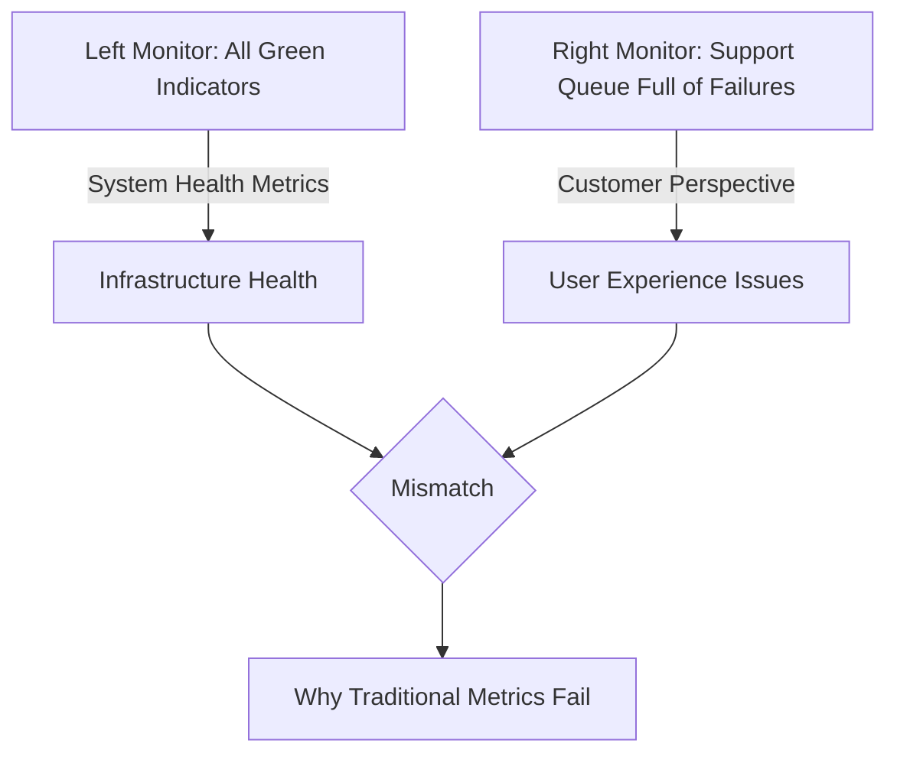

### Teaching Narrative

SRE metrics fundamentally differ from traditional IT monitoring by measuring what matters to users rather than infrastructure health. While traditional monitoring captures system state (CPU, memory, disk utilization), SRE metrics measure service outcomes from the customer perspective. These outcome-based metrics create a direct link between technical measurements and business impact, enabling teams to understand if systems are truly meeting user needs regardless of internal component status.

### Common Example of the Problem

A major credit card authorization system presents a striking example of this issue. On the surface, all infrastructure metrics indicate a healthy system:

| **Metric**            | **Value**          | **Status** |
| --------------------- | ------------------ | ---------- |
| CPU Utilization       | 15%                | ✅ Healthy  |
| Memory Usage          | 40%                | ✅ Healthy  |
| Network Bandwidth     | 30% Capacity       | ✅ Healthy  |
| Service Health Checks | All Reporting "OK" | ✅ Healthy  |

Despite these reassuring indicators, the customer support queue is rapidly filling with urgent reports of declined transactions and merchant complaints. This disconnect arises because traditional monitoring focuses on internal component health rather than the end-to-end success of customer transactions.

To illustrate the gap, consider the following simplified flow:

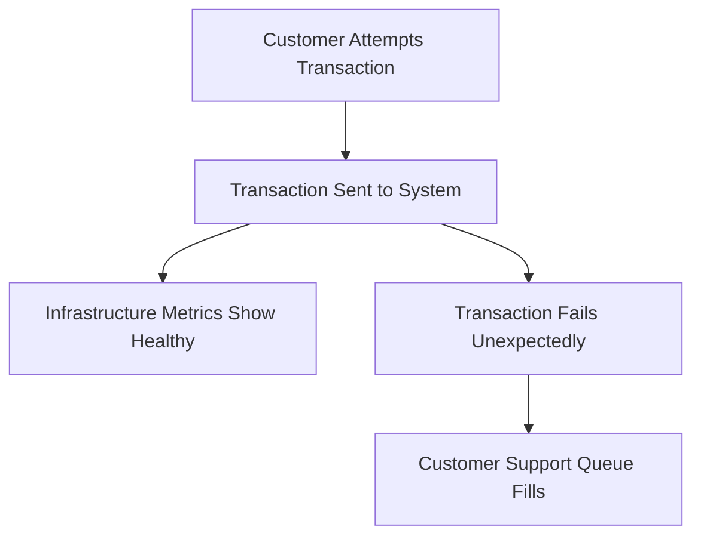

Here, infrastructure metrics ("Healthy") fail to capture the critical outcome—successful transaction processing—that directly impacts the customer experience. Without metrics that align with user outcomes, the system creates a false sense of security while actual business operations suffer.

### SRE Best Practice: Evidence-Based Investigation

To ensure service reliability is aligned with customer outcomes, use the following checklist for implementing transaction-focused metrics:

#### Checklist: Key Metrics for Evidence-Based Investigation

- **Authorization Success Rate**  
  Measure the percentage of approved vs. attempted transactions to track the reliability of payment processing.

- **Segmented Success Metrics**  
  Break down success rates by:
  - Card type (e.g., Visa, Mastercard, etc.)
  - Merchant category (e.g., retail, travel, etc.)
  - Transaction value ranges (e.g., <$100, $100-$500, >$500)

- **Latency Distribution Metrics**  
  Capture and analyze latency across percentiles (p50, p90, p99) instead of relying on averages to highlight outliers affecting user experience.

- **Decline Rate Metrics**  
  Monitor transaction decline rates with detailed classifications of failure reasons (e.g., insufficient funds, card expired, network errors).

- **End-to-End Transaction Completion**  
  Track the success of transactions across all processing stages, ensuring visibility into the full customer journey.

By systematically applying this checklist, teams can focus on customer-centric metrics, enabling precise and evidence-based investigations into service reliability issues.

### Banking Impact

For authorization systems, the gap between healthy infrastructure metrics and failed transactions creates direct revenue impact, customer frustration, and merchant dissatisfaction. When monitoring focuses only on system health, authorization failures can continue for hours before detection, potentially causing millions in lost transactions, damaged customer trust, and regulatory concerns.

#### Real-World Case Study: Major Bank Outage

In 2022, a major financial institution experienced a critical outage in its payment authorization system. Traditional monitoring tools showed all systems operational—green across the board for CPU, memory, and network utilization. However, customers began reporting widespread transaction failures at point-of-sale terminals. Over a six-hour period, more than 500,000 transactions were declined, resulting in an estimated $25 million in lost revenue.

The root cause was traced to a misconfigured service dependency that disrupted the authorization flow. Because traditional metrics failed to capture the customer impact, the issue went undetected until the customer support team escalated the problem. By the time engineers responded, the damage to customer trust and brand reputation was already severe, with social media amplifying dissatisfaction.

This example highlights why SRE metrics, such as successful transaction rates and latency from the user perspective, are critical in financial services. These metrics enable teams to detect and respond to user-facing issues in real time, reducing both financial losses and reputational harm.

### Implementation Guidance

To effectively implement outcome-based SRE metrics, follow these steps:

1. **Define Key Metrics**  
   Identify transaction success metrics that directly measure customer experience outcomes. Examples include request success rates, page load times, or error-free transactions.

2. **Create Composite Metrics**  
   Develop composite metrics by combining technical performance indicators (e.g., latency, error rate) with business success indicators (e.g., completed purchases, user retention).

3. **Implement Synthetic Monitoring**  
   Set up synthetic transaction monitoring to simulate real customer journeys. This helps measure end-to-end success rates across critical paths.

4. **Develop Insightful Dashboards**  
   Build dashboards that prominently display transaction success rates alongside traditional system health metrics. Ensure these dashboards are accessible to both technical and non-technical stakeholders.

5. **Correlate Metrics**  
   Establish correlations between infrastructure metrics and transaction success metrics. Use these correlations to identify leading indicators of potential customer impact.

#### Implementation Flowchart

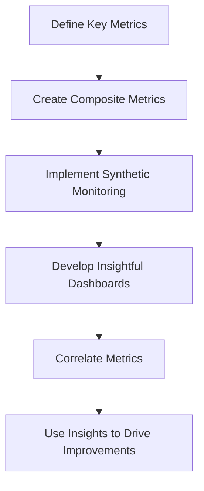

This step-by-step process ensures a customer-centric approach to SRE metrics, enabling teams to focus on what truly matters: delivering reliable and satisfying user experiences.

## Panel 2: Metrics Evolution Pathway

### Scene Description

The evolution of the team's monitoring journey is represented as a three-stage visual:

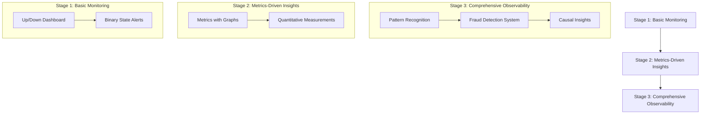

- **Stage 1: Basic Monitoring** – Focused on simple "up/down" dashboards that indicate a binary state: is the system functioning or broken? Alerts are rudimentary and provide minimal context.
- **Stage 2: Metrics-Driven Insights** – Introduces graphs and numerical data. This stage quantifies the issue, showing how broken the system is and providing deeper metrics for analysis.
- **Stage 3: Comprehensive Observability** – Delivers full-system understanding. Features include pattern recognition and fraud detection systems, enabling the team to quickly identify causal factors and predict system behavior.

### Teaching Narrative

Metrics maturity follows a clear evolution from basic monitoring through metrics to comprehensive observability. This progression represents a journey of increasing measurement sophistication: monitoring tells you if something is broken (binary state), metrics tell you how badly it's broken (quantitative measurement), and observability enables you to understand why it's breaking (causal insight). Each stage builds on the previous, adding layers of measurement depth that transform raw data into actionable intelligence about system behavior.

### Common Example of the Problem

A bank's fraud detection system appears healthy according to conventional metrics:

- 100% service availability
- 3ms average API response time
- 0.1% error rate on API calls
- Normal CPU and memory utilization
- All database connections functioning

Despite these positive indicators, customer complaints about legitimate transactions being incorrectly declined are increasing exponentially. The existing metrics fail to capture the essential measurement: false positive rates in the fraud detection algorithm, requiring deeper observability across transaction patterns, customer behavior, and decision boundaries.

#### Comparison of Metrics and Observability Gaps

| **Metric Type**         | **Example Metric**                  | **What It Measures**                        | **Critical Gap**                                 |
| ----------------------- | ----------------------------------- | ------------------------------------------- | ------------------------------------------------ |
| Basic Monitoring        | Service availability (100%)         | System uptime                               | Doesn't highlight issues in transaction accuracy |
| Performance Metrics     | API response time (3ms)             | Speed of responses                          | Ignores quality of decision-making processes     |
| Error Metrics           | API error rate (0.1%)               | Technical errors in API responses           | Misses incorrect fraud classification outcomes   |
| Resource Utilization    | CPU and memory utilization (normal) | Infrastructure health                       | Unrelated to fraud detection effectiveness       |
| Observability (Missing) | False positive rate                 | Incorrectly blocked legitimate transactions | Provides actionable insight into fraud algorithm |

This table highlights how conventional metrics focus on system performance and availability but fail to expose critical issues in specific application outcomes, such as the accuracy of fraud detection decisions. Observability extends beyond these metrics to uncover causal insights into transaction patterns, customer behavior, and decision-making thresholds, enabling targeted improvements to the fraud detection system.

### SRE Best Practice: Evidence-Based Investigation

Implement a progressive metrics hierarchy that builds from basic health to comprehensive observability. Use the following checklist to guide your development and ensure systematic implementation:

#### Checklist for Metrics Hierarchy

- **Foundational Availability Metrics**
  - [ ] Monitor service up/down status.
  - [ ] Track endpoint response success rates.

- **Performance and Capacity Metrics**
  - [ ] Measure response times for critical operations.
  - [ ] Monitor queue depths to identify bottlenecks.
  - [ ] Track throughput rates to assess system load and performance.

- **Business Outcome Metrics**
  - [ ] Record transaction success rates to align with business goals.
  - [ ] Monitor approval percentages for key workflows.
  - [ ] Track false positive rates to evaluate system accuracy.

- **Customer Experience Metrics**
  - [ ] Measure task completion rates to understand user success.
  - [ ] Identify abandonment points in user flows.
  - [ ] Track friction measurements to highlight usability issues.

- **Causal Relationship Metrics**
  - [ ] Investigate correlation patterns to identify potential dependencies.
  - [ ] Monitor anomaly indicators for early detection of issues.
  - [ ] Develop prediction metrics to anticipate future system behavior.

### Banking Impact

In fraud detection systems, the gap between basic metrics and true observability directly impacts the balance between fraud prevention and customer experience. Without observability metrics that reveal false positive patterns by merchant category, geographic anomalies, or time-based triggers, banks must choose between excessive fraud exposure or frustrating legitimate customers. Enhanced metrics enable precision tuning that simultaneously improves fraud capture and customer satisfaction, directly affecting both security posture and revenue retention.

### Implementation Guidance

To evolve your metrics maturity effectively, follow these step-by-step instructions using a fraud detection system as an example:

1. **Assess Current Metrics Maturity**
   - Perform an audit of your current monitoring setup:
     - Identify if you only have basic up/down monitoring (e.g., "Fraud detection service is operational").
     - Evaluate whether quantitative metrics are already in place (e.g., "Number of fraud cases detected per minute").
     - Check for any current observability practices (e.g., distributed tracing or anomaly detection).
   - Define a roadmap to progress from basic monitoring to observability.

2. **Implement Business Outcome Metrics**
   - Shift focus from system performance to business impact:
     - Start tracking key metrics, such as "Percentage of fraudulent transactions detected" or "False positive rate of fraud detection algorithm."
     - Align these metrics with business goals (e.g., minimizing financial losses due to fraud while maintaining customer satisfaction).

3. **Develop Correlation Metrics**
   - Identify relationships between different datasets to uncover hidden insights:
     - For example, correlate "Transaction volume by geographic region" with "Fraud alerts triggered" to detect regional patterns.
     - Use these correlations to refine detection algorithms or preemptively address emerging issues.
   - Automate the generation of these correlation metrics where possible to enable real-time analysis.

4. **Create Pattern Detection Metrics**
   - Build metrics that recognize anomalies before they escalate:
     - For instance, track "Rate of identical transactions from the same IP address" or "Unusual transaction amounts during non-peak hours."
     - Use statistical techniques or machine learning models to identify deviations from historical patterns.
   - Integrate alerts for these anomalies into your monitoring pipeline.

5. **Build Exploratory Observability Dashboards**
   - Design dashboards that allow dynamic exploration of data:
     - Include visualizations of fraud trends over time, correlations between metrics, and anomaly heatmaps.
     - Enable drill-down capabilities for deeper investigation, such as filtering transactions by user ID or geographic region.
   - Move beyond static reporting by incorporating real-time updates and interactive elements.

#### Example Workflow: Fraud Detection System Metrics Evolution

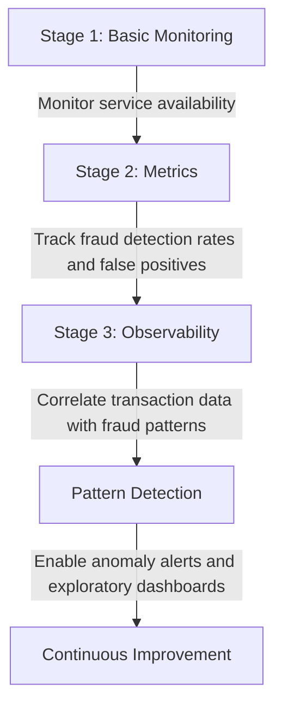

By following this step-by-step approach, your team can systematically enhance its metrics maturity, transforming raw data into actionable insights and enabling proactive responses to complex system behaviors.

## Panel 3: The Business Cost of Metric Blindness

### Scene Description

Emergency meeting with the CRO to review financial impact dashboards after a critical mobile banking outage on payroll day. The room is tense as charts on the screen reveal the escalating consequences of the incident:

- **Financial Losses Over Time**: A line graph shows a steep upward curve, representing mounting revenue losses by the minute.
- **Regulatory Penalties**: A bar chart highlights cumulative fines, growing in proportion to the outage duration.
- **Customer Churn**: A pie chart visualizes a sharp increase in account closures and customer complaints, with a significant portion attributed to high-value customers.

Below is a simplified representation of the financial impact data:

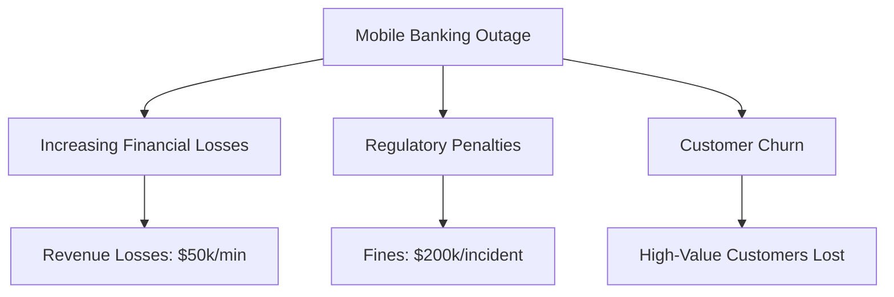

These visuals underscore the critical need for real-time, comprehensive metrics to mitigate the cascading effects of such incidents.

### Teaching Narrative

Comprehensive metrics provide essential visibility that directly impacts business outcomes through faster detection, more effective response, and clearer communication during incidents. This "illumination" function of metrics transforms incident management from reactive to proactive by providing early warning of developing issues, precise impact assessment, and measurement-driven recovery tracking. For financial institutions, each minute without appropriate metrics during an incident translates directly to increased costs across multiple dimensions.

### Common Example of the Problem

A mobile banking platform fails during peak payroll processing, but operations teams lack critical visibility metrics:

- No degradation metrics showing progression before failure (only binary up/down)
- No transaction volume metrics by channel or type to quantify impact scope
- No financial value metrics to assess monetary exposure
- No historical performance metrics for comparison or resolution estimation
- No regulatory compliance metrics to guide reporting obligations

This metrics gap turns what could have been a 30-minute minor incident into a three-hour major outage with corresponding financial and reputational damage. Without quantitative measurements, teams resort to guesswork and assumption throughout the response process.

#### Checklist for Identifying Missing Metrics in Your System

- [ ] **Degradation Metrics**: Can you detect gradual performance issues before full failure?
- [ ] **Transaction Volume Metrics**: Do you track transaction counts by channel and type?
- [ ] **Financial Exposure Metrics**: Are you monitoring the monetary impact of disruptions in real-time?
- [ ] **Historical Performance Metrics**: Do you have baseline data for comparison and recovery estimation?
- [ ] **Regulatory Compliance Metrics**: Are you tracking metrics required for regulatory reporting during incidents?

Use this checklist to evaluate your current monitoring systems and identify gaps that could leave your organization vulnerable during critical incidents.

### SRE Best Practice: Evidence-Based Investigation

Implement comprehensive incident metrics across the full lifecycle. The table below organizes key metrics by lifecycle stage and highlights their corresponding benefits for clarity and actionable guidance:

| **Lifecycle Stage**        | **Key Metrics**                                                          | **Benefits**                                                                                  |
| -------------------------- | ------------------------------------------------------------------------ | --------------------------------------------------------------------------------------------- |
| **Early Detection**        | - Progressive degradation metrics showing trends before failure          | Enables proactive intervention to prevent outages.                                            |
|                            | - Baseline deviation metrics highlighting anomalies from normal patterns | Detects abnormal behaviors early for faster diagnosis.                                        |
|                            | - Leading indicator metrics predicting potential issues                  | Provides foresight into emerging risks to prioritize attention.                               |
| **Impact Quantification**  | - Transaction volume metrics by service and channel                      | Identifies magnitude and scope of the issue across systems.                                   |
|                            | - Financial value metrics for affected operations                        | Quantifies direct financial impact for business prioritization.                               |
|                            | - Customer segment impact metrics by priority and value                  | Highlights critical customer groups for targeted communication and remediation.               |
| **Response Effectiveness** | - Recovery progression metrics tracking remediation                      | Tracks the efficiency and effectiveness of recovery efforts.                                  |
|                            | - Transaction success rate restoration metrics                           | Measures progress toward restoring normal operational functionality.                          |
|                            | - Backlog processing metrics for delayed operations                      | Monitors the resolution of accumulated transactional delays caused by the incident.           |
| **Regulatory Compliance**  | - Service availability metrics aligned to regulatory definitions         | Ensures compliance with mandated service level agreements (SLAs).                             |
|                            | - Customer impact metrics for reporting requirements                     | Provides accurate data for transparency and regulatory submissions.                           |
|                            | - Financial exposure metrics for materiality assessment                  | Assesses the broader financial implications to ensure alignment with regulatory expectations. |

By organizing metrics in this structured manner, teams can more effectively implement evidence-based investigation practices, ensuring faster detection, accurate impact assessment, and improved response and compliance outcomes.

### Banking Impact

The cost of inadequate metrics during banking incidents cascades across multiple dimensions, much like a small leak in a pipe that, if left undetected, can cause widespread damage to a home:

- **Direct Financial Impact**: Just as water from the leak can ruin floors and walls, failed transactions, compensation payments, and penalty interest erode financial stability.
- **Operational Costs**: Emergency repairs to the pipe mirror the extended resolution time, emergency resource allocation, and recovery efforts required during incidents.
- **Regulatory Consequences**: Ignoring the leak over time can lead to structural inspections and fines, just as poor metric visibility can result in reporting violations, examination findings, and compliance penalties.
- **Customer Impact**: A homeowner’s trust in their property diminishes with each unresolved leak; similarly, inadequate metrics damage customer relationships, erode trust, and increase the risk of attrition.

By enabling faster detection and resolution—just 15 minutes sooner—the financial benefit for critical banking services during peak periods can be measured in millions of dollars. Much like addressing a small leak early prevents costly repairs, robust metrics provide the visibility needed to minimize cascading losses across the business.

### Implementation Guidance

#### Checklist for Implementing Effective Metrics

- **Define Business-Centric Metrics**
  - Translate technical incidents into financial impact metrics that clearly communicate business costs.
  - Include metrics such as revenue loss per minute, penalty exposure, and churn projections.

- **Develop Regulatory Compliance Dashboards**
  - Align dashboards with required reporting thresholds and regulatory mandates.
  - Ensure real-time visibility into compliance status during incidents.

- **Design Customer Impact Metrics**
  - Segment metrics by customer value tiers, relationship importance, and affected services.
  - Prioritize visibility into high-value customer impacts for tailored responses.

- **Establish Baseline Comparisons**
  - Build comparative metrics to identify deviations from normal performance patterns.
  - Use historical data and predictive analytics to set dynamic baselines.

- **Assign Clear Ownership**
  - Define metric ownership roles across technical and business teams.
  - Ensure accountability for monitoring, reporting, and responding to metric-driven insights.

#### Key Considerations

- **Integration**: Ensure metrics are integrated across monitoring tools and dashboards for unified visibility.
- **Automation**: Automate metric collection and reporting to reduce manual effort and latency.
- **Scalability**: Design metrics systems to scale with organizational growth and complexity.
- **Training**: Provide training to teams on interpreting and acting on metrics effectively.

By following this checklist, organizations can establish a robust metrics framework that enhances incident management, reduces business costs, and supports strategic decision-making.

## Panel 4: From Data Points to Meaningful Signals

### Scene Description

In a collaborative team brainstorming session, engineers and stakeholders gather around a whiteboard to define critical Service Level Indicators (SLIs) for ATM services. The whiteboard is filled with technical metrics, customer journey maps, and business goals, as the team works to identify which metrics best capture the customer experience.

To visualize the transformation process, consider the following conceptual flow:

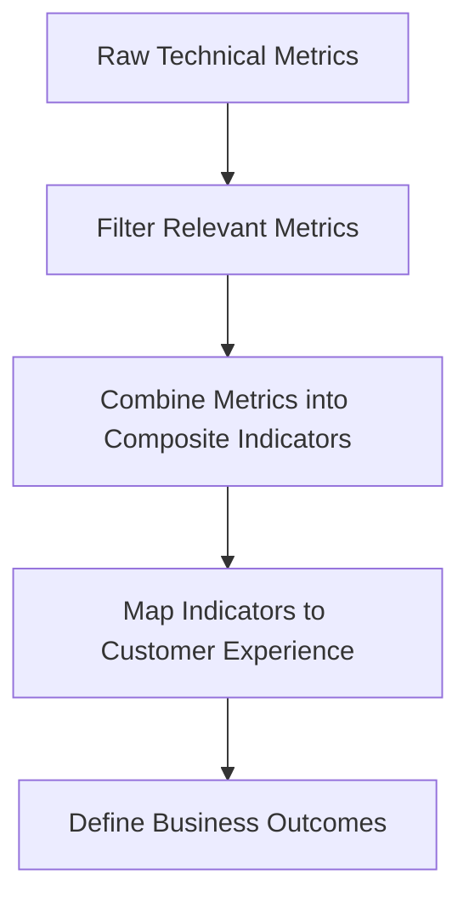

This journey illustrates the progression from isolated technical measurements to meaningful SLIs that align with both technical performance and customer satisfaction. The visualization highlights the iterative nature of this process, emphasizing collaboration and shared understanding between technical and business perspectives.

### Teaching Narrative

Service Level Indicators (SLIs) transform isolated technical metrics into meaningful measurements of customer experience. This transformation process requires identifying which metrics truly correlate with service quality from the user perspective and combining technical measurements into composite indicators that reflect business outcomes. Effective SLIs bridge the gap between what we can measure technically and what actually matters to customers, creating a shared language between technical and business stakeholders.

### Common Example of the Problem

The ATM operations team monitors numerous technical metrics to ensure system health:

| **Technical Metric**                 | **Description**                              |
| ------------------------------------ | -------------------------------------------- |
| Network latency                      | Time taken for data to travel (milliseconds) |
| Cash dispenser mechanism operational | Status of cash dispensing hardware           |
| Card reader error frequency          | Percentage of read errors in transactions    |
| Receipt printer paper supply         | Level of paper available in the printer      |
| Software service health checks       | Status of backend services powering the ATM  |

Despite this diligent monitoring, these isolated metrics fail to answer the critical question: **Can customers successfully complete their banking transactions?**

For example:

- An ATM with a failing receipt printer might still be marked "operational" in monitoring systems.
- However, customers encountering error messages when trying to print receipts leave frustrated, impacting their experience.

This disconnect highlights the gap between purely technical measurements and meaningful customer outcomes. Without aligning technical metrics to what truly matters for customers, the service's perceived quality may suffer despite systems appearing functional.

### SRE Best Practice: Evidence-Based Investigation

Transform technical metrics into meaningful SLIs through systematic refinement. Use the following checklist to guide your process:

---

#### **Checklist for Transforming Metrics into SLIs**

1. **Understand the Customer Journey**
   - [ ] Map complete transaction paths from the customer's perspective.
   - [ ] Identify critical success points and moments that matter in each journey.
   - [ ] Highlight potential failure modes that could impact journey completion.

2. **Define Success Metrics**
   - [ ] Capture transaction completion rate metrics (e.g., initiated vs. successfully completed).
   - [ ] Measure time-to-completion from the customer's perspective, prioritizing perceived responsiveness.
   - [ ] Identify metrics for error recovery, showcasing resilience to minor issues.

3. **Develop and Validate Composite Indicators**
   - [ ] Design SLIs that combine multiple technical metrics into a single meaningful indicator:
     - E.g., *Cash Availability SLI* integrating hardware uptime, software reliability, and currency refill rates.
     - E.g., *Operational Capability SLI* reflecting the availability of all required ATM functions.
     - E.g., *Customer Experience SLI* combining speed, success, and usability factors.
   - [ ] Ensure the composite indicators correlate strongly with customer satisfaction and business outcomes.
   - [ ] Validate SLIs by testing them against historical data and real-world scenarios.

4. **Collaborate Across Teams**
   - [ ] Involve both technical and business stakeholders to align SLIs with organizational goals.
   - [ ] Use SLIs as a shared language to bridge technical insights and customer impact.

---

By following this checklist, your team can transform raw metrics into meaningful signals that reflect true customer experience and operational success.

### Banking Impact

For ATM services, the gap between technical metrics and customer-centric SLIs can be likened to a car dashboard that shows the fuel level but not whether the car is running smoothly. A technically "available" ATM might appear operational, much like a car with a full tank, but if it frustrates customers with slow performance or confusing errors, it’s effectively as undrivable as a car with engine trouble. These frustrations often push customers to more expensive channels like branches or call centers, increasing operational costs.

Effective SLIs act as the full dashboard, providing a clearer picture of both the technical and experiential aspects of the service. By focusing on SLIs that highlight actual customer impact—such as transaction speed or error frequency—the team can prioritize improvements that optimize both customer satisfaction and cost-effectiveness. This ensures that the service doesn't just appear functional but truly performs in a way that meets customer expectations.

### Implementation Guidance

1. **Create customer journey maps for all critical ATM transaction types with measurement points**  
   Begin by mapping out the end-to-end customer journey for key ATM services, such as cash withdrawals, balance inquiries, and fund transfers. Identify specific touchpoints where technical metrics can be collected, such as card validation, PIN entry, transaction processing, and receipt printing.

2. **Develop composite SLIs that reflect successful journey completion rather than component health**  
   Focus on SLIs that measure the customer's ability to complete their desired transaction successfully. For example, instead of monitoring only the uptime of the card reader or the transaction processor, create a composite SLI like "Successful Transaction Rate" that combines metrics from all critical touchpoints of the journey.

3. **Implement weighted metric calculations that prioritize customer-visible components**  
   Assign higher weights to technical metrics that directly impact customer experience. For instance, if receipt printing failures occur but don't prevent transaction success, they should have a lower weight compared to failures in transaction processing.

4. **Establish correlation analysis between SLIs and customer satisfaction/complaint metrics**  
   Use statistical methods to identify relationships between your SLIs and customer feedback data. For example, analyze how fluctuations in the Successful Transaction Rate correlate with increases in customer complaints about failed transactions.

5. **Create regular SLI effectiveness reviews using actual customer feedback and behavior data**  
   Schedule periodic reviews to assess how well your SLIs reflect true customer experience. Incorporate data from customer satisfaction surveys, feedback channels, and ATM usage patterns to refine your indicators over time.

#### Case Study: Successful SLI Implementation for ATM Withdrawals

A financial institution faced frequent customer complaints about their ATM services, despite high uptime reported by individual component monitors. The team decided to implement composite SLIs to better reflect customer experience.

- **Step 1:** They mapped the withdrawal journey, identifying key touchpoints like card authentication, PIN entry, transaction processing, and cash dispensing.
- **Step 2:** They created a composite SLI called "Withdrawal Success Rate," combining metrics such as authentication success, PIN validation accuracy, and cash dispenser availability.
- **Step 3:** Weighted metrics prioritized customer-visible components, assigning higher importance to transaction completion over receipt printing.
- **Step 4:** Correlation analysis revealed that a drop in the Withdrawal Success Rate by 2% directly correlated with a 15% increase in customer complaints about failed transactions.
- **Step 5:** Regular reviews, incorporating customer feedback and ATM usage data, led to adjustments in how SLIs were calculated, improving their relevance and accuracy.

By focusing on composite SLIs and integrating customer feedback, the institution successfully reduced complaints by 25% over six months and gained clearer insights into service quality from the customer perspective.

## Panel 5: Setting Realistic Performance Targets

### Scene Description

The SRE is engaged in a negotiation with the product team about reliability requirements for the payment system. A trade-off graph is displayed, illustrating the relationship between reliability metrics (e.g., availability percentages) and velocity/cost. The graph highlights the "five nines" (99.999%) target with question marks, emphasizing the tension between achieving extreme reliability and the associated costs and delivery speed. Below is a conceptual representation of the trade-off graph:

```asciidraw
   Reliability (%)
       ^
  100%  |                                    ?
        |                                  *  
   99.9%|                              *       
        |                          *             
   99.0%|                    *                   
        |              *                         
   90.0%|        *                               
        |    *                                    
        +-------------------------------------->  
        Low                  High
                   Velocity / Cost
```

This visual serves to underscore the diminishing returns and escalating costs associated with pursuing ultra-high reliability, encouraging a discussion on balancing business needs with technical feasibility.

### Teaching Narrative

Service Level Objectives (SLOs) transform SLI measurements into target performance levels, creating a quantitative reliability framework. Unlike aspirational goals, effective SLOs require calibration based on business requirements, technical capabilities, and economic trade-offs. The metrics challenge lies in setting values that balance reliability needs against innovation velocity and cost efficiency while reflecting actual service criticality rather than applying uniform standards across all systems.

### Common Example of the Problem

A bank's payment processing product team demands "five nines" reliability (99.999%, equating to just 5 minutes downtime per year) for all payment-related services. These demands are based on the following metrics:

| Metric                   | Target Value                    |
| ------------------------ | ------------------------------- |
| API availability         | 99.999%                         |
| Transaction success rate | 99.999%                         |
| Response time            | < 200ms for 99.999% of requests |

However, this uniform approach disregards the critical differences between payment types, which should inform differentiated metric targets. The table below highlights these distinctions:

| Payment Type                 | Key Characteristics                   | Appropriate Reliability Focus                    |
| ---------------------------- | ------------------------------------- | ------------------------------------------------ |
| High-value wire transfers    | Large transaction amounts; low volume | Maximum reliability and availability             |
| Retail card authorizations   | High throughput; customer convenience | Throughput and reasonable reliability balance    |
| Account information requests | Informational; non-critical           | Moderate reliability, cost-effective performance |

By failing to account for these differences, the resulting SLO metrics create impractical standards for some services while inadequately protecting truly critical functions.

### SRE Best Practice: Evidence-Based Investigation

Implement a differentiated SLO framework based on service criticality and business impact by following this checklist:

#### Checklist for Evidence-Based SLO Design

1. **Categorize Services by Criticality**
   - [ ] Identify and classify services into tiers based on business impact and criticality.
     - Tier 1: Settlement and high-value transfers (e.g., 99.99%+ availability)
     - Tier 2: Standard payment processing (e.g., 99.9%+ availability)
     - Tier 3: Informational services (e.g., 99.5%+ availability)
   - [ ] Validate service categorization with product teams to align on priorities.

2. **Define Multi-Dimensional SLO Metrics**
   - [ ] Specify key SLO dimensions to measure:
     - [ ] Availability: Percentage of successful responses (e.g., 99.9% or higher).
     - [ ] Latency: Time to respond at critical percentiles (e.g., p50, p90, p99).
     - [ ] Throughput: Peak capacity requirements during high-demand scenarios.
     - [ ] Accuracy: Transaction correctness and data integrity.
   - [ ] Establish realistic thresholds for each metric based on historical data and technical limitations.

3. **Align SLOs with Economic Trade-offs**
   - [ ] Calculate cost-per-reliability-increment to understand financial impacts.
   - [ ] Assess innovation impact metrics to evaluate how reliability levels affect development velocity.
   - [ ] Define and monitor error budgets to enable calculated risk-taking and resource prioritization.
   - [ ] Regularly review economic alignment with stakeholders to account for evolving business priorities.

4. **Validate and Iterate**
   - [ ] Continuously monitor SLO performance and refine thresholds as needed.
   - [ ] Use post-incident reviews to validate metric accuracy and service tier classification.
   - [ ] Incorporate feedback from cross-functional teams to improve alignment.

By following this checklist, you can ensure that your SLO framework is evidence-based, practical, and adaptable to both technical constraints and business goals.

### Banking Impact

For payment systems, appropriate SLO calibration directly impacts both service reliability and innovation velocity. Excessive reliability requirements for non-critical services create unnecessary engineering costs, slow feature development, and reduce competitiveness. Insufficient reliability targets for critical services may allow unacceptable failure rates for high-value transactions. Finding the right balance requires metrics that reflect the actual business impact of different reliability levels for each service type.

### Implementation Guidance

To effectively set realistic performance targets, follow these structured steps:

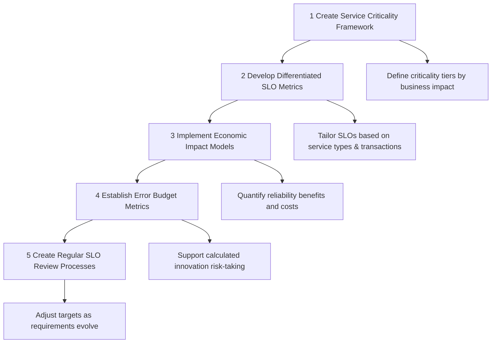

1. **Create Service Criticality Framework**
   - Define criticality tiers based on the business impact of system failures.
   - Assign reliability requirements for each tier to align with organizational priorities.

2. **Develop Differentiated SLO Metrics**
   - Tailor SLOs to specific service types and transaction categories to reflect their unique reliability needs.
   - Avoid applying blanket standards across all systems, ensuring alignment with actual service criticality.

3. **Implement Economic Impact Models**
   - Quantify both the benefits of achieving higher reliability and the associated costs.
   - Use these models to make informed trade-off decisions between performance, velocity, and cost.

4. **Establish Error Budget Metrics**
   - Define error budgets that provide structured allowances for unreliability.
   - Enable calculated risk-taking to foster innovation while maintaining reliability thresholds.

5. **Create Regular SLO Review Processes**
   - Schedule periodic reviews to evaluate and adjust SLO targets based on evolving business needs and technical capabilities.
   - Ensure SLOs remain relevant and actionable as service requirements change.

## Panel 6: Aligning Technical and Regulatory Metrics

### Scene Description

The scene presents a collaborative meeting between an SRE, a compliance officer, and a business stakeholder to discuss service level requirements. The conversation focuses on aligning internal SLOs, customer SLAs, and regulatory reporting requirements. Below is a visual representation of the discussed hierarchy, illustrating the relationships between these elements and their corresponding metric thresholds:

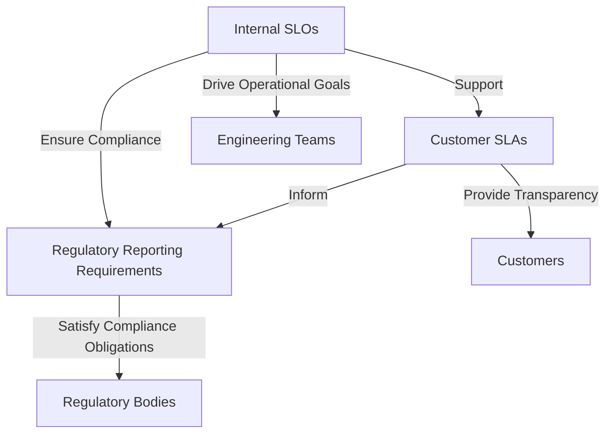

This hierarchy demonstrates how internal metrics (SLOs) are foundational to meeting customer agreements (SLAs) and satisfying external regulatory standards, ensuring alignment across all levels of the organization.

### Teaching Narrative

Financial services metrics exist within a complex regulatory framework that imposes external requirements on measurement, reporting, and performance standards. Effective metric design must integrate these regulatory requirements with internal operational needs, creating a cohesive measurement system that satisfies compliance obligations while providing practical utility for engineering teams. This integration prevents the proliferation of parallel, disconnected measurement systems that create confusion and compliance gaps.

### Common Example of the Problem

A bank implements SLO metrics based solely on engineering considerations without integrating regulatory requirements or customer SLAs. This creates three parallel measurement systems that often conflict:

| Metric Type              | Focus Area                           | Example Metric                    | Key Issue During Incident                                                                        |
| ------------------------ | ------------------------------------ | --------------------------------- | ------------------------------------------------------------------------------------------------ |
| **Engineering Metrics**  | Technical performance                | Response time, error rates        | Show acceptable performance, leading engineers to believe systems are operating normally.        |
| **Compliance Metrics**   | Regulatory requirements              | Availability, incident thresholds | Highlight a violation (e.g., downtime exceeds regulatory thresholds), triggering non-compliance. |
| **Customer SLA Metrics** | Contractual obligations to customers | Processing time guarantees        | Indicate SLA breaches, risking penalties or customer dissatisfaction.                            |

#### Conflict During an Incident

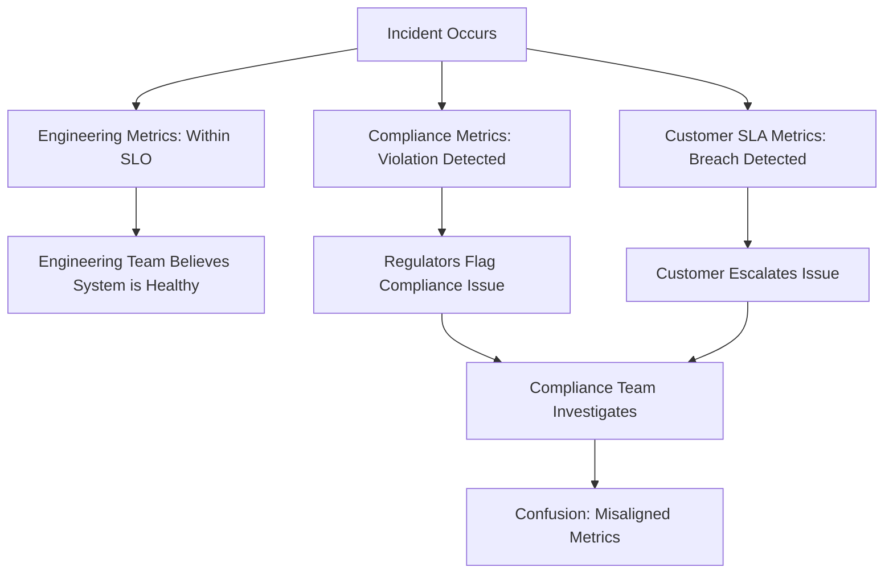

As shown above, while engineering metrics indicate acceptable performance within SLO thresholds, compliance metrics detect a regulatory violation, and SLA metrics reveal unmet contractual obligations. This disconnect leads to confusion among teams, delays in response, and increased risk of regulatory penalties or customer dissatisfaction.

### SRE Best Practice: Evidence-Based Investigation

Create an integrated metrics framework that aligns technical, contractual, and regulatory requirements. Use the following checklist to guide implementation:

#### Checklist: Steps for Creating an Integrated Metrics Framework

1. **Regulatory Metrics Mapping**
   - Identify and document availability metrics as defined by relevant regulations (e.g., calendar-based uptime requirements).
   - Map processing time metrics for regulated transaction types to ensure compliance.
   - Define incident classification metrics with thresholds for regulatory reporting.
   - Include security and compliance metrics mandated by industry-specific regulations (e.g., banking, financial services).

2. **Metrics Hierarchy Integration**
   - Establish technical foundation metrics that support higher-level business and regulatory measurements.
   - Ensure business metrics directly satisfy regulatory reporting requirements.
   - Align customer-facing metrics with contractual service-level agreements (SLAs).
   - Develop a clear mapping of relationships between metric levels (e.g., technical → business → regulatory).

3. **Threshold Alignment Metrics**
   - Set internal operational thresholds tighter than external regulatory requirements to provide a safety margin.
   - Create graduated thresholds for progressive escalation and issue prioritization.
   - Define leading indicator metrics to proactively identify risks of compliance violations.

4. **Validation & Iteration**
   - Periodically review metrics to ensure continued alignment with regulatory changes and business needs.
   - Validate metrics against real-world scenarios to confirm accuracy and utility.
   - Update and iterate on the framework to incorporate lessons learned from incidents or audits.

5. **Documentation & Communication**
   - Maintain comprehensive documentation of all metrics, their thresholds, and their relationships.
   - Ensure key stakeholders (e.g., engineering, compliance, business) understand the framework and its implications.
   - Use the framework as a reference during audits, regulatory reviews, and internal training sessions.

By following this checklist, SRE teams can build and maintain a metrics framework that balances operational efficiency with regulatory compliance, while minimizing confusion and ensuring consistency across all measurement layers.

### Banking Impact

Misalignment between technical and regulatory metrics is like a car dashboard displaying incorrect speed or fuel levels. Just as a faulty dashboard can mislead a driver into speeding or running out of gas, poorly aligned metrics can lead organizations to unknowingly breach compliance requirements. When metrics fail to reflect regulatory definitions accurately, critical reporting violations might occur without triggering internal alerts. This creates significant risks, including liability for notification failures, adverse examination findings, and potential financial penalties.

Integrated metrics act like a well-calibrated dashboard, ensuring that operations teams have a clear view of both technical performance and its compliance implications. By aligning technical and regulatory metrics, teams can proactively address emerging issues, maintain compliance, and avoid the operational chaos that stems from disconnected or misleading measurement systems.

### Implementation Guidance

1. **Create comprehensive mapping between technical metrics and regulatory requirements**  
   Begin by identifying all regulatory reporting requirements relevant to your service and map them to internal technical metrics. This ensures alignment between operational performance and compliance obligations. Use a table or matrix to maintain traceability between these metrics and their corresponding regulatory mandates.

2. **Implement regulatory threshold monitoring with appropriate buffer margins**  
   Configure monitoring systems to track regulatory thresholds with defined buffer zones. These buffers act as early warning indicators to preemptively address potential compliance violations. Below is an example of a simple threshold-monitoring script using Python and a monitoring API like Prometheus:

   ```python
   from prometheus_api_client import PrometheusConnect

   prom = PrometheusConnect(url="http://prometheus-server", disable_ssl=True)

   query = 'your_metric_name{job="service_name"}'
   buffer_margin = 0.9  # 90% of the regulatory threshold
   regulatory_threshold = 1000  # Example threshold value

   results = prom.custom_query(query=query)
   for result in results:
       current_value = float(result['value'][1])
       if current_value >= regulatory_threshold * buffer_margin:
           print(f"Warning: Metric approaching threshold. Current value: {current_value}")
   ```

3. **Develop integrated dashboards showing both technical and compliance perspectives**  
   Use a single-pane-of-glass approach to visualize metrics from both technical and regulatory perspectives. Below is an example of a dashboard structure:

   - **Top Row**: Key SLIs/SLOs for internal engineering teams (e.g., latency, error rate).
   - **Middle Row**: Regulatory metrics with clear thresholds and current status.
   - **Bottom Row**: SLA compliance status tied to customer commitments.

   Example dashboard layout in text:

   ```ascii
   +----------------------------+
   | Internal SLIs/SLOs         |
   | - Latency: 200ms           |
   | - Error Rate: 0.5%         |
   +----------------------------+
   | Regulatory Metrics         |
   | - Transaction Time: 95% in 500ms |
   | - Uptime: 99.9%            |
   +----------------------------+
   | SLA Compliance             |
   | - SLA 1: Met               |
   | - SLA 2: At Risk           |
   +----------------------------+
   ```

4. **Build automated notification systems for approaching regulatory thresholds**  
   Automate notifications to alert relevant teams when metrics approach regulatory limits. For example, integrate with Slack or email systems for real-time alerts. Example code snippet using Python and Slack API:

   ```python
   import requests

   slack_webhook_url = "https://hooks.slack.com/services/your/slack/webhook"
   alert_message = "Regulatory threshold approaching for metric: your_metric_name"

   def send_slack_alert(message):
       payload = {"text": message}
       response = requests.post(slack_webhook_url, json=payload)
       if response.status_code == 200:
           print("Alert sent successfully")
       else:
           print(f"Failed to send alert: {response.status_code}")

   send_slack_alert(alert_message)
   ```

5. **Establish joint metrics reviews with engineering, compliance, and business stakeholders**  
   Schedule regular cross-functional reviews to evaluate metric performance, discuss threshold adjustments, and ensure alignment. Use a shared document or dashboard during these reviews to facilitate clear communication and track decisions. Encourage stakeholders to provide feedback on the practical utility of the metrics and identify gaps or areas for improvement.

## Panel 7: Building Measurement into Code

### Scene Description

In this scene, a Developer and an SRE are pair programming to add instrumentation to a new transaction processing service. The screen is split into two sections:

1. **Before Instrumentation**: The initial code is displayed, showing the absence of measurement points. This highlights how raw processing logic lacks visibility into performance, transaction flow, and business context.

2. **After Instrumentation**: The updated code includes strategically placed measurement points. These additions enable the collection of critical metrics, such as transaction latency, error rates, and key business indicators.

Below is a conceptual text-based representation of the split screen, illustrating the transformation:

```
+-----------------------------------+-----------------------------------+
| Before Instrumentation         | After Instrumentation          |
| ------------------------------ | ------------------------------ |
| def process_transaction(data): | def process_transaction(data): |
| # processing logic here        | start_timer("transaction")     |
| validate(data)                 | validate(data)                 |
| process(data)                  | process(data)                  |
| finalize(data)                 | finalize(data)                 |
| return "Success"               | record_metric("success_rate")  |
|                                | stop_timer("transaction")      |
|                                | return "Success"               |
+-----------------------------------+-----------------------------------+
```

Critical measurement points, such as `start_timer`, `stop_timer`, and `record_metric`, are highlighted in the "After Instrumentation" section. These additions ensure the service can report both technical performance and business metrics, laying the foundation for comprehensive monitoring and observability.

### Teaching Narrative

Comprehensive metrics begin with effective instrumentation - the systematic addition of measurement points within applications. Even the most sophisticated monitoring systems cannot provide visibility without properly placed instrumentation that captures the right data at appropriate points in the processing flow. For banking systems, this instrumentation must measure not just technical performance but also business context, transaction characteristics, and customer experience factors.

### Common Example of the Problem

A bank deploys a new transaction processing service with minimal instrumentation, capturing only basic availability data. The application logs contain limited timing information, no transaction context, and inconsistent formatting. When performance issues emerge, the operations team lacks critical visibility:

- Which transaction types experience problems (no business context metrics)
- Where in the process bottlenecks occur (no component-level timing metrics)
- Whether specific customer segments are affected (no user dimension metrics)
- How current performance compares to historical patterns (no baseline metrics)

This instrumentation gap transforms troubleshooting from data-driven analysis to speculative guesswork, extending resolution time and customer impact.

#### Flowchart: Missing Metrics and Their Impact on Troubleshooting

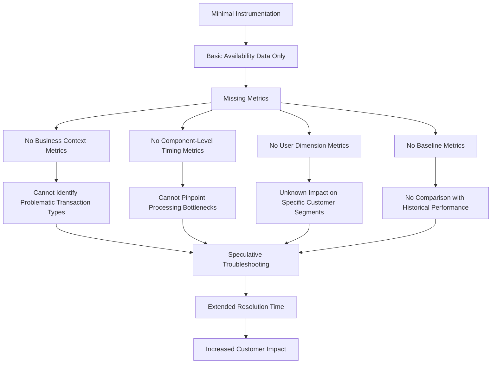

This flowchart illustrates how missing instrumentation metrics cascade into specific visibility gaps, leading to ineffective troubleshooting and prolonged customer-facing issues. By systematically addressing these gaps, teams can shift from reactive problem-solving to proactive performance management.

### SRE Best Practice: Evidence-Based Investigation

Implement a comprehensive instrumentation strategy across three key dimensions. Use the checklist below to ensure all critical measurement points are covered:

| **Dimension**             | **Key Metrics**                                               |
| ------------------------- | ------------------------------------------------------------- |
| **Technical Performance** | - Function-level timing metrics for processing steps          |
|                           | - Error capture metrics with detailed classification          |
|                           | - Resource utilization metrics (threads, connections, memory) |
|                           | - Dependency performance metrics for external services        |
| **Business Context**      | - Transaction type classification metrics                     |
|                           | - Processing stage tracking metrics                           |
|                           | - Amount range and risk category metrics                      |
|                           | - Merchant or counterparty classification metrics             |
| **Customer Experience**   | - User segment identification metrics                         |
|                           | - Channel and device context metrics                          |
|                           | - Session and journey position metrics                        |
|                           | - Historical context and relationship metrics                 |

This structured approach ensures that each dimension of instrumentation is addressed, enabling evidence-based investigation and decision-making during incidents or performance analysis.

### Banking Impact

For transaction processing, instrumentation quality directly determines both operational visibility and control effectiveness. Inadequate instrumentation creates dangerous blind spots where issues develop undetected, potentially allowing transaction failures to persist without mitigation. Comprehensive instrumentation enables rapid identification of emerging issues, precise troubleshooting, and data-driven optimization based on actual transaction patterns and performance characteristics.

### Implementation Guidance

1. **Develop Standardized Instrumentation Libraries**  
   Create and maintain shared libraries that implement consistent metrics across all banking applications. These libraries should include pre-defined functions for common metrics such as response time, error counts, and throughput. For example, in Python:

   ```python
   from metrics_library import Metrics

   metrics = Metrics(service_name="transaction_processor")

   def process_transaction(transaction):
       with metrics.timer("transaction_processing_time"):
           # Transaction processing logic
           if transaction.is_valid():
               metrics.increment("valid_transactions")
           else:
               metrics.increment("invalid_transactions")
   ```

2. **Implement Comprehensive Timing Metrics**  
   Ensure timing metrics are captured at all critical stages of transaction processing. For instance, measure the time taken for request validation, database operations, and response generation to identify latency hotspots.

3. **Add Business Context Dimensions to Metrics**  
   Enhance technical metrics with business context by appending dimensions like transaction type, customer segment, or geographic region. Example:

   ```python
   metrics.increment("transactions_processed", tags={
       "transaction_type": transaction.type,
       "customer_segment": transaction.customer_segment,
       "region": transaction.region
   })
   ```

4. **Create Correlation Identifiers**  
   Use correlation identifiers to track transactions across system and service boundaries. Generate unique IDs at the entry point and propagate them through all calls. This enables end-to-end traceability. Example of generating and passing a correlation ID:

   ```python
   import uuid

   def generate_correlation_id():
       return str(uuid.uuid4())

   def process_request(request):
       correlation_id = request.headers.get("X-Correlation-ID", generate_correlation_id())
       # Pass correlation_id to downstream services
       process_transaction(request.data, correlation_id)
   ```

5. **Establish Instrumentation Reviews**  
   Integrate instrumentation reviews into standard development workflows. During code reviews, ensure that all new features include the necessary metrics and that these metrics align with the standardized library. Use checklists to enforce best practices, such as verifying timing metrics and correlation identifiers are implemented correctly.
