# Chapter 2: Log Anatomy - Building Blocks of Effective Logging

## Chapter Overview

Welcome to log anatomy—where your logs either solve incidents or create them. Think of this chapter as the autopsy table for your data: we’re slicing open log entries to show you what’s really inside (or missing when you need it most). Banking systems are complex, high-stakes beasts; vague logs are the equivalent of a surgeon operating blindfolded. This isn’t about “nice to have” details—it’s about whether you find the root cause in minutes or watch revenue, customers, and your sanity walk out the door. We’ll dissect every critical log element, mock bad practices, and show you why incomplete logs are costing your business real money (and sleep). If you enjoy piecing together incidents like a crime scene, keep logging like it’s 1999. If you want fast, evidence-based troubleshooting and bulletproof observability, read on and get your logging act together.

______________________________________________________________________

## Learning Objectives

- **Define** the essential components of a complete log entry for complex, distributed banking systems.
- **Implement** standardized, high-precision timestamps and clock synchronization across all services.
- **Propagate** unique identifiers (transaction, session, correlation) to stitch events together across microservices.
- **Enrich** logs with environmental, operational, and resource context to kill off guesswork during incidents.
- **Structure** error information for immediate diagnosis instead of post-mortem regret.
- **Adopt** structured logging formats (e.g., JSON) for automation-friendly analysis and reporting.
- **Assess** your logging practices and chart a practical, staged evolution path toward real observability.

______________________________________________________________________

## Key Takeaways

- “Transaction Failed” is the log entry equivalent of “Something happened.” It’s useless. Don’t be useless.
- If your logs don’t have millisecond-accurate, synchronized timestamps, you’re just making up incident timelines. The auditors will love that.
- Lacking consistent identifiers? Enjoy your two-week wild goose chase. Correlation IDs or bust.
- Context-free logs mean “reproduce in prod” is your only troubleshooting strategy. That’s not a plan, it’s negligence.
- Unstructured logs are great—if your life goal is writing regex and hating yourself. Structured logs or nothing.
- Generic error messages are how you guarantee support center meltdowns, angry customers, and lost revenue. Get specific or get comfortable with chaos.
- Logging isn’t a one-and-done project. It’s an arms race against system complexity and business risk. If you’re not evolving your practices, you’re falling behind.
- Every hour wasted due to bad logs is money, customer trust, and competitive advantage burned. “We’ll fix it next quarter” is code for “We’re fine with bleeding cash.”
- You can’t buy observability. You build it—one complete, context-rich, structured log entry at a time. Start now or prepare for post-mortem bingo.

______________________________________________________________________

## Panel 1: The Missing Puzzle Piece - Anatomy of a Complete Log Entry

### Scene Description

A bustling banking war room during an incident investigation is split into two contrasting scenes. On the left, a frustrated team struggles with vague logs containing only generic messages like "Transaction Failed." Their whiteboard is cluttered with guesses, and team members are buried in trial-and-error debugging. On the right, a focused team efficiently analyzes comprehensive logs. Their logs include precise timestamps, transaction IDs, account identifiers, operation types, and detailed error codes. The team quickly pinpoints the root cause, allowing them to resolve the issue in minutes.

Below is a text-based representation of the split-screen visualization:

```
+--------------------------------------+--------------------------------------+
|        Vague Logs (Left Team)        | Comprehensive Logs (Right Team)      |
+--------------------------------------+--------------------------------------+
| "Transaction Failed"                 | Timestamp: 2023-04-15T14:32:21.345Z  |
| No transaction ID                    | Transaction ID: T12345               |
| No timestamp                         | Account ID: A987654                  |
| No context                           | Operation: Credit Card Payment       |
|                                       | Amount: $127.50                      |
|                                       | Error Code: AUTH_INSUFFICIENT_FUNDS  |
|                                       | Context: Failed at authorization     |
+--------------------------------------+--------------------------------------+
```

The left team's lack of contextual log details creates confusion and delays, while the right team's detailed logs empower rapid troubleshooting. This juxtaposition underscores the critical value of complete log entries during incident resolution.

### Teaching Narrative

A complete log entry is the foundation of effective troubleshooting, containing essential elements that transform it from noise to signal. In banking systems, where a single transaction may traverse dozens of components, comprehensive log entries must include: precise timestamps with millisecond precision, contextual identifiers (transaction IDs, session IDs), operation details (payment type, amount, channel), system state information, and structured error details. The difference between "Transaction Failed" and "Credit Card Payment #T12345 for $127.50 failed at authorization step with code AUTH_INSUFFICIENT_FUNDS at 2023-04-15T14:32:21.345Z" represents the gap between hours of investigation and instant resolution. This anatomical completeness enables both human troubleshooting and automated analysis—capabilities that become increasingly important as we progress toward advanced observability.

### Common Example of the Problem

A major retail bank recently faced a critical incident when their mobile payment system began experiencing intermittent failures during peak hours. Customer complaints flooded the support center, but the operations team had minimal actionable information. Their payment gateway logs contained only basic status messages like "Payment Processing Error" with no additional context.

The investigation team spent over five hours manually correlating customer reports with transaction timestamps, attempting to recreate the conditions, and testing various hypotheses without clear evidence. Eventually, they discovered that payments were failing only when customers attempted to use a specific tokenized wallet provider combined with reward point redemption—a pattern that would have been immediately obvious with proper logging.

In contrast, six months later after implementing comprehensive logging, a similar issue was resolved in just 22 minutes because logs clearly showed:\
"Payment Authorization Failed: Transaction ID: PAY-2023-04-15-AX7842, Customer ID: 38291, Payment Method: TokenizedWallet-Provider5, Amount: $84.27, Redemption Points: 2500, Error: TOKEN_VALIDATION_MISMATCH, Component: RewardIntegrationService, Timestamp: 2023-04-15T14:32:21.345Z".\
This detailed context immediately identified the specific integration point and error condition, enabling targeted resolution.

#### Timeline Comparison

The following timeline illustrates the stark difference in resolution time between the two incidents:

```mermaid
gantt
    title Incident Investigation Timeline
    dateFormat  HH:mm
    axisFormat  %H:%M
    section Incident 1 (Pre-comprehensive Logging - 5 hours)
    Customer Complaints Flood Support Center         :done, 00:00, 00:45
    Operations Team Begins Log Analysis              :active, 00:45, 02:00
    Hypotheses Testing and Manual Correlations       :active, 02:00, 04:45
    Root Cause Identified and Issue Resolved         :done, 04:45, 05:00

    section Incident 2 (Post-comprehensive Logging - 22 minutes)
    Customer Complaints Flood Support Center         :done, 00:00, 00:02
    Context-Rich Logs Identified Root Cause          :crit, active, 00:02, 00:20
    Targeted Resolution Applied                      :done, 00:20, 00:22
```



This side-by-side comparison highlights how comprehensive logging transforms a lengthy and resource-intensive investigation into a swift, targeted response. By providing precise details like timestamps, transaction IDs, payment methods, error codes, and impacted components, the second scenario demonstrates the power of complete log entries in reducing both resolution time and service disruption.

### SRE Best Practice: Evidence-Based Investigation

SRE best practice requires implementing log entries with a complete anatomical structure designed for rapid troubleshooting and pattern identification. Evidence-based investigation begins with ensuring each log entry contains all contextual elements necessary to understand the event without requiring additional information.

#### Checklist: Anatomy of a Complete Log Entry

| **Category**            | **Required Details**                                                                                                |
| ----------------------- | ------------------------------------------------------------------------------------------------------------------- |
| **Temporal Context**    | Precise timestamps with millisecond accuracy and explicit timezone in ISO 8601 format (`YYYY-MM-DDTHH:MM:SS.sssZ`). |
| **Transaction Context** | Unique identifiers for the specific operation and its parent business transaction.                                  |
| **Customer Context**    | Identifiers for the account/customer, anonymized appropriately to maintain privacy.                                 |
| **Operational Context** | The action being performed, including type, parameters, and business purpose.                                       |
| **Technical Context**   | Service name, instance ID, component, and environment information.                                                  |
| **Outcome Details**     | Success/failure indication with specific response codes and descriptions.                                           |
| **Error Context**       | For failures, detailed error information including error type, code, and message.                                   |
| **Performance Data**    | Duration or latency information to detect performance patterns.                                                     |

#### Practical Steps for Evidence-Based Analysis

When investigating incidents using properly structured logs, follow these systematic steps to streamline troubleshooting:

1. **Filter by Attributes**: Narrow down relevant logs by specific attributes such as timestamps, transaction IDs, or error codes.
2. **Group by Patterns**: Aggregate logs by common properties (e.g., error codes, services) to identify recurring issues.
3. **Correlate Across Timestamps**: Analyze sequences of events to understand the flow and dependencies of transactions.
4. **Compare with Baselines**: Cross-reference with historical performance data to highlight anomalies and deviations.
5. **Iterate and Validate**: Continuously refine queries and validate hypotheses against the log data until root cause is identified.

This anatomical completeness transforms troubleshooting from speculative guesswork to evidence-based analysis, dramatically reducing mean-time-to-resolution while enabling authoritative understanding of what occurred.

### Banking Impact

The business impact of incomplete log entries extends far beyond technical inconvenience to directly affect revenue, customer experience, and operational costs. For the retail bank in our example, the five-hour investigation period created multiple negative outcomes:

| **Impact Area**         | **Metric**                                      | **Details**                                                                                                                                      |
| ----------------------- | ----------------------------------------------- | ------------------------------------------------------------------------------------------------------------------------------------------------ |
| **Direct Revenue Loss** | $115,000 in permanent revenue loss              | 8,200 failed payment transactions during the investigation period, representing $820,000 in transaction volume, with a 14% abandonment rate.     |
| **Customer Experience** | 28-point drop in Net Promoter Score (NPS)       | 22% of affected users reported being "likely or very likely" to try a competitor's payment solution.                                             |
| **Operational Costs**   | $8,400 in direct labor costs                    | Extended investigation required five engineers and three support specialists for the full duration, plus opportunity cost from delayed projects. |
| **Reputational Damage** | 340% increase in negative social media mentions | Social sentiment analysis highlighted the inability to provide clear status updates, including posts from high-follower accounts.                |

In contrast, implementing comprehensive logging reduced the resolution time to just 22 minutes, achieving dramatically improved metrics:

| **Impact Area**         | **Metric**                                    | **Details**                                                                                |
| ----------------------- | --------------------------------------------- | ------------------------------------------------------------------------------------------ |
| **Direct Revenue Loss** | Minimal impact                                | Only 267 transactions were affected, with no measurable abandonment.                       |
| **Customer Experience** | No NPS drop                                   | Customer satisfaction metrics remained stable.                                             |
| **Operational Costs**   | 96.4% reduction in incident-related costs     | Minimal labor required for investigation, allowing resources to focus on other priorities. |
| **Reputational Damage** | No significant negative social media mentions | Social sentiment remained neutral, with no escalation from high-visibility accounts.       |

This stark difference illustrates how comprehensive log entries transform incident response, mitigating business impact across all critical areas.

### Implementation Guidance

1. **Develop Standardized Log Entry Templates**\
   Define reusable log entry templates for various transaction types to ensure consistency in capturing all required anatomical elements. For example:

   ```json
   {
       "timestamp": "2023-04-15T14:32:21.345Z",
       "transaction_id": "T12345",
       "session_id": "S67890",
       "operation": "CreditCardAuthorization",
       "amount": 127.50,
       "currency": "USD",
       "status": "FAILED",
       "error_code": "AUTH_INSUFFICIENT_FUNDS",
       "component": "AuthorizationService"
   }
   ```

2. **Create Logging Libraries or Middleware**\
   Implement libraries or middleware that automatically include essential context such as timestamps, transaction IDs, and service-specific metadata. For instance, in Python:

   ```python
   import logging
   from datetime import datetime

   def create_log_entry(transaction_id, session_id, operation, status, amount=None, error_code=None, component=None):
       return {
           "timestamp": datetime.utcnow().isoformat(timespec='milliseconds') + "Z",
           "transaction_id": transaction_id,
           "session_id": session_id,
           "operation": operation,
           "amount": amount,
           "status": status,
           "error_code": error_code,
           "component": component
       }

   # Example usage
   log_entry = create_log_entry(
       transaction_id="T12345",
       session_id="S67890",
       operation="CreditCardAuthorization",
       status="FAILED",
       amount=127.50,
       error_code="AUTH_INSUFFICIENT_FUNDS",
       component="AuthorizationService"
   )
   logging.info(log_entry)
   ```

3. **Implement Field-Level Requirements**\
   Enforce mandatory fields for critical transaction types. For example, a credit card authorization log must include `transaction_id`, `amount`, `operation`, `error_code`, and `status`. Use validation in your logging system to ensure compliance.

   ```python
   def validate_log_entry(log_entry):
       required_fields = ["timestamp", "transaction_id", "operation", "status"]
       missing_fields = [field for field in required_fields if field not in log_entry]
       if missing_fields:
           raise ValueError(f"Missing required fields: {', '.join(missing_fields)}")
   ```

4. **Establish Naming Conventions**\
   Standardize field names and identifiers across services (e.g., `transaction_id` for transactions, `session_id` for user sessions) to ensure log consistency.

5. **Integrate Log Validation into CI/CD Pipelines**\
   Add automated checks in your CI/CD pipeline to validate log entry completeness. For example, use a JSON Schema to validate log structure:

   ```json
   {
       "$schema": "http://json-schema.org/draft-07/schema#",
       "type": "object",
       "properties": {
           "timestamp": { "type": "string", "format": "date-time" },
           "transaction_id": { "type": "string" },
           "operation": { "type": "string" },
           "status": { "type": "string" }
       },
       "required": ["timestamp", "transaction_id", "operation", "status"]
   }
   ```

6. **Create Reference Documentation**\
   Provide a comprehensive guide with examples of complete log entries for different transaction types. Example for a transfer log:

   ```json
   {
       "timestamp": "2023-04-15T14:45:12.123Z",
       "transaction_id": "T54321",
       "session_id": "S98765",
       "operation": "FundsTransfer",
       "amount": 2500.00,
       "currency": "USD",
       "source_account": "ACC12345",
       "destination_account": "ACC67890",
       "status": "SUCCESS",
       "component": "TransferService"
   }
   ```

7. **Implement Log Quality Monitoring**\
   Use monitoring tools to detect patterns of incomplete log entries. For example, define alerts for missing `transaction_id` or `error_code` fields in logs.

8. **Conduct Incident Simulation Exercises**\
   Run regular simulations to validate that logs contain sufficient details for troubleshooting. Incorporate scenarios such as missing fields or ambiguous error codes to test real-world readiness.

   ```mermaid
   flowchart TD
       Start[Incident Simulation]
       Start --> ValidateLogs[Validate Log Completeness]
       ValidateLogs --> Analyze[Analyze Logs for Root Cause]
       Analyze --> FixIssues[Identify and Fix Logging Gaps]
       FixIssues --> End[Improved Logging]
   ```

By implementing these practices, you ensure that logs are not only complete but also actionable, supporting both human and automated troubleshooting.

## Panel 2: The Timestamp Truth - Precision and Synchronization

### Scene Description

The operations center buzzes with activity as engineers tackle a transaction sequencing issue in a securities trading system. At the heart of the room, a large display screen showcases log entries from multiple systems, meticulously aligned by timestamp. The alignment reveals that what initially seemed like a random failure is, in fact, a subtle but critical timing problem.

A close-up of the display highlights timestamps with microsecond precision, narrowing down the issue to a crucial 50-millisecond window where race conditions manifest during peak trading hours. Below is a text-based representation of the display, emphasizing the alignment of logs and the precise window where the problem occurs:

```
System A: 2023-10-25T14:01:18.001234Z - Transaction Initiated
System B: 2023-10-25T14:01:18.012567Z - Fraud Check Started
System C: 2023-10-25T14:01:18.045678Z - Transaction Processed
System A: 2023-10-25T14:01:18.051234Z - Confirmation Sent
                            ^--- 50 ms ---^
```

This vivid visualization underscores the importance of timestamp precision and synchronization. The engineers in the scene use this timeline to pinpoint the race conditions, laying the groundwork for resolving the issue and preventing future occurrences.

### Teaching Narrative

Timestamps are the chronological backbone of effective logging, but their value depends entirely on precision and synchronization. In high-frequency banking environments like trading platforms, millisecond or even microsecond precision isn't a luxury—it's a requirement for understanding race conditions, performance bottlenecks, and causality. Even more critical is timestamp synchronization across systems. When a payment processor, fraud detection system, and core banking platform use different time sources or formats, troubleshooting becomes a complex puzzle of timeline reconstruction. Modern SRE practices require NTP synchronization, consistent timezone handling (preferably UTC), and ISO-8601 formatting (YYYY-MM-DDTHH:MM:SS.sssZ) to create a coherent chronology across distributed banking systems. This precise chronological foundation enables both sequence understanding and performance analysis—critical capabilities for reliable financial systems.

### Common Example of the Problem

An investment bank's fixed income trading platform recently experienced a perplexing issue where certain bond trades appeared to be executing out of sequence, occasionally resulting in incorrect pricing. Customer complaints indicated that time-sensitive orders during market volatility were sometimes processed in an order different from their submission, creating both financial losses and compliance concerns.

Initial investigation was severely hampered by timestamp inconsistencies across the trading infrastructure. The front-end order system recorded timestamps in EST with second-level precision using AM/PM format (4:32:15 PM). The order routing system used millisecond precision in UTC (14:32:15.432Z). The execution engine recorded timestamps in epoch time (1681565535432). Additionally, the clock drift between systems ranged from 50-200 milliseconds due to inconsistent NTP configurations.

This timestamp chaos made it impossible to accurately reconstruct the sequence of events. Below is a simplified timeline diagram illustrating the mismatched timestamps and the corrected sequence after synchronization:


After three days of investigation, the team discovered that during periods of high market volatility when order frequency exceeded 100 per second, a race condition in the order prioritization algorithm was causing sequence inversions—but only when orders arrived within 30 milliseconds of each other. This critical insight was only possible after implementing timestamp standardization and synchronization across all systems, allowing engineers to reconstruct the exact sequence with sufficient precision to identify the underlying code issue.

### SRE Best Practice: Evidence-Based Investigation

SRE best practice requires establishing timestamp standards that enable accurate sequence reconstruction and causality analysis in distributed systems. Evidence-based investigation depends on timestamps that allow events to be correctly ordered and correlated across system boundaries.

#### Key Timestamp Requirements Checklist:

| Requirement                   | Description                                                                        |
| ----------------------------- | ---------------------------------------------------------------------------------- |
| **Precision Standardization** | Millisecond precision at minimum; microsecond precision for high-frequency systems |
| **Format Consistency**        | Use ISO-8601 format (YYYY-MM-DDTHH:MM:SS.sssZ) across all systems                  |
| **Timezone Standardization**  | Log all timestamps in UTC to ensure universal consistency                          |
| **Clock Synchronization**     | Configure NTP with a clear stratum hierarchy to maintain clock accuracy            |
| **Drift Monitoring**          | Regularly verify synchronization; set alerts for drift exceeding thresholds        |
| **Logical Clock Integration** | Use Lamport clocks or vector clocks in distributed systems for absolute ordering   |

#### Evidence-Based Investigation Steps:

1. **Normalize Timestamps**: Convert all timestamps to a consistent format (ISO-8601) and timezone (UTC).
2. **Verify Synchronization Accuracy**: Confirm clocks across systems are synchronized within acceptable drift thresholds.
3. **Reconstruct Unified Timeline**: Align events from multiple systems into a single chronological sequence.
4. **Analyze Causality**: Use the reconstructed timeline to identify causal relationships, race conditions, and timing dependencies.
5. **Monitor and Iterate**: Continuously improve synchronization and timestamp practices based on post-incident reviews.

This synchronized chronological foundation transforms troubleshooting from timeline guesswork to precise sequence analysis. It empowers SREs to accurately identify race conditions, timing dependencies, and performance bottlenecks that would otherwise remain invisible, ensuring the reliability of distributed financial systems.

### Banking Impact

The business impact of timestamp inconsistencies in financial systems extends beyond technical confusion to create direct financial, regulatory, and reputational consequences. For the investment bank in our example, the three-day investigation period and underlying issue created multiple critical impacts:

| **Impact Category**           | **Description**                                                                                                    | **Example Consequences**                                                                                 |
| ----------------------------- | ------------------------------------------------------------------------------------------------------------------ | -------------------------------------------------------------------------------------------------------- |
| **Direct Financial Loss**     | Trades executed at incorrect prices due to sequence inversion.                                                     | $1.6M in direct losses reconciled through manual adjustments and client compensation.                    |
| **Regulatory Exposure**       | Sequence inversions violating execution priority rules, triggering regulatory scrutiny.                            | Self-reported disclosure, subsequent audit, and potential penalties.                                     |
| **Client Confidence Erosion** | Institutional clients losing trust in transaction reliability, especially where millisecond precision is critical. | 34% reduction in order flow, representing $4.2M in daily transaction volume.                             |
| **Operational Inefficiency**  | Manual reconciliation and compliance reviews due to missing or incorrect sequence data.                            | 8 full-time associates over two weeks, costing $64,000 in labor plus additional compliance review costs. |

The bank calculated that proper timestamp implementation would have enabled identification of the race condition during pre-release testing, preventing both the incident and its business consequences entirely. Following remediation and timestamp standardization, similar potential issues were identified and resolved in development three times in the subsequent year, demonstrating the ongoing value of proper chronological logging.

### Implementation Guidance

1. **Establish a Timestamp Standard**\
   Mandate the use of the ISO-8601 format (`YYYY-MM-DDTHH:MM:SS.sssZ`) with UTC timezone across your organization. Define precision requirements by system type (e.g., microsecond precision for high-frequency trading, millisecond for standard applications).\
   **Example Code Snippet (Python):**

   ```python
   from datetime import datetime, timezone

   # Generate ISO-8601 timestamp with microsecond precision
   timestamp = datetime.now(timezone.utc).isoformat(timespec='microseconds')
   print(timestamp)  # Output: 2023-10-01T12:34:56.123456Z
   ```

2. **Centralize NTP Configuration**\
   Configure all infrastructure to synchronize with a reliable NTP server, ensuring proper stratum hierarchy and redundancy.\
   **Example NTP Configuration (Linux - `/etc/ntp.conf`):**

   ```
   server 0.pool.ntp.org iburst
   server 1.pool.ntp.org iburst
   server 2.pool.ntp.org iburst
   server 3.pool.ntp.org iburst

   driftfile /var/lib/ntp/ntp.drift
   logfile /var/log/ntp.log
   ```

   Ensure monitoring of NTP synchronization status with tools like `ntpq` or `chronyc`.

3. **Standardize Timestamp Generation in Code**\
   Build or adopt logging libraries/middleware that enforce standardized timestamp generation.\
   **Example Code Snippet (Node.js - Winston Logger):**

   ```javascript
   const winston = require('winston');
   const logger = winston.createLogger({
       format: winston.format.combine(
           winston.format.timestamp({ format: 'YYYY-MM-DDTHH:mm:ss.SSSZ' }),
           winston.format.json()
       ),
       transports: [new winston.transports.Console()]
   });

   logger.info('Transaction completed');
   ```

4. **Validate Timestamps in CI/CD Pipelines**\
   Implement validation checks in your CI/CD pipeline to ensure timestamp compliance before deployment.\
   **Example CI/CD Validation Script (Bash):**

   ```bash
   # Validate ISO-8601 timestamps in logs
   if grep -qE '^[0-9]{4}-[0-9]{2}-[0-9]{2}T[0-9]{2}:[0-9]{2}:[0-9]{2}\.[0-9]{3}Z$' application_logs.log; then
       echo "Timestamp validation passed."
   else
       echo "Timestamp validation failed." >&2
       exit 1
   fi
   ```

5. **Monitor Clock Drift**\
   Set up automated clock drift monitoring with alerts if synchronization exceeds thresholds (e.g., ±10ms for most systems, ±1ms for high-frequency platforms).\
   **Example Clock Drift Monitoring (Chrony - Command Line):**

   ```bash
   chronyc tracking
   ```

   Automate alerts using monitoring tools like Prometheus with custom alerts for drift metrics.

6. **Supplement with Logical Clocks for Distributed Systems**\
   When absolute ordering across systems is critical, implement logical clocks (e.g., Lamport clocks or vector clocks).\
   **Example Pseudocode for Lamport Clock:**

   ```
   # On event (send/receive):
   local_timestamp += 1
   if received_timestamp > local_timestamp:
       local_timestamp = received_timestamp + 1
   ```

7. **Normalize Legacy Timestamps in Aggregation Pipelines**\
   Add transformation logic in your log aggregation platform to standardize legacy timestamp formats.\
   **Example Logstash Configuration (Elastic Stack):**

   ```logstash
   filter {
       date {
           match => ["timestamp", "MM/dd/yyyy HH:mm:ss", "ISO8601"]
           target => "@timestamp"
       }
   }
   ```

8. **Verify Implementation with Timeline Reconstruction Exercises**\
   Conduct regular exercises to test if your timestamping implementation supports accurate cross-system analysis. Use tools like `jq` or custom scripts to reconstruct sequences from logs.\
   **Example Script for Log Sequence Validation (Python):**

   ```python
   import json

   with open('logs.json') as f:
       logs = sorted(json.load(f), key=lambda x: x['timestamp'])

   for log in logs:
       print(f"{log['timestamp']} - {log['event']}")
   ```

By combining these implementations with robust testing and monitoring, you can ensure precision and synchronization are maintained across your systems, enabling reliable and accurate analysis of distributed events.

## Panel 3: The Identifier Web - Connecting Events Across Systems

### Scene Description

A visualization room where an SRE demonstrates distributed transaction tracing to new team members. The space is dominated by transparent screens displaying a dynamic flow of log entries from various banking systems, such as the mobile app, API gateway, authentication service, and core banking platform. These entries are represented as nodes on a network graph, with lines forming connections based on shared identifiers.

As the SRE highlights a specific transaction ID, the corresponding nodes across all systems illuminate, while the connecting lines pulse to indicate their relationships. The visualization builds a complete picture of a customer's mortgage application journey, showing how credit checks, document processing, underwriting, and funding activities interconnect. Below is a text-based representation of this flow:

```
[Mobile App] --> [API Gateway] --> [Authentication Service] --> [Core Banking]
     |                                             |
     v                                             v
[Credit Checks]                              [Underwriting]
     |                                             |
     v                                             v
[Document Processing] --------------------> [Funding]
```

This interactive demonstration reinforces how identifiers transform isolated log entries into a cohesive web of events, enabling efficient troubleshooting and insight into the customer's end-to-end experience.

### Teaching Narrative

Identifiers transform isolated log entries into connected narratives by establishing relationships across systems, services, and time. In banking environments, where a single customer journey might touch dozens of systems, three identifier types are essential: Transaction IDs that follow specific business operations (like a payment or loan application), Session IDs that group user activities, and Correlation IDs that link technical operations across services. When consistently implemented, these identifiers create a traversable web of events that reveals complete system behavior. Consider a mortgage application that triggers credit checks, document processing, underwriting, and funding activities across separate systems—without consistent identifiers, these appear as unrelated events, making issue isolation nearly impossible. The disciplined inclusion of these identifiers transforms troubleshooting from hunting through isolated logs to following a clear thread of related events, regardless of which systems they span.

### Common Example of the Problem

A large retail bank's mortgage processing system recently experienced an issue where applications were being abandoned at an unusually high rate during the document submission phase. Initial investigation showed no clear errors in the document upload component itself, but customers were reporting that their applications seemed to "disappear" after document submission.

The troubleshooting process was severely hampered by disconnected identifiers across the mortgage platform. The web application generated a session ID for user interactions, the document management system created its own document IDs with no reference to the originating application, the credit check system used the customer's social security number as a primary key, and the underwriting system generated a separate application reference number once the process reached that stage.

This fragmentation is illustrated below:


As shown, the identifiers used by each system were isolated and incompatible, making it impossible to trace a customer's journey end-to-end. After two weeks of investigation, including painful manual correlation of timestamps and customer information, the team discovered that applications with certain document types were triggering an asynchronous verification process that was failing silently. This connection was nearly impossible to see because the verification system had no link to the original application identifier.

After implementing consistent identifier propagation through all systems, a similar issue three months later was diagnosed in 45 minutes. Logs clearly showed the complete transaction path with consistent identifiers connecting every step in the process, enabling the team to resolve the issue quickly:


By propagating a single consistent identifier (e.g., `Transaction ID: TX123`) across all systems, the team could trace events seamlessly through the entire mortgage processing pipeline. This disciplined approach to identifier management transformed troubleshooting from a manual, error-prone process into a streamlined, efficient operation.

### SRE Best Practice: Evidence-Based Investigation

SRE best practice requires implementing a comprehensive identifier strategy that creates navigable connections between related events across system boundaries. Evidence-based investigation depends on the ability to trace transactions end-to-end regardless of how many systems they traverse.

An effective identifier strategy includes multiple interconnected identifier types. The table below summarizes these identifiers, their purposes, and examples to make implementation more actionable:

| **Identifier Type** | **Purpose**                                                                          | **Example Use Case**                                                           |
| ------------------- | ------------------------------------------------------------------------------------ | ------------------------------------------------------------------------------ |
| **Transaction IDs** | Track a specific business transaction across all systems it touches                  | Mortgage application ID that connects credit checks, underwriting, and funding |
| **Session IDs**     | Group multiple user actions during a single interaction period                       | A user's mobile banking session covering login, fund transfer, and logout      |
| **Request IDs**     | Identify a specific technical operation that is part of a larger transaction         | A single API call to fetch account balances within a mobile banking session    |
| **Correlation IDs** | Link related operations across service boundaries, especially in distributed systems | Connecting asynchronous operations like document uploads and fraud checks      |
| **Entity IDs**      | Provide consistent identifiers for business objects across systems                   | Customer ID that links account details, loan applications, and service history |

#### Steps for Evidence-Based Investigation Using Identifiers

1. **Start from the Transaction**: Begin with a transaction identifier (e.g., a failed mortgage application) and trace its path through all systems.
2. **Follow Related Identifiers**: Use correlated identifiers (e.g., session IDs, request IDs) to connect related operations and understand how different events link together.
3. **Analyze Divergences**: Identify where behavior deviates from expectations (e.g., a missing credit check or delayed underwriting response).
4. **Pattern Recognition**: Compare multiple transaction traces to identify recurring issues or system-wide trends.
5. **Scope Impact**: Determine the precise scope of affected identifiers to assess the impact on users and business operations.

This connected identifier web transforms troubleshooting from disjointed system-by-system analysis to coherent transaction-focused investigation, dramatically reducing mean-time-to-understanding while enabling precise impact assessment.

### Banking Impact

The business impact of fragmented identifiers extends beyond technical troubleshooting challenges to create direct customer experience degradation, revenue impact, and operational inefficiency. For the retail bank in our example, the two-week investigation period and underlying issue created several significant consequences:

- **Application Abandonment**: During the investigation period, approximately 340 mortgage applications were affected by the silent failure, with 72% of those customers abandoning the process entirely rather than restarting, representing approximately $1.2 billion in potential mortgage value.

- **Customer Acquisition Cost Waste**: With an average customer acquisition cost of $1,800 for mortgage applicants, the abandoned applications represented over $440,000 in marketing and sales expenses without resulting revenue.

- **Competitive Displacement**: Follow-up analysis showed that 58% of customers who abandoned applications subsequently obtained mortgages from competitors within 30 days, representing both immediate lost revenue and long-term relationship value.

- **Operational Inefficiency**: The investigation required five engineers and three business analysts dedicated full-time for two weeks, representing approximately $112,000 in direct labor costs plus opportunity cost from delayed feature development.

The bank calculated that proper identifier implementation would have reduced the resolution time from two weeks to approximately one hour based on subsequent experiences, preventing 97% of the application abandonment and associated revenue loss. Following the identifier strategy implementation, similar issues were identified and resolved before significant customer impact in four instances over the next year.

### Implementation Guidance

1. Establish an identifier strategy that defines required identifier types for different banking functions, their generation patterns, and propagation requirements across system boundaries.

2. Create standardized identifier formats with appropriate characteristics: guaranteed uniqueness, system/source identifiability, proper length and character composition, and chronological components where helpful.

3. Implement identifier generation libraries or services that ensure consistent creation patterns across technologies and teams. For example, in a REST API context, you can use a middleware function to generate a `Correlation-ID` if one is not already present:

   ```javascript
   const { v4: uuidv4 } = require('uuid');

   function correlationIdMiddleware(req, res, next) {
       const correlationId = req.header('X-Correlation-ID') || uuidv4();
       req.correlationId = correlationId;
       res.setHeader('X-Correlation-ID', correlationId);
       next();
   }

   module.exports = correlationIdMiddleware;
   ```

   Ensure that all services in your architecture are configured to propagate this identifier downstream.

4. Develop explicit propagation mechanisms for each interface type in your architecture:

   - **REST APIs**: Use HTTP headers (e.g., `X-Transaction-ID`, `X-Session-ID`, `X-Correlation-ID`) to pass identifiers between services.
   - **Queuing Systems**: Attach identifiers as message properties (e.g., `transactionId` or `correlationId`).
   - **Databases**: Introduce fields specifically for identifiers in tables storing persisted data.
   - **Batch Processes**: Include identifiers in filenames or metadata for traceability.

5. Establish logging standards that mandate inclusion of all relevant identifiers in every log entry with consistent field names and formats. For example, a structured log entry in JSON format might look like this:

   ```json
   {
       "timestamp": "2023-10-18T12:34:56Z",
       "level": "INFO",
       "message": "Customer mortgage application submitted",
       "transactionId": "txn-123456789",
       "correlationId": "corr-abcdef123456",
       "sessionId": "sess-987654321"
   }
   ```

6. Create identifier validation as part of your CI/CD pipeline to prevent deployments with non-compliant identifier implementation. For example, validate presence and format of required identifiers in API request/response contracts.

7. Implement trace visualization capabilities in your log analysis platform that can automatically construct transaction flows based on your identifier web. A simple trace might look like this:

   ```plaintext
   Transaction ID: txn-123456789
   ├── [API Gateway] Received request
   ├── [Authentication Service] User authenticated
   ├── [Core Banking System] Mortgage application processed
   └── [Notification Service] Confirmation email sent
   ```

8. Conduct regular traceability exercises to verify end-to-end transaction visibility across critical banking journeys like payments, account opening, and loan processing. Use these exercises to identify gaps in identifier propagation or logging.

By embedding these practices into your systems, you create a robust identifier web that enables seamless distributed tracing and improved operational understanding of complex workflows.

## Panel 4: The Context Carriers - Environmental and State Information

### Scene Description

A banking incident review meeting where an SRE presents two log examples from a failed payment processing batch. The first example shows only basic operation information, while the second includes crucial context: the batch size, server environment details, resource utilization at time of execution, database connection pool status, and the specific payment processor configuration active during the failure. Team members note how this contextual information immediately narrowed the investigation to connection pool exhaustion under specific load conditions.

Below is a text-based flow representation to illustrate the progression from basic logs to context-rich logs and their impact on troubleshooting:

```
[Basic Logs]
    |
    v
[Add Environmental Context]
    - Server Region
    - Deployment Version
    - Active Feature Flags
    |
    v
[Add Operational Context]
    - Batch Size
    - Queue Depth
    - Transaction Type
    |
    v
[Add Resource State]
    - Memory Utilization
    - Connection Pool Status
    - CPU Load
    |
    v
[Context-Rich Logs]
    |
    v
[Impact: Investigation Narrowed]
    - Quickly identify connection pool exhaustion under specific load
    - Focus on relevant environmental and operational conditions
```

This flow highlights how the inclusion of layered contextual information transforms logs from basic event records into powerful tools for pinpointing root causes.

### Teaching Narrative

Context transforms isolated log events into meaningful intelligence by capturing the environment and state in which operations occur. In banking systems, where behavior can vary dramatically based on conditions like transaction volume, time of day, or system configuration, this contextual information is invaluable. Effective log entries must include: environmental context (server region, deployment version, feature flags active), operational context (batch size, queue depth, transaction type), resource state (memory utilization, connection pool status), and user context (channel, customer segment) when appropriate. This transforms logs from simple event records into rich situational narratives. Consider a payment authorization failure—knowing it occurred during 99% database connection pool utilization during month-end processing with a recently deployed code version immediately narrows the investigation scope. This additional dimensionality is what elevates logs from basic chronology to comprehensive observability.

### Common Example of the Problem

A global bank recently experienced a critical incident when their end-of-day payment batch processing system failed during month-end closing. The failure affected thousands of corporate payments representing billions in total value, threatening to miss settlement windows and create significant financial consequences.

Initial troubleshooting was severely hampered by contextual poverty in the logs. The only available information showed basic operation status with messages like "Batch Processing Failed - Database Error" without any additional context about the environment or state at the time of failure.

The investigation team spent over nine hours testing various hypotheses and attempting to reproduce the issue in different environments. Eventually, they discovered the root cause: the specific combination of an unusually large batch size (3x normal volume due to month-end), a recent configuration change that had reduced the database connection pool size in the production environment only, and a temporary network latency spike that caused connections to remain open longer than usual—collectively creating a connection pool exhaustion scenario.

None of these contributing factors were captured in the logs, making the diagnosis process essentially a process of elimination across dozens of variables.

To illustrate the contrast between context-poor and context-rich logging, the following table compares the initial log entry with the improved version:

| **Aspect**                   | **Context-Poor Log Entry**               | **Context-Rich Log Entry**                                                                                                                                                                                                                        |
| ---------------------------- | ---------------------------------------- | ------------------------------------------------------------------------------------------------------------------------------------------------------------------------------------------------------------------------------------------------- |
| **Log Message**              | Batch Processing Failed - Database Error | Batch Processing Error: Environment=PROD-US-EAST, Version=2.3.4, BatchID=EOD-20230731, BatchSize=24367, DBConnections=147/150, DBResponseTime=345ms, ConfigProfile=reduced-pool-monthend, NetworkLatency=47ms, Error=ConnectionAcquisitionTimeout |
| **Batch Size**               | Not captured                             | 24367                                                                                                                                                                                                                                             |
| **Environment**              | Not captured                             | PROD-US-EAST                                                                                                                                                                                                                                      |
| **Deployment Version**       | Not captured                             | 2.3.4                                                                                                                                                                                                                                             |
| **Database Connection Pool** | Not captured                             | 147/150                                                                                                                                                                                                                                           |
| **Database Response Time**   | Not captured                             | 345ms                                                                                                                                                                                                                                             |
| **Configuration Details**    | Not captured                             | reduced-pool-monthend                                                                                                                                                                                                                             |
| **Network Latency**          | Not captured                             | 47ms                                                                                                                                                                                                                                              |
| **Error Type**               | Database Error                           | ConnectionAcquisitionTimeout                                                                                                                                                                                                                      |

After implementing context-rich logging, a similar issue three months later was diagnosed in 17 minutes because the logs clearly displayed all the relevant environmental and operational information. This dramatically reduced the time and effort required to identify the root cause, demonstrating the power of comprehensive, meaningful logging.

### SRE Best Practice: Evidence-Based Investigation

SRE best practice requires implementing context-rich logging that captures the complete environmental and operational state in which events occur. Evidence-based investigation depends on understanding not just what happened but under what specific conditions it happened.

Effective contextual logging should include multiple dimensions:

1. **Environmental Context**: Deployment environment, region, infrastructure details, application version, feature flags active, configuration profiles
2. **Operational Context**: Processing volumes, batch sizes, queue depths, retry counts, processing modes, execution phases
3. **Resource State**: System resource utilization (CPU, memory), connection pool status, thread pool status, cache statistics, storage metrics
4. **Temporal Context**: Time of day context, business cycle phase (day/month/quarter end), relative timing within larger processes
5. **User Context**: Channel information (web, mobile, API), customer segments, session characteristics

#### Checklist for Context-Rich Logging

Use the following checklist to ensure your logs capture all critical dimensions of context for evidence-based investigation:

- [ ] **Environmental Context**: Include deployment region, application version, infrastructure details, feature flags, and active configurations.
- [ ] **Operational Context**: Log batch sizes, queue depths, retry attempts, processing volumes, and execution phases.
- [ ] **Resource State**: Capture metrics such as CPU/memory usage, connection pool status, thread pool metrics, and cache performance.
- [ ] **Temporal Context**: Record timestamps, business cycle phases, and process-relative timings.
- [ ] **User Context**: Add information on user channels, customer segments, and session attributes.

#### Investigative Approach with Context-Rich Logs

When investigating issues, SREs leverage context-rich logs to conduct evidence-based analysis. Key methodologies include:

- **Pattern Analysis**: Compare conditions during failures to those of normal operations.
- **Context Correlation**: Identify relationships between specific contextual variables and error patterns.
- **State Reconstruction**: Recreate the exact environmental and operational state that led to the issue.

This level of contextual richness transforms troubleshooting from blind hypothesis testing to targeted, evidence-driven analysis, enabling precise identification of contributing factors without extensive reproduction efforts.

### Banking Impact

The business impact of contextual poverty extends far beyond technical troubleshooting challenges to create direct financial consequences, regulatory exposure, and customer trust erosion. For the global bank in our example, the nine-hour resolution delay created several critical business impacts:

- **Settlement Window Failures**: Approximately 4,200 high-value corporate payments missed their designated settlement windows, incurring penalty fees totaling $870,000 and requiring emergency processing exceptions.

- **Liquidity Management Disruption**: Corporate clients experienced unexpected delays in cash position updates, creating treasury management issues with estimated indirect costs of $1.2-1.8 million across their customer base.

- **Regulatory Reporting Issues**: The payment delay affected regulatory reporting timelines for liquidity coverage ratios in two jurisdictions, requiring special exception documentation and creating compliance scrutiny.

- **Client Relationship Damage**: Multiple strategic corporate clients escalated the issue to executive relationship managers, with two placing their banking relationship under review, putting approximately $14 million in annual fee revenue at risk.

The cascading effects of delayed resolution can be visualized as follows:


The bank calculated that context-rich logging would have reduced the resolution time from nine hours to under 30 minutes based on subsequent experiences, preventing approximately 95% of the settlement failures and associated penalties. Following the implementation of enhanced contextual logging, similar potential issues were proactively identified through pattern recognition before causing customer impact in seven instances over the next year.

### Implementation Guidance

1. Conduct a context audit for critical banking systems to identify essential environmental and state information that should be included in logs for different operation types.

2. Establish logging standards that define required contextual elements for different transaction types, with specific attention to information needed for troubleshooting common failure modes.

3. Implement context collection mechanisms that automatically gather environmental and state information at the time of logging, reducing implementation burden on development teams.

4. Create context carriers in your application architecture (like thread-local storage or request contexts) that make relevant state information available throughout the processing lifecycle.

   ```java
   // Example: Using ThreadLocal for context propagation in a Java application
   public class RequestContext {
       private static final ThreadLocal<Map<String, String>> context = ThreadLocal.withInitial(HashMap::new);

       public static void set(String key, String value) {
           context.get().put(key, value);
       }

       public static String get(String key) {
           return context.get().get(key);
       }

       public static void clear() {
           context.remove();
       }
   }

   // Usage within a request lifecycle
   RequestContext.set("batchSize", "500");
   RequestContext.set("serverRegion", "us-east-1");
   logger.info("Processing payment batch", RequestContext.get("batchSize"), RequestContext.get("serverRegion"));
   ```

5. Develop contextual logging libraries that automatically enrich log entries with environment, resource, and operational state information.

   ```python
   # Example: Enriching logs with context in Python using a custom logger
   import logging

   class ContextFilter(logging.Filter):
       def __init__(self, context):
           super().__init__()
           self.context = context

       def filter(self, record):
           for key, value in self.context.items():
               setattr(record, key, value)
           return True

   # Define context and logger
   context = {"batch_size": "500", "server_region": "us-east-1", "feature_flags": "new-payment-processor"}
   logger = logging.getLogger("contextualLogger")
   handler = logging.StreamHandler()
   formatter = logging.Formatter("%(asctime)s - %(name)s - %(levelname)s - %(message)s - [batch_size=%(batch_size)s, server_region=%(server_region)s, feature_flags=%(feature_flags)s]")
   handler.setFormatter(formatter)
   logger.addHandler(handler)
   logger.addFilter(ContextFilter(context))
   logger.setLevel(logging.INFO)

   # Log a message with enriched context
   logger.info("Processing payment batch")
   ```

6. Implement periodic state logging that captures system conditions at regular intervals, providing baseline context even when errors aren't occurring.

7. Create contextual dashboards in your log analysis platform that visualize relationships between environmental factors and error patterns.

   ```mermaid
   graph LR
       Environment[Environment Context: Server Region, Deployment Version] -->|Correlates with| Errors
       Resource[Resource State: Memory Utilization, Connection Pool Status] -->|Patterns observed in| Errors
       Operational[Operational Context: Batch Size, Queue Depth] -->|Linked to| Errors
   ```

8. Conduct regular incident simulation exercises to verify that your contextual logging implementation provides sufficient information for efficient diagnosis of different failure scenarios.

## Panel 5: The Error Anatomy - Structured Error Information

### Scene Description

Inside a bustling financial data center, two engineers work side-by-side at a monitoring station, analyzing error logs from a credit card processing system. One screen displays generic error messages, such as "System Error 500," offering little context for troubleshooting. In contrast, the second screen showcases structured error information: detailed error codes, categories (e.g., system, validation, business rule, external dependency), severity levels, exception types with stack traces, and user-facing message recommendations.

Above the engineers, a dashboard visualizes the structured error data into actionable insights. Bar charts display error distributions by type and severity, pie charts highlight the components most affected, and a heatmap reveals customer impact trends. This dynamic visualization bridges the gap between technical resolution and business reporting, illustrating how structured error information transforms raw failures into digestible insights.


This scene vividly demonstrates the critical difference between generic failures and actionable insights. By leveraging structured error information, the engineers can quickly diagnose issues, identify patterns, and prioritize resolutions based on business-critical factors.

### Teaching Narrative

Error information in logs must go beyond simple failure notifications to enable rapid diagnosis and pattern recognition. In banking systems, where errors can range from temporary network issues to serious financial discrepancies, structured error details enable appropriate response and prioritization. Comprehensive error logging includes: specific error codes tied to documentation, error categorization (system, validation, business rule, external dependency), severity levels aligned with business impact, exception details with stack traces where appropriate, and contextual details specific to the error type. This structure enables both human troubleshooting and automated analysis. When a transaction validation error occurs, knowing precisely which validation rule failed, with what input data, and how frequently this occurs across transactions transforms an opaque failure into an actionable insight. For financial systems, where each moment of failure has direct customer and business impact, this detailed error anatomy directly translates to faster resolution and better reliability.

### Common Example of the Problem

A major payment processor recently experienced a situation where their merchant transaction system began showing elevated failure rates, but the generic error logging provided minimal diagnostic information. The logs simply showed "Transaction Processing Error" with a generic HTTP 500 status code for thousands of failing transactions.

The investigation team had to manually analyze transaction patterns, test various failure hypotheses, and engage multiple teams across the organization in an attempt to identify the root cause. After nearly 12 hours of investigation involving more than 20 people across 5 teams, they discovered that a specific combination of transaction currency, merchant category, and processing path was triggering a validation rule that had been incorrectly modified during a recent update. This diagnosis was only possible after extensive manual correlation and testing because the error logs lacked structured information about what specific validation had failed, what rule was being applied, and what characteristics of the transaction had triggered the validation failure.

Three months later, after implementing structured error logging, a similar validation issue was identified and resolved in 28 minutes. The structured logs provided clear diagnostic details, including:

```
Transaction Failed: 
  ErrorCode=VAL-4392, 
  Category=VALIDATION_ERROR, 
  Severity=TRANSACTION_BLOCKING, 
  Component=MerchantValidationService, 
  Rule=CurrencyRoutingValidator, 
  RuleVersion=2.3, 
  InvalidValue=JPY-MCG5, 
  ValidValues=[JPY-MCG1, JPY-MCG2, JPY-MCG3], 
  ExceptionType=RuleValidationException
```

This information was accompanied by relevant transaction details and a stack trace pointing to the exact code location.

To illustrate the efficiency gains, the following table compares the investigation and resolution timelines before and after structured error logging was introduced:

| Investigation Phase       | Without Structured Logging (12 hours)                                   | With Structured Logging (28 minutes)                     |
| ------------------------- | ----------------------------------------------------------------------- | -------------------------------------------------------- |
| Initial Failure Detection | 1 hour: Escalation and pattern recognition across multiple failing logs | 2 minutes: Error surfaced with detailed structured logs  |
| Hypothesis Testing        | 6 hours: Correlation of transaction data across teams                   | 10 minutes: Specific validation rule identified          |
| Root Cause Identification | 4 hours: Manual testing of potential triggers                           | 10 minutes: Error details directly pointed to root cause |
| Resolution Implementation | 1 hour: Fix deployment after diagnosis                                  | 6 minutes: Fix deployment after diagnosis                |
| **Total Time**            | **12 hours**                                                            | **28 minutes**                                           |

The structured error logging enabled faster detection, diagnosis, and resolution by providing actionable insights upfront, eliminating the need for extensive manual investigation. This reduced downtime significantly and improved both operational efficiency and customer experience.

### SRE Best Practice: Evidence-Based Investigation

SRE best practice requires implementing structured error logging that transforms generic failure notifications into comprehensive diagnostic information. Evidence-based investigation depends on errors that provide sufficient detail to understand not just that something failed, but exactly what failed, why it failed, and under what conditions it failed.

Effective error logging architecture includes multiple structured components:

1. **Error Identification**: Unique error codes that precisely identify the specific error condition, tied to documentation and knowledge bases.
2. **Error Categorization**: Classification of errors into meaningful categories (validation, system, dependency, security, business rule) to enable pattern analysis.
3. **Severity Classification**: Business-aligned severity levels that indicate the actual impact rather than just technical severity.
4. **Component Information**: Precise identification of the system component, module, or service where the error originated.
5. **Contextual Details**: Error-specific information that provides necessary diagnostic context (failed validation rules, input values, invalid states).
6. **Technical Details**: Appropriate technical information including exception types, stack traces (with proper security consideration), and underlying causes.
7. **Resolution Guidance**: Where applicable, information about potential remediation steps or user-facing message recommendations.

#### Checklist: Structured Error Logging for Effective Investigation

To implement structured error logging, ensure the following checklist is adhered to:

- [ ] Assign **unique error codes** for every error condition and link them to documentation or internal knowledge bases.
- [ ] Define **error categories** for high-level grouping (e.g., system, validation, business rule, dependency).
- [ ] Specify **severity levels** aligned with the business impact (e.g., critical, major, minor).
- [ ] Log the **originating component** to pinpoint where the error occurred (e.g., service name, module).
- [ ] Include **contextual details** relevant to the error type (e.g., failed input, invalid state).
- [ ] Capture **technical details** such as exception types, stack traces, or root causes.
- [ ] Provide **remediation guidance** where possible, including actionable advice or user-facing messages.

#### Example: Structured Error Logging Implementation

Below is a code snippet demonstrating a structured error logging approach in Python:

```python
import logging
import json
from datetime import datetime

# Configure logger
logger = logging.getLogger("payment_processor")
logger.setLevel(logging.ERROR)

# Example structured error log function
def log_error(error_code, category, severity, component, context, exception=None):
    error_log = {
        "timestamp": datetime.utcnow().isoformat(),
        "error_code": error_code,
        "category": category,
        "severity": severity,
        "component": component,
        "context": context,
        "exception_type": type(exception).__name__ if exception else None,
        "exception_message": str(exception) if exception else None,
        "stack_trace": getattr(exception, "__traceback__", None).__str__() if exception else None
    }
    logger.error(json.dumps(error_log))

# Example usage
try:
    # Simulate an error
    raise ValueError("Invalid transaction amount")
except ValueError as e:
    log_error(
        error_code="TXN1001",
        category="validation",
        severity="critical",
        component="TransactionValidator",
        context={"input_data": {"amount": -100}},
        exception=e
    )
```

#### Investigating Errors Using Structured Data

When investigating issues using structured error information, SREs should:

- Identify error clusters by **error code** or **category** to detect patterns.
- Correlate error occurrences with **transaction characteristics** or **environmental conditions**.
- Trend error rates to uncover increases in failures across components or customers.
- Utilize error signatures to quickly identify **known issues** and apply prior resolutions.

This structured approach transforms error analysis from generic troubleshooting to precise diagnosis, enabling both rapid resolution of individual issues and systematic improvements based on error patterns.

### Banking Impact

The business impact of unstructured error information extends beyond technical troubleshooting challenges to create significant financial, operational, and customer experience consequences. The following table summarizes the critical impacts observed during a 12-hour resolution delay for the payment processor in our example:

| **Category**                 | **Impact Description**                                                                           | **Quantified Impact**                                                                           |
| ---------------------------- | ------------------------------------------------------------------------------------------------ | ----------------------------------------------------------------------------------------------- |
| **Transaction Revenue Loss** | Failed transactions during the incident period resulted in lost processing fees.                 | ~47,000 failed transactions, $4.2M in transaction value, ~$110,000 in lost processing fees.     |
| **Customer Experience**      | Generic error messages caused transaction abandonment and retry attempts, worsening system load. | Increased retries and frustration for merchants and cardholders, degrading trust and usability. |
| **Merchant Relationships**   | Service disruptions led to SLA penalties from key enterprise clients.                            | $175,000 in penalties from three large enterprise merchants.                                    |
| **Operational Inefficiency** | Investigation required significant cross-team resources, delaying resolution.                    | 20+ staff members across 5 teams, costing ~$28,000 in direct labor for the incident.            |
| **Support Cost Escalation**  | Call center volumes surged due to customer confusion, requiring additional resources.            | 340% increase in support calls, longer wait times, and added staffing costs.                    |

#### Preventative Impact of Structured Error Logging

Structured error logging has since demonstrated the capacity to significantly mitigate these impacts. The company calculated that implementing structured error logging would have reduced the resolution time from 12 hours to under 30 minutes, preventing approximately 97% of failed transactions and associated revenue loss. Over the following year, similar issues were identified and resolved proactively in nine instances, avoiding significant business disruptions.

### Implementation Guidance

1. Establish an error taxonomy that defines standard error categories, severity levels, and structural requirements for different error types across your organization.

2. Create a centralized error code registry that assigns unique codes to specific error conditions, with associated documentation that explains causes, impact, and resolution steps.

3. Develop error logging libraries or middleware that enforce structured error information with required fields for each error category.

4. Implement exception handling frameworks that automatically capture and structure relevant diagnostic information while respecting security and privacy requirements.

5. Create error log analysis dashboards that visualize patterns by code, category, component, and impact level.

6. Establish error log quality monitoring that alerts on patterns of unstructured or incomplete error information.

7. Develop error knowledge bases that are automatically updated based on resolution information and linked to specific error codes.

8. Conduct regular incident simulation exercises to verify that your error logging implementation provides sufficient structure for efficient diagnosis of different failure types.

## Panel 6: The Format Revolution - Structured vs. Unstructured Logging

### Scene Description

A modernization planning session unfolds as the bank's technology team evaluates their legacy logging approach against a new structured logging framework. On one side of the split screen, a dense block of unstructured text logs is displayed, requiring intricate parsing and manual scanning to extract meaningful information. In contrast, the other side shows a structured JSON log, with neatly separated fields like `timestamp`, `transaction_id`, `status`, `location`, and `error_code`.

Below the split screen, a diagram illustrates how these formats differ in practical usage:

```
+-----------------------+       +-----------------------+
|   Unstructured Log    |       |    Structured Log     |
+-----------------------+       +-----------------------+
|  [INFO] ATM TX Failed |       | {                    |
|  Code: ERR123         |       |   "timestamp": "...", |
|  Loc: Branch42         |       |   "transaction_id":.. |
|  Time: 10:34 AM       |       |   "status": "failed", |
|                       |       |   "error_code":...    |
| Parsing Required!     |       | }                    |
+-----------------------+       +-----------------------+
```

The engineer demonstrates the impact of these formats live: with unstructured logs, analyzing ATM transaction failures involves complex scripts to parse error messages and extract fields like location or failure type. However, with the structured JSON log, a simple query instantly filters and aggregates transactions by location, card type, and error code. The team's excitement grows as they see how structured logging transforms raw data into actionable insights, enabling faster troubleshooting and deeper analysis—capabilities that were unattainable with their legacy system.

### Teaching Narrative

Log format determines not just how information is stored, but what analysis capabilities are possible. Traditional unstructured logging—where information is embedded in human-readable but machine-unfriendly text—severely limits automated analysis. Modern SRE practices demand structured logging, where information is organized into defined fields with consistent types and formats. In banking systems processing millions of transactions daily, this structure is the difference between manual log reading and powerful automated analysis. Structured formats like JSON provide clear field separation, support nested data for complex transactions, enable schema validation for consistency, and allow for field-specific indexing to accelerate searches. Consider analyzing failed payments: with unstructured logs, finding all declined transactions over $10,000 requires complex text parsing; with structured logs, it's a simple query on clearly defined amount and status fields. This formatting choice isn't merely technical—it determines whether your logs become an analytical asset or remain an archaeological challenge.

### Common Example of the Problem

A large national bank was struggling with troubleshooting issues in their ATM network, which generated millions of transaction logs daily across 4,200 machines. Their legacy logging system produced unstructured text logs with information embedded in variable message formats:

```text
07/15/2023 08:42:15 - ATM Transaction - Terminal ID: ATM-1234 - Card processed for customer, withdrawal requested for $300.00 - Approved
07/15/2023 08:45:22 - ATM Transaction - Terminal ID: ATM-2241 - Error processing transaction - Card read error - Customer card returned
```

When attempting to analyze patterns of card read failures across their network, the operations team had to develop complex regular expressions to extract information from these inconsistent text formats. A seemingly simple question like "What percentage of transactions at drive-up ATMs are experiencing card read errors compared to lobby ATMs?" required over 40 hours of development time to create parsing scripts, with results that still contained significant error rates due to message format inconsistencies.

After modernizing to structured JSON logging, the same analysis took less than 5 minutes through a simple query, as all logs now contained clearly defined fields:

```json
{
  "timestamp": "2023-07-15T08:45:22.123Z",
  "terminal_id": "ATM-2241",
  "terminal_type": "drive_up",
  "location": "Branch-342",
  "transaction_type": "withdrawal",
  "card_type": "debit",
  "error_code": "CARD_READ_ERROR",
  "error_category": "hardware",
  "customer_impact": "card_returned",
  "amount_requested": 300.00
}
```

This structured format enabled immediate analysis across any combination of fields, allowing the team to quickly identify that certain terminal types were experiencing 3.8x higher card read error rates, eventually leading to the discovery of a hardware design flaw in specific ATM models.

#### Comparison of Unstructured vs. Structured Logs

To highlight the key differences and benefits, the following table summarizes the contrast between the unstructured and structured logging approaches:

| **Aspect**               | **Unstructured Logs**                                                              | **Structured Logs**                                                                                  |
| ------------------------ | ---------------------------------------------------------------------------------- | ---------------------------------------------------------------------------------------------------- |
| **Format**               | Free-form text with variable structure                                             | Well-defined fields in a consistent format (e.g., JSON)                                              |
| **Parsing Complexity**   | Requires custom regular expressions and manual scripts                             | Easily queryable with standard tools like SQL or Elasticsearch                                       |
| **Error Susceptibility** | High error rates due to inconsistent message formats                               | Low error rates due to schema enforcement and validation                                             |
| **Analysis Speed**       | Slow: Complex parsing can take hours or days                                       | Fast: Field-based queries can be executed in seconds                                                 |
| **Automation**           | Limited: Manual intervention needed for extracting and analyzing data              | High: Supports automated analysis and advanced workflows                                             |
| **Scalability**          | Poor: Parsing overhead grows with log volume                                       | Excellent: Consistent format scales efficiently with large datasets                                  |
| **Example Query**        | Requires building scripts to extract "card read errors" and group by terminal type | Simple query: `SELECT COUNT(*) WHERE error_code = 'CARD_READ_ERROR' AND terminal_type = 'drive_up';` |
| **Use Case Flexibility** | Limited: Only specific, predefined patterns can be extracted                       | High: Any field or combination of fields can be queried dynamically                                  |

This comparison underscores the transformative power of structured logging, enabling teams to move from reactive, time-intensive troubleshooting to proactive, data-driven decision-making.

### SRE Best Practice: Evidence-Based Investigation

SRE best practice requires implementing structured logging formats that transform logs from text to be read into data to be analyzed. Evidence-based investigation depends on the ability to efficiently query, filter, and aggregate log data across multiple dimensions without complex parsing or preprocessing.

#### Checklist for Effective Structured Logging Implementation

- **[ ] Defined Schema**: Specify expected fields, their types, and formats for every log category.
- **[ ] Consistent Formatting**: Use machine-friendly formats such as JSON or key-value pairs with clear field separation.
- **[ ] Field Typing**: Ensure explicit data types (e.g., string, number, boolean, timestamp) for all fields to enable type-specific operations.
- **[ ] Nested Structures**: Support hierarchical data for representing complex transactions while maintaining queryability.
- **[ ] Schema Evolution**: Implement mechanisms to handle schema changes gracefully, ensuring backward compatibility.

#### Checklist for Evidence-Based Investigation Using Structured Logs

- **[ ] Query Efficiency**: Run focused queries to filter, aggregate, and retrieve relevant log data across multiple dimensions.
- **[ ] Statistical Analysis**: Perform numerical analysis on structured fields to identify trends or anomalies.
- **[ ] Field Correlations**: Analyze relationships and patterns between specific log fields to uncover root causes.
- **[ ] Visual Insights**: Build dashboards or visualizations to interpret data attributes for decision-making.

This structured approach transforms log analysis from text parsing to data processing. By adhering to these best practices, SREs can leverage sophisticated analytical techniques—such as multi-dimensional queries and pattern recognition—that are impractical or impossible with unstructured formats.

### Banking Impact

The business impact of unstructured logging extends beyond technical limitations to create significant operational inefficiency, delayed insights, and missed improvement opportunities. For the national bank in our example, the structured logging transformation delivered several quantifiable benefits:

- **Operational Efficiency**: Average incident investigation time decreased by 64% across all ATM-related issues as teams could immediately query relevant transactions without custom parsing, representing approximately $840,000 in annual labor cost savings.

- **Proactive Issue Detection**: Using structured data analysis, the bank implemented pattern detection that identified emerging hardware issues 7-12 days before they would cause significant customer impact, reducing service disruptions by 37% in the first year.

- **Customer Experience Improvement**: By rapidly identifying and addressing the terminal hardware issues, the bank reduced card read errors from 4.2% to 0.8% of transactions, directly improving customer satisfaction metrics for their physical banking experience.

- **Data-Driven Decisions**: The ability to easily correlate transaction patterns with terminal types, locations, and customer segments enabled data-driven investment decisions for ATM placement and upgrades, improving overall return on infrastructure investment by 14%.

- **Regulatory Reporting**: Structured transaction data simplified compliance reporting requirements, reducing the time to generate required regulatory reports from 3-5 days to 4-6 hours per reporting cycle.

The bank calculated that their investment in structured logging modernization achieved full ROI within nine months through operational savings alone, with substantial additional value from improved customer experience and data-driven decision making capabilities.

### Implementation Guidance

#### Steps for Transitioning to Structured Logging


1. **Establish Logging Standards**: Define a structured logging standard, typically using a format like JSON. Specify field naming conventions and schema requirements for different log types to ensure consistency across teams.

2. **Create Structured Logging Libraries**: Develop libraries for each technology stack in use, enabling consistent implementation and reducing the chances of errors.

3. **Develop Schema Registries**: Build and maintain schema registries to document and validate the expected fields, data types, and formats for various transaction and log categories.

4. **Implement Log Validation in CI/CD Pipeline**: Integrate automated checks in your CI/CD pipelines to prevent the deployment of services producing non-compliant log formats.

5. **Deploy Log Processing Infrastructure**: Set up infrastructure tailored to handle structured logs, such as systems with advanced indexing and query capabilities optimized for structured formats.

6. **Create Dashboards and Visualization Tools**: Develop tools that utilize structured fields to enable filtering, aggregation, and graphical representation of log data for actionable insights.

7. **Establish Transformation Pipelines for Legacy Logs**: Design and implement pipelines to convert unstructured logs into structured formats during the transition period, ensuring historical data remains accessible.

8. **Develop Training Programs**: Provide training for engineering and operations teams to help them understand and leverage the capabilities of structured logging in their workflows.

## Panel 7: The Evolution Path - From Basic to Advanced Logging

### Scene Description

A learning center where new SREs explore the progression of banking system logging through interactive displays and a visual timeline. The timeline illustrates four key stages of evolution, each marked by distinct advancements:

1. **Basic Text Logging (Legacy Systems)**: Logs consist of simple, unstructured text, primarily used for basic troubleshooting.
2. **Early Structured Logging**: Key fields like timestamps and transaction identifiers are added, enabling more consistent and targeted analysis.
3. **Advanced Structured Logging**: Logs adopt fully structured formats (e.g., JSON), providing comprehensive context for deeper insights.
4. **Integrated Observability**: Logs seamlessly connect with metrics and traces, enabling real-time monitoring, predictive analytics, and automated remediation.

Below is a text-based timeline that highlights the progression:


Annotations along the timeline emphasize how each evolutionary step enhanced capabilities—from simple troubleshooting to predictive analysis and automated remediation. This visual representation helps SREs connect the dots between logging maturity and operational benefits.

### Teaching Narrative

Log anatomy isn't static—it evolves as systems, technologies, and practices mature. Understanding this evolutionary path helps teams strategically advance their logging capabilities. The journey typically progresses through distinct stages: from basic text logging with minimal information, to consistent inclusion of key fields like timestamps and identifiers, to fully structured formats with comprehensive context, and finally to integrated observability where logs connect seamlessly with metrics and traces. In banking environments, this evolution often mirrors system modernization, with newer digital channels implementing advanced practices while legacy systems maintain basic approaches. The challenge for financial institutions is managing this heterogeneity while driving consistent improvement. By understanding the anatomy of effective logs, teams can systematically enhance their observability capabilities, component by component. Each improvement in log quality—adding better timestamps, implementing consistent transaction IDs, or converting to structured formats—delivers immediate analytical benefits while building toward comprehensive observability.

### Common Example of the Problem

A regional bank recently faced significant challenges during their digital transformation initiative because their logging capabilities varied dramatically across their technology landscape. Their evolutionary stages were clearly visible across different systems:

| **Stage**   | **Description**                                        | **Example**                                                                                                                                                                                                                                                                                                                                                                                                                                                                                                                                                                                                                                                                                                                                                                                                                                                                                                                                                                                                                                                                                                                                                                                                                                          |
| ----------- | ------------------------------------------------------ | ---------------------------------------------------------------------------------------------------------------------------------------------------------------------------------------------------------------------------------------------------------------------------------------------------------------------------------------------------------------------------------------------------------------------------------------------------------------------------------------------------------------------------------------------------------------------------------------------------------------------------------------------------------------------------------------------------------------------------------------------------------------------------------------------------------------------------------------------------------------------------------------------------------------------------------------------------------------------------------------------------------------------------------------------------------------------------------------------------------------------------------------------------------------------------------------------------------------------------------------------------- |
| **Stage 1** | Basic Existence Logging (Core Banking Platform, 1990s) | `text<br>07/15/2023 08:42:15 TRANSACTION COMPLETE<br>07/15/2023 08:45:22 TRANSACTION FAILED<br>`                                                                                                                                                                                                                                                                                                                                                                                                                                                                                                                                                                                                                                                                                                                                                                                                                                                                                                                                                                                                                                                                                                                                                     |
| **Stage 2** | Enhanced Basic Logging (ATM Network, 2000s)            | `text<br>07/15/2023 08:42:15 - ATM-1234 - WITHDRAWAL - $300.00 - APPROVED<br>07/15/2023 08:45:22 - ATM-2241 - WITHDRAWAL - $500.00 - FAILED - INSUFFICIENT FUNDS<br>`                                                                                                                                                                                                                                                                                                                                                                                                                                                                                                                                                                                                                                                                                                                                                                                                                                                                                                                                                                                                                                                                                |
| **Stage 3** | Early Structured Logging (Online Banking, 2010s)       | `json<br>{<br>  "timestamp": "2023-07-15T08:45:22Z",<br>  "service": "transfer-service",<br>  "transaction_id": "TRX-12345678",<br>  "user_id": "UID-87654321",<br>  "amount": 1000.00,<br>  "status": "failed",<br>  "error_code": "INSUFFICIENT_FUNDS"<br>}<br>`                                                                                                                                                                                                                                                                                                                                                                                                                                                                                                                                                                                                                                                                                                                                                                                                                                                                                                                                                                                   |
| **Stage 4** | Advanced Observability (Mobile Banking, Current)       | `json<br>{<br>  "timestamp": "2023-07-15T08:45:22.123Z",<br>  "service": "payment-service",<br>  "instance": "payment-svc-pod-3421",<br>  "transaction_id": "PAY-12345678",<br>  "correlation_id": "CORR-87654321",<br>  "session_id": "SESS-13579246",<br>  "customer": {<br>    "id": "CUS-24680135",<br>    "segment": "premium",<br>    "tenure_days": 1247<br>  },<br>  "transaction": {<br>    "type": "bill_payment",<br>    "amount": 1500.00,<br>    "currency": "USD",<br>    "destination": {<br>      "type": "external_account",<br>      "institution": "Utility Provider Inc"<br>    }<br>  },<br>  "context": {<br>    "channel": "mobile_app",<br>    "app_version": "4.2.1",<br>    "device_type": "iOS-15.2.1",<br>    "network": "5G"<br>  },<br>  "performance": {<br>    "request_duration_ms": 237,<br>    "database_queries": 4,<br>    "external_calls": 1<br>  },<br>  "outcome": {<br>    "status": "failed",<br>    "error": {<br>      "code": "NSF-001",<br>      "category": "funds_verification",<br>      "message": "Insufficient available balance",<br>      "detail": "Available balance $1,240.00 is less than requested amount $1,500.00",<br>      "handling": "user_notification"<br>    }<br>  }<br>}<br>` |

```mermaid
flowchart TD
    A[Basic Existence Logging<br>(Core Banking Platform, 1990s)] -->|Minimal Context| B[Enhanced Basic Logging<br>(ATM Network, 2000s)]
    B -->|Additional Metadata (e.g., Amount, ATM ID)| C[Early Structured Logging<br>(Online Banking, 2010s)]
    C -->|Fully Structured Logs with Context| D[Advanced Observability<br>(Mobile Banking, Current)]
```

This heterogeneity created significant challenges when trying to implement cross-channel analytics or customer journey tracking. When investigating issues that spanned multiple systems—like a customer initiating a transfer in mobile banking that affected their core account balance and then triggered an ATM withdrawal rejection—the varying log quality made end-to-end visibility nearly impossible.

The bank recognized that while complete standardization was impractical due to the cost of legacy modernization, they needed a strategic approach to progressively enhance logging quality where possible while implementing adapter layers for systems that couldn't be directly upgraded.

### SRE Best Practice: Evidence-Based Investigation

SRE best practice requires understanding the evolutionary stages of logging maturity and implementing a strategic progression plan that systematically enhances observability capabilities. Evidence-based investigation depends on recognizing current limitations while methodically advancing logging quality across the technology landscape.

#### Logging Maturity Stages Checklist

Use the following checklist to assess and guide your logging maturity journey:

| Stage                                 | Characteristics                                                                     | Best Practices                                                                         |
| ------------------------------------- | ----------------------------------------------------------------------------------- | -------------------------------------------------------------------------------------- |
| **Existence Logging**                 | Basic recording that an event occurred, with minimal context or structure           | Ensure every critical operation has at least a basic log entry for visibility          |
| **Contextual Basic Logging**          | Enhanced logging with consistent inclusion of key identifiers and operation details | Standardize inclusion of timestamps, transaction IDs, and error codes in logs          |
| **Structured Format Adoption**        | Use of machine-readable formats with clear field separation                         | Adopt structured logging formats (e.g., JSON) for easier parsing and analysis          |
| **Comprehensive Context Integration** | Enrichment with full environmental, operational, and business context               | Add user/session details, system environment variables, and business-relevant metadata |
| **Cross-Pillar Observability**        | Integration of logs with metrics and traces for unified visibility                  | Implement correlation IDs to connect logs, metrics, and traces across systems          |
| **Intelligent Observability**         | Analytics, pattern recognition, and automated insights                              | Leverage machine learning and log analytics platforms for real-time anomaly detection  |

#### Strategic Approaches for Heterogeneous Environments

Heterogeneous environments pose unique challenges, especially in banking systems with a mix of legacy and modern platforms. Use the following strategies to manage and evolve observability effectively:

- **Adapters and Normalization**: For legacy systems, implement log adapters to normalize formats and enrich data without modifying the original systems.
- **Prioritized High-Value Flows**: Focus on enhancing logging for critical transaction flows that deliver the most immediate operational or business benefit.
- **Incremental Improvement**: Start with the most impactful context elements (e.g., timestamps, transaction IDs) and gradually expand to full context enrichment.
- **Parallel Compatibility**: Maintain backward compatibility for legacy systems while enabling advanced capabilities for modern platforms.

#### Progression Roadmap Example

Here’s a simplified roadmap illustrating how teams can progress through the logging maturity stages:


This evolutionary perspective transforms observability enhancement from an all-or-nothing proposition to a progressive journey, enabling continuous improvement regardless of starting point.

### Banking Impact

The business impact of logging heterogeneity extends beyond technical limitations to create significant customer experience fragmentation, operational inefficiency, and missed business intelligence opportunities. For the regional bank in our example, their strategic logging evolution initiative delivered several substantial benefits:

- **Customer Journey Visibility**: By implementing consistent correlation identifiers even in legacy systems, the bank achieved 87% improvement in cross-channel journey visibility, enabling them to identify and address key friction points that were causing a 23% abandonment rate in mortgage applications.

- **Incident Resolution Efficiency**: Mean-time-to-resolution for cross-system incidents decreased by 71% after implementing log normalization and correlation capabilities, representing approximately $1.2 million in annual operational savings.

- **Fraud Detection Enhancement**: Advanced log analytics applied to normalized transaction data improved fraud detection rates by 34% while reducing false positives by 28%, decreasing fraud losses by approximately $4.5 million annually.

- **Business Intelligence Capabilities**: Consistent structured logging across digital channels enabled previously impossible customer behavior analytics, supporting personalization initiatives that increased product cross-sell effectiveness by 47%.

- **Development Efficiency**: Standardized logging approaches reduced implementation time for new features by approximately 8%, as development teams spent less time creating custom logging solutions for each new service.

The bank calculated that their phased logging evolution strategy delivered an ROI of 340% over three years, with benefits accelerating as coverage expanded across their technology landscape. The key insight was that even incremental improvements in log quality—implemented strategically across high-value transaction flows—could deliver substantial business benefits without requiring complete system replacement.

### Implementation Guidance

To guide teams in advancing their logging maturity, follow this structured approach. Use the flow diagram below as a reference for the step-by-step process:


1. **Assess Current State**\
   Evaluate your existing logging practices across all systems. Identify gaps and inconsistencies in log quality, creating a heat map to visualize the logging maturity levels of different components in your technology landscape.

2. **Develop Logging Maturity Model**\
   Define a custom maturity model tailored to your organization. Outline clear characteristics and requirements for each stage of logging evolution, from basic text logging to integrated observability.

3. **Create Strategic Roadmap**\
   Prioritize logging improvements based on a combination of business value, technical feasibility, and customer impact. This roadmap should balance quick wins with longer-term initiatives.

4. **Implement Adapters for Legacy Systems**\
   For systems that cannot be directly modified, develop adapter and normalization layers to standardize log formats and enable consistent analysis across heterogeneous environments.

5. **Establish Minimum Logging Standards**\
   Define and enforce baseline logging requirements that all systems must adhere to, regardless of their technology stack. Focus on critical elements such as timestamps, correlation identifiers, and basic transaction context.

6. **Develop Centralized Enrichment Capabilities**\
   Build centralized enrichment mechanisms to enhance logs with additional context (e.g., user, environment, or transaction metadata) during collection. This approach compensates for the limitations of systems with restricted native logging capabilities.

7. **Create Cross-Training Programs**\
   Develop training initiatives to upskill teams. Ensure they understand both advanced logging techniques and the constraints of working with legacy systems, fostering a culture of collaboration and knowledge sharing.

8. **Establish Feedback Mechanisms**\
   Create metrics and dashboards to demonstrate the business value derived from logging improvements. Share success stories to build organizational support for continued investment in logging enhancements.

9. **Iterate and Refine**\
   Regularly revisit the maturity model, roadmap, and standards as your systems and business needs evolve. Use feedback loops to ensure continuous improvement.

By following this structured approach, teams can systematically enhance their logging capabilities, building a strong foundation for advanced observability.
