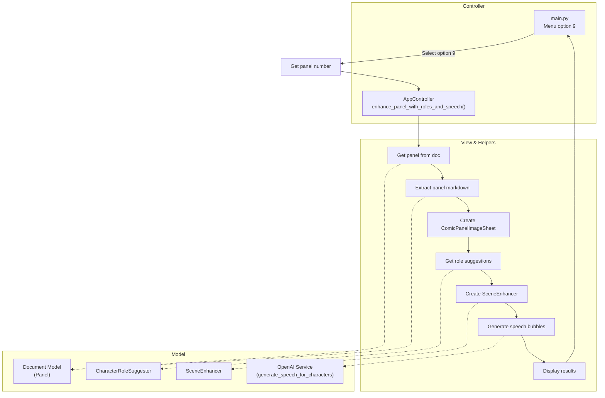
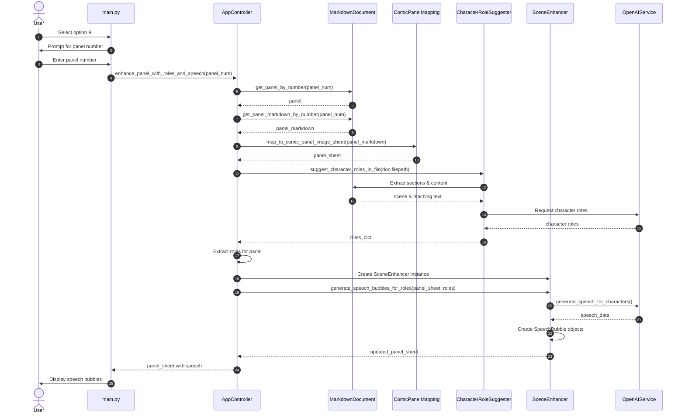

# Mermaid Diagrams for "Enhance Panel with Roles and Speech"

## Flow Diagram

## Sequence Diagram

These diagrams illustrate the flow and interactions for the "Enhance Panel with Roles and Speech" feature (option 9). The process involves:

1. Getting the panel markdown from the document model
2. Creating a ComicPanelImageSheet from the markdown
3. Getting character role suggestions using the CharacterRoleSuggester
4. Instantiating a SceneEnhancer to generate speech bubbles
5. Using OpenAI to generate speech content for the characters
6. Returning the enhanced panel with speech bubbles to display to the user

The implementation properly follows object-oriented principles by creating and using class instances for each service.
