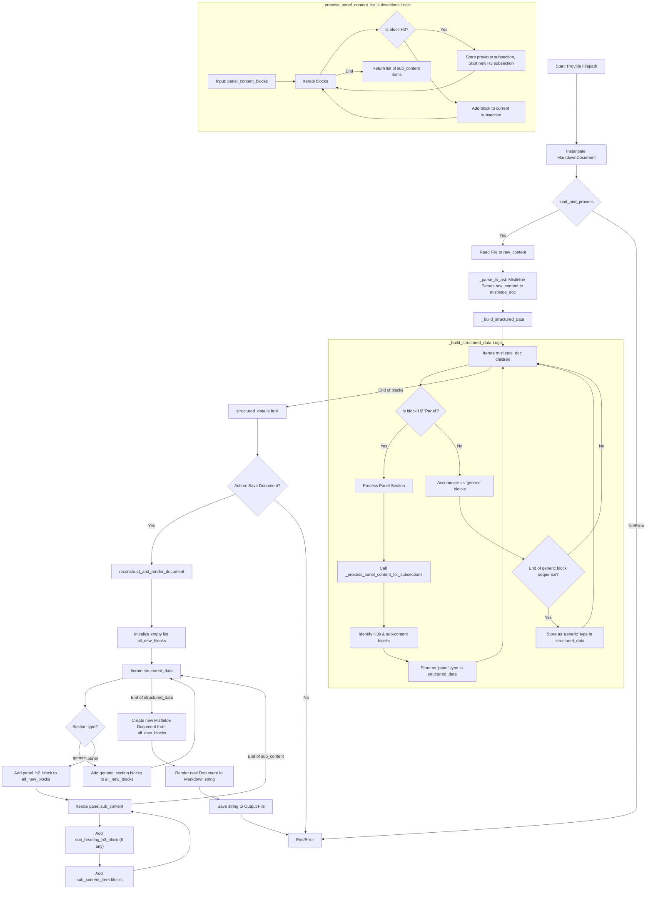

```mermaid
graph TD
    A[Start: Provide Filepath] --> B(Instantiate MarkdownDocument);
    B --> C{load_and_process};
    C -- Yes --> D[Read File to raw_content];
    C -- No/Error --> Z[End/Error];
    D --> E[_parse_to_ast: Mistletoe Parses raw_content to mistletoe_doc];
    E --> F[_build_structured_data];
    F --> G[Iterate mistletoe_doc children];
    G --> H{"Is block H2 'Panel'?"};
    H -- Yes --> I[Process Panel Section];
    I --> I1[Call _process_panel_content_for_subsections];
    I1 --> I2[Identify H3s & sub-content blocks];
    I2 --> J[Store as 'panel' type in structured_data];
    H -- No --> K[Accumulate as 'generic' blocks];
    K --> L{End of generic block sequence?};
    L -- Yes --> M[Store as 'generic' type in structured_data];
    L -- No --> G;
    J --> G;
    M --> G;
    G -- End of blocks --> N[structured_data is built];

    N --> O{Action: Save Document?};
    O -- Yes --> P[reconstruct_and_render_document];
    P --> Q[Initialize empty list all_new_blocks];
    Q --> R[Iterate structured_data];
    R --> S{Section type?};
    S -- generic --> T[Add generic_section.blocks to all_new_blocks];
    S -- panel --> U[Add panel_h2_block to all_new_blocks];
    U --> V[Iterate panel.sub_content];
    V --> W["Add sub_heading_h3_block (if any)"];
    W --> X[Add sub_content_item.blocks];
    X --> V;
    T --> R;
    V -- End of sub_content --> R;
    R -- End of structured_data --> Y[Create new Mistletoe Document from all_new_blocks];
    Y --> Y1[Render new Document to Markdown string];
    Y1 --> Y2[Save string to Output File];
    Y2 --> Z;
    O -- No --> Z;

    subgraph _build_structured_data Logic
        G
        H
        I
        I1
        I2
        J
        K
        L
        M
    end

    subgraph _process_panel_content_for_subsections Logic
        direction LR
        I1_A[Input: panel_content_blocks] --> I1_B[Iterate blocks]
        I1_B --> I1_C{Is block H3?}
        I1_C -- Yes --> I1_D[Store previous subsection, Start new H3 subsection]
        I1_C -- No --> I1_E[Add block to current subsection]
        I1_D --> I1_B
        I1_E --> I1_B
        I1_B -- End --> I1_F[Return list of sub_content items]
    end

```