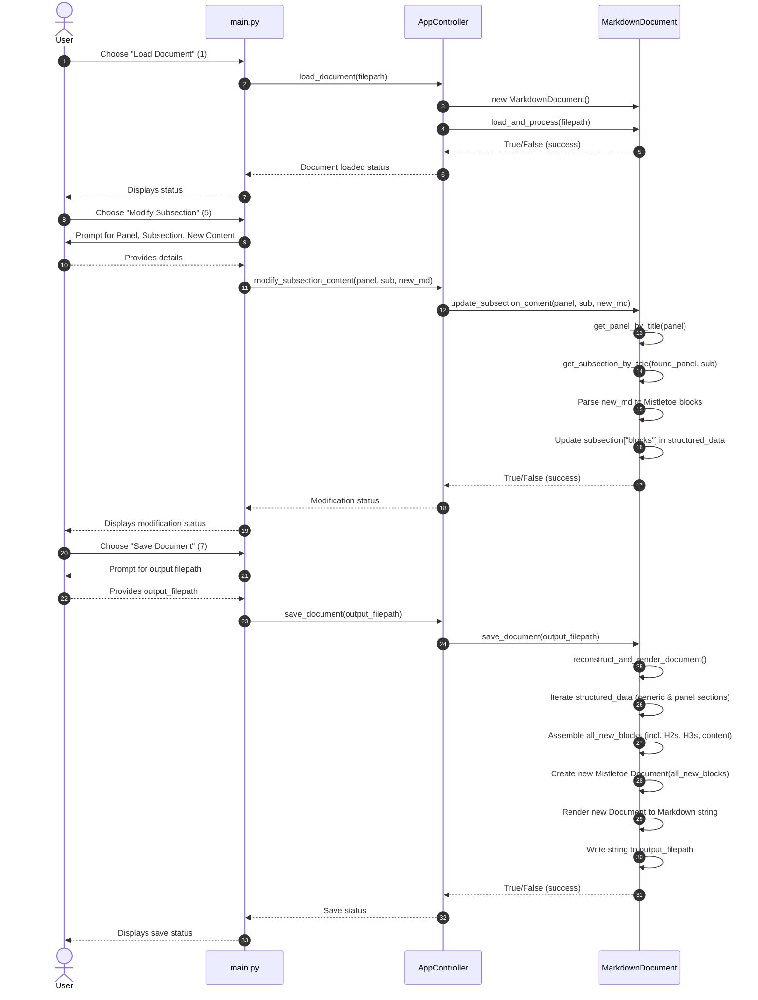

# Suggest Character Roles Only (all panels in a folder)

```mermaid
sequenceDiagram
    autonumber
    actor User
    participant CLI as main.py
    participant Controller as AppController
    participant Model as MarkdownDocument

    User->>CLI: Choose "Load Document" (1)
    CLI->>Controller: load_document(filepath)
    Controller->>Model: new MarkdownDocument()
    Controller->>Model: load_and_process(filepath)
    Model-->>Controller: True/False (success)
    Controller-->>CLI: Document loaded status
    CLI-->>User: Displays status

    User->>CLI: Choose "Modify Subsection" (5)
    CLI->>User: Prompt for Panel, Subsection, New Content
    User-->>CLI: Provides details
    CLI->>Controller: modify_subsection_content(panel, sub, new_md)
    Controller->>Model: update_subsection_content(panel, sub, new_md)
    Model->>Model: get_panel_by_title(panel)
    Model->>Model: get_subsection_by_title(found_panel, sub)
    Model->>Model: Parse new_md to Mistletoe blocks
    Model->>Model: Update subsection["blocks"] in structured_data
    Model-->>Controller: True/False (success)
    Controller-->>CLI: Modification status
    CLI-->>User: Displays modification status

    User->>CLI: Choose "Save Document" (7)
    CLI->>User: Prompt for output filepath
    User-->>CLI: Provides output_filepath
    CLI->>Controller: save_document(output_filepath)
    Controller->>Model: save_document(output_filepath)
    Model->>Model: reconstruct_and_render_document()
    Model->>Model: Iterate structured_data (generic & panel sections)
    Model->>Model: Assemble all_new_blocks (incl. H2s, H3s, content)
    Model->>Model: Create new Mistletoe Document(all_new_blocks)
    Model->>Model: Render new Document to Markdown string
    Model->>Model: Write string to output_filepath
    Model-->>Controller: True/False (success)
    Controller-->>CLI: Save status
    CLI-->>User: Displays save status


```
