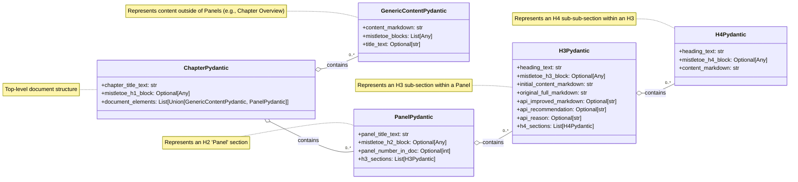

```mermaid
classDiagram
    direction LR

    class ChapterPydantic {
        +chapter_title_text: str
        +mistletoe_h1_block: Optional[Any]
        +document_elements: List[Union[GenericContentPydantic, PanelPydantic]]
    }

    class GenericContentPydantic {
        +content_markdown: str
        +mistletoe_blocks: List[Any]
        +title_text: Optional[str]
    }

    class PanelPydantic {
        +panel_title_text: str
        +mistletoe_h2_block: Optional[Any]
        +panel_number_in_doc: Optional[int]
        +h3_sections: List[H3Pydantic]
    }

    class H3Pydantic {
        +heading_text: str
        +mistletoe_h3_block: Optional[Any]
        +initial_content_markdown: str
        +original_full_markdown: str
        +api_improved_markdown: Optional[str]
        +api_recommendation: Optional[str]
        +api_reason: Optional[str]
        +h4_sections: List[H4Pydantic]
    }

    class H4Pydantic {
        +heading_text: str
        +mistletoe_h4_block: Optional[Any]
        +content_markdown: str
    }

    ChapterPydantic o-- "0..*" GenericContentPydantic : contains
    ChapterPydantic o-- "0..*" PanelPydantic : contains
    PanelPydantic   o-- "0..*" H3Pydantic : contains
    H3Pydantic      o-- "0..*" H4Pydantic : contains

    note for ChapterPydantic "Top-level document structure"
    note for PanelPydantic "Represents an H2 'Panel' section"
    note for H3Pydantic "Represents an H3 sub-section within a Panel"
    note for H4Pydantic "Represents an H4 sub-sub-section within an H3"
    note for GenericContentPydantic "Represents content outside of Panels (e.g., Chapter Overview)"

```