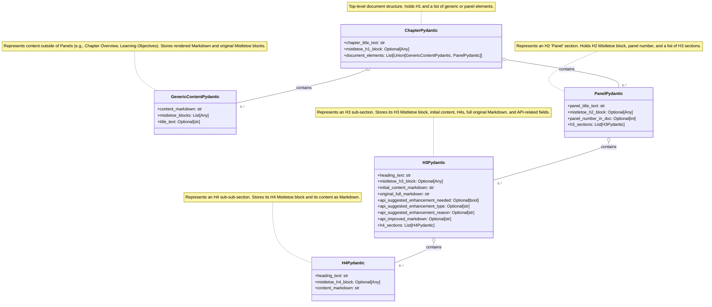

# Classes and their relationships in the document structure

```mermaid
classDiagram
    direction TD

    class ChapterPydantic {
        +chapter_title_text: str
        +mistletoe_h1_block: Optional[Any]
        +document_elements: List[Union[GenericContentPydantic, PanelPydantic]]
    }

    class GenericContentPydantic {
        +content_markdown: str
        +mistletoe_blocks: List[Any]
        +title_text: Optional[str]
    }

    class PanelPydantic {
        +panel_title_text: str
        +mistletoe_h2_block: Optional[Any]
        +panel_number_in_doc: Optional[int]
        +h3_sections: List[H3Pydantic]
    }

    class H3Pydantic {
        +heading_text: str
        +mistletoe_h3_block: Optional[Any]
        +initial_content_markdown: str
        +original_full_markdown: str
        +api_suggested_enhancement_needed: Optional[bool]
        +api_suggested_enhancement_type: Optional[str]
        +api_suggested_enhancement_reason: Optional[str]
        +api_improved_markdown: Optional[str]
        +h4_sections: List[H4Pydantic]
    }

    class H4Pydantic {
        +heading_text: str
        +mistletoe_h4_block: Optional[Any]
        +content_markdown: str
    }

    ChapterPydantic o-- "0..*" GenericContentPydantic : contains
    ChapterPydantic o-- "0..*" PanelPydantic : contains
    PanelPydantic   o-- "0..*" H3Pydantic : contains
    H3Pydantic      o-- "0..*" H4Pydantic : contains

    note for ChapterPydantic "Top-level document structure, holds H1 and a list of generic or panel elements."
    note for GenericContentPydantic "Represents content outside of Panels (e.g., Chapter Overview, Learning Objectives). Stores rendered Markdown and original Mistletoe blocks."
    note for PanelPydantic "Represents an H2 'Panel' section. Holds H2 Mistletoe block, panel number, and a list of H3 sections."
    note for H3Pydantic "Represents an H3 sub-section. Stores its H3 Mistletoe block, initial content, H4s, full original Markdown, and API-related fields."
    note for H4Pydantic "Represents an H4 sub-sub-section. Stores its H4 Mistletoe block and its content as Markdown."

```
