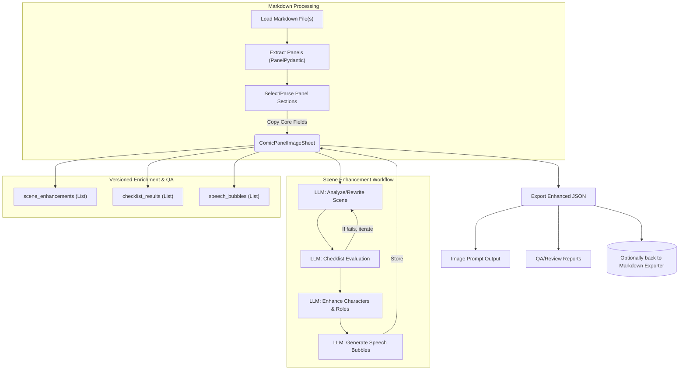
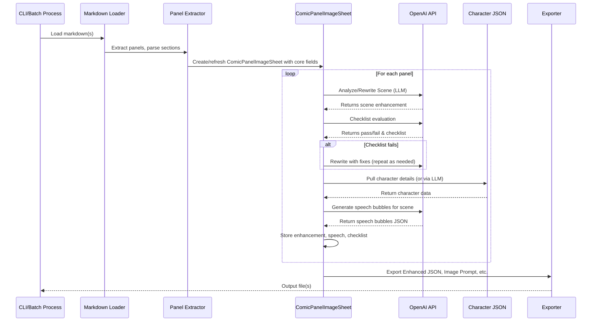
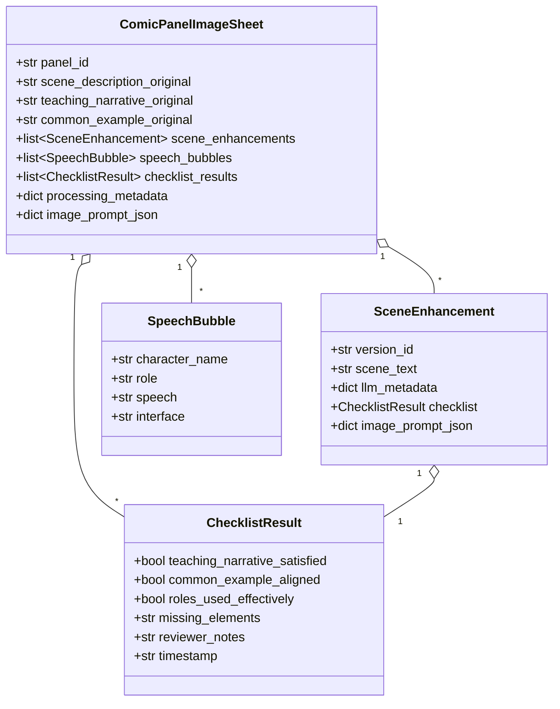

# **Step-by-Step LLM-Driven Panel Processing Pipeline**

## **High-Level Steps**

1. **Load Markdown Source**

   * (Single file/panel, all panels, or all files in directory)
2. **Extract/Select Panel(s)**

   * Choose one, all, or batch as per tier.
3. **For Each Panel:**

   1. **Parse Panel Content** (scene, teaching narrative, common example, etc.)
   2. **Ask LLM: What is the Scene Theme?**
   3. **Ask LLM: What Roles are Required?**
   4. **Ask LLM: Rewrite Scene with Required Roles**
   5. **Ask LLM: Evaluate Scene Against Checklist**
   6. **If Fails: Loop Back and Rewrite Until Satisfied**
   7. **Enhance Characters (name, visual\_tags, etc. from JSON or LLM)**
   8. **Ask LLM: Generate Speech Bubbles for Scene**
   9. **Assemble JSON Output for Enhanced Panel**
4. **Save Enhanced JSON (single, batch, or per file as needed)**

---

## **Mermaid Flow Diagram**

---

## **Mermaid Sequence Diagram**

## **Class/Data Structure Diagram (UML-style for Pydantic Upgrade Reference)**

---

## **Three-Tier Processing Support**

* **Tier 1:** Select a single panel to process (ideal for interactive or debugging).
* **Tier 2:** Process all panels in one markdown file (batch, for whole chapters).
* **Tier 3:** Process all markdown files in a directory (mass batch, for full curriculum builds).

**The diagrams above remain accurate—your orchestration just wraps more panels or files per tier.**

---

## **How This Will Help You**

* **Visual Traceability:** See every step and LLM call—perfect for debugging and QA.
* **Flexible Orchestration:** Each box in the diagram can be mapped to a function/method, pipeline stage, or even GUI step.
* **Easy Expansion:** Add more LLM steps, pre/post-processing, or QA logic as you iterate.
* **No Local Bias:** LLM does all high-order creative work; code only orchestrates and glues.

---

## **If/When You Want a GUI**

* The flow and sequence here could be the backend for a Tkinter or PyQt GUI.
* GUI would just add “panel/file/directory” selectors and progress/status visualization on top of this pipeline.
* You’ll get exactly the same output, just with more interactivity for manual review or edit-in-the-loop.

---

## **Anything Else?**

Would you like:

* Example code scaffolding (with stubs for each LLM call)?
* A YAML/JSON config format for these steps/prompts?
* A worked demo with a real markdown file?

**Just tell me your preferred next step—this design will scale with you!**
