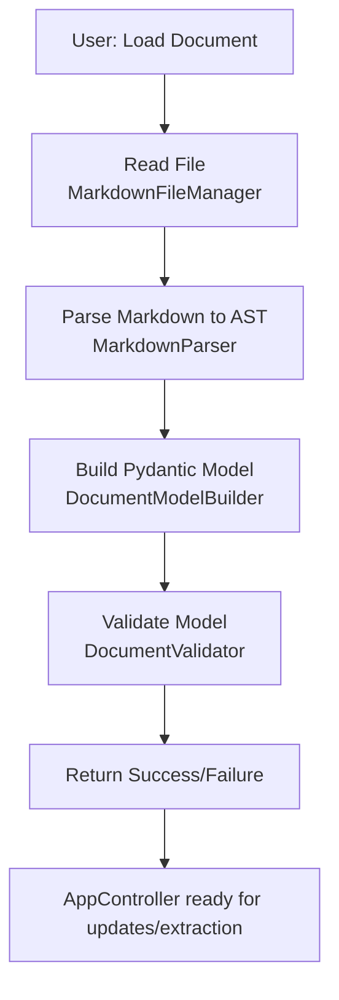

# Flow of Pydantic Models

```mermaid
flowchart TD
    A[User: Load Document] --> B[Read File<br>MarkdownFileManager]
    B --> C[Parse Markdown to AST<br>MarkdownParser]
    C --> D[Build Pydantic Model<br>DocumentModelBuilder]
    D --> E[Validate Model<br>DocumentValidator]
    E --> F[Return Success/Failure]
    F --> G[AppController ready for updates/extraction]
```
