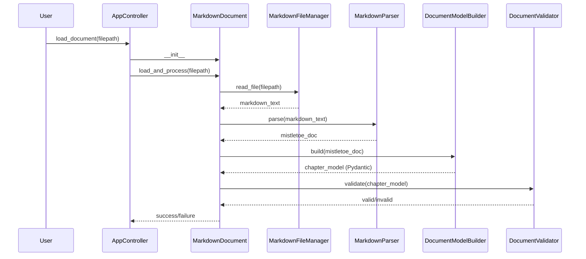

# Markdown Sequence Diagram

```mermaid
sequenceDiagram
    participant U as User
    participant AC as AppController
    participant MD as MarkdownDocument
    participant FM as MarkdownFileManager
    participant MP as MarkdownParser
    participant MB as DocumentModelBuilder
    participant DV as DocumentValidator

    U->>AC: load_document(filepath)
    AC->>MD: __init__
    AC->>MD: load_and_process(filepath)
    MD->>FM: read_file(filepath)
    FM-->>MD: markdown_text
    MD->>MP: parse(markdown_text)
    MP-->>MD: mistletoe_doc
    MD->>MB: build(mistletoe_doc)
    MB-->>MD: chapter_model (Pydantic)
    MD->>DV: validate(chapter_model)
    DV-->>MD: valid/invalid
    MD-->>AC: success/failure
```
