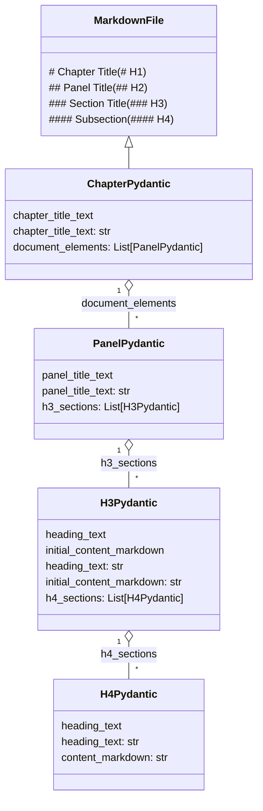
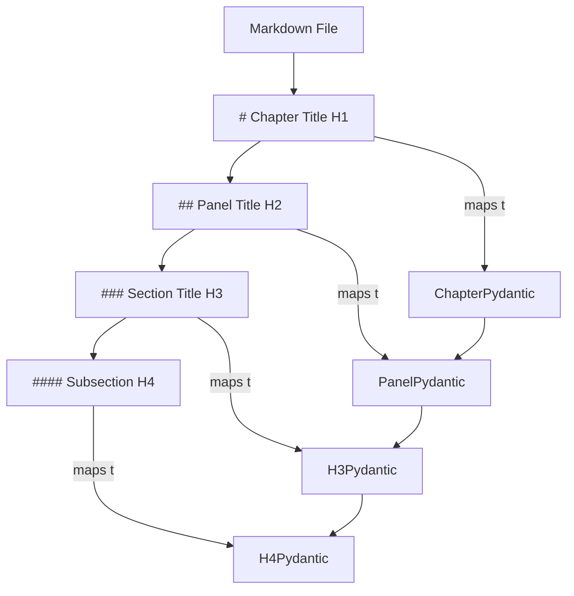

# Markdown to Pydantic Model Mapping

This document visualizes how a structured Markdown training file is mapped to the document model used in your codebase.

---

## Mermaid Class Diagram



---

## Mermaid Flowchart: File → Model Construction



---

## Markdown → Model Mapping Table

| Markdown Heading      | Model Class       | Key Field(s)                                   | Example Value                          |
| --------------------- | ----------------- | ---------------------------------------------- | -------------------------------------- |
| `# Chapter Title`     | `ChapterPydantic` | `chapter_title_text`                           | "From Monitoring to Observability"     |
| `## Panel Title`      | `PanelPydantic`   | `panel_title_text`                             | "The Midnight Alert..."                |
| `### Section Title`   | `H3Pydantic`      | `heading_text`, `initial_content_markdown`     | "Scene Description"                    |
| `#### Subsection`     | `H4Pydantic`      | `heading_text`, `content_markdown`             | "Step 1: Enable Comprehensive Logging" |
| Body Text/Code/Tables | Various           | `content_markdown`, `initial_content_markdown` | Paragraphs, lists, tables              |

---

## Brief Mapping Explanation

* Each **`# H1`** heading at the top of your markdown creates a `ChapterPydantic` instance.
* Each **`## H2`** heading (usually for panels/scenes) creates a `PanelPydantic` inside `document_elements`.
* Each **`### H3`** (sections within a panel) creates an `H3Pydantic` in `h3_sections`.
* Each **`#### H4`** under an H3 creates an `H4Pydantic` in `h4_sections`.
* All text/content beneath these headings are stored in the relevant `content_markdown` or `initial_content_markdown` fields.

---

# Step-by-Step Example: Mapping Your Markdown File

## Example Markdown Panel

```
## Panel 1: The Midnight Alert - Limitations of Traditional Monitoring

### Scene Description
A dimly lit operations center at 2 AM. ...
...
### Teaching Narrative
Traditional monitoring has created a dangerous illusion ...
...
### Common Example of the Problem
A major retail bank recently experienced ...
...
```

---

## Parsing & Model Tree Construction

* **Panel 1** (`## ...`) → `PanelPydantic`

  * **panel\_title\_text**: `"Panel 1: The Midnight Alert - Limitations of Traditional Monitoring"`
  * **h3\_sections**: List of `H3Pydantic`:

    * `"Scene Description"`: Contains the narrative under this heading.
    * `"Teaching Narrative"`: Contains the teaching block.
    * `"Common Example of the Problem"`: Contains the example story.
    * Others as defined in your markdown.

---

## Sample Pydantic Model Code

```python
panel1 = PanelPydantic(
    panel_title_text="Panel 1: The Midnight Alert - Limitations of Traditional Monitoring",
    panel_number_in_doc=1,
    h3_sections=[
        H3Pydantic(
            heading_text="Scene Description",
            initial_content_markdown="A dimly lit operations center at 2 AM...",
            h4_sections=[]
        ),
        H3Pydantic(
            heading_text="Teaching Narrative",
            initial_content_markdown="Traditional monitoring has created a dangerous illusion...",
            h4_sections=[]
        ),
        H3Pydantic(
            heading_text="Common Example of the Problem",
            initial_content_markdown="A major retail bank recently experienced ...",
            h4_sections=[]
        ),
        # ... More H3 sections as parsed
    ]
)
```

---

## Chapter Model Example

```python
chapter = ChapterPydantic(
    chapter_title_text="From Monitoring to Observability - The Logging Evolution",
    document_elements=[
        panel1,
        # ... More panels
    ]
)
```

---

## Recap

* **Markdown File** = *Hierarchical headings & content*
* **Pydantic Model** = *Tree of Chapter > Panels > Sections > Subsections*

---
