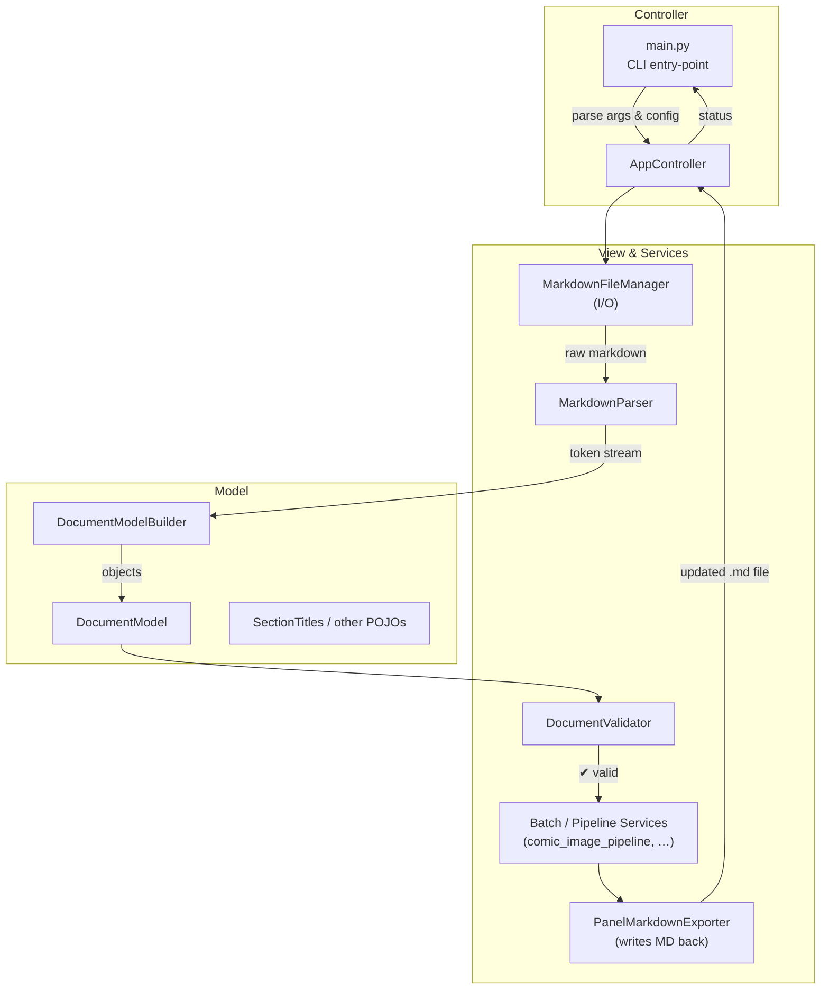
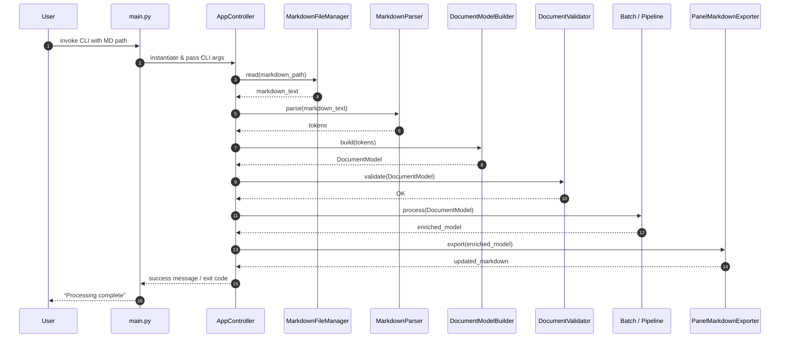

# Request 1: Load Markdown File and Process

## Overview

This document describes the flow of control and sequence of interactions for loading a Markdown file, parsing it, validating its content, and exporting the processed data back to Markdown format. The system follows a Model-View-Controller (MVC) architecture, with components grouped into **Controller**, **Model**, and **View & Services**.

### 1 ️Flow-of-Control (Flowchart)

---

### 2 ️Sequence-of-Interactions (Sequence Diagram)

---

### How to Use

* Paste either diagram into any Mermaid-enabled editor (or your existing **Kroki** Docker instance) to render PNG/SVG assets automatically.
* The MVC grouping can be expanded in future iterations—for example, you might split the **View** cluster into *Renderers* vs. *Report Generators* once those flows become distinct.
* When additional entry points appear in `main.py` (e.g. a **batch** flag that skips validation), you can replicate the same pattern and add diverging branches or alternate lifelines.

Let me know if you’d like a second set of diagrams for any other paths that `main.py` can launch (e.g. *“Generate scene JSON”* or *“Sync image metadata”*) and I’ll extend the models accordingly.
