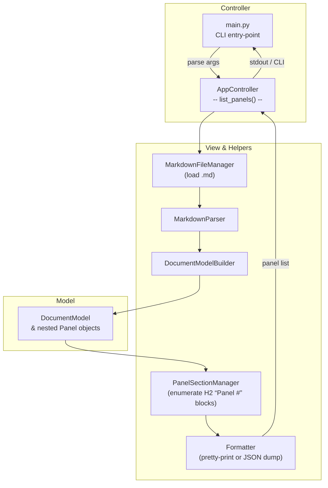
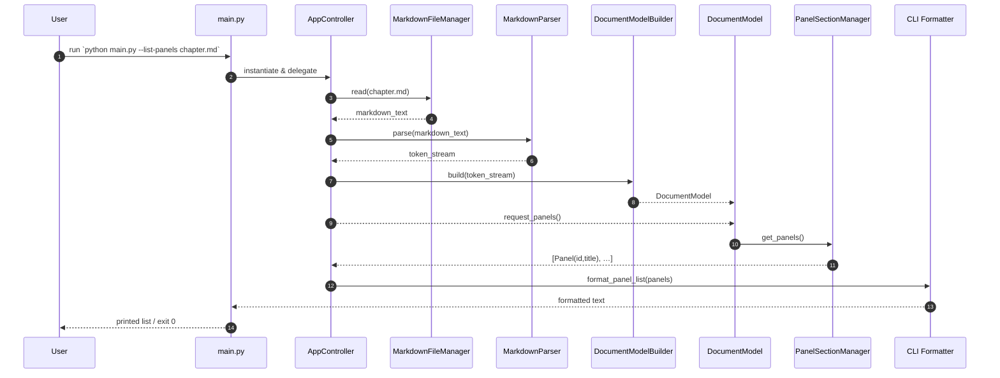

Below is an **MVC-oriented** depiction of the “**List Panels**” execution path that begins in **`src/main.py`**.
Just like the earlier diagram set, it contains both a **flowchart** (control flow) and a **sequence diagram** (runtime interactions).
These reflect the modules and folders reported in `dir_report_may_19_2025.txt` .

---

### 1 ️⃣ Flow-of-Control (Flowchart)

---

### 2 ️⃣ Sequence-of-Interactions (Sequence Diagram)

---

### Usage Notes

1. **Render** – Paste either diagram into any Mermaid-enabled viewer or your Kroki server to obtain PNG/SVG assets.
2. **Extending** – If `list_panels` later gains flags for JSON output, paging, or filtering, simply add branches from **PanelSectionManager** to the new formatter or export service.
3. **Documentation** – Embedding these diagrams in your repo’s `README.md` or internal wiki helps new contributors grasp the lightweight “read-parse-enumerate” flow without wading through code first.

Let me know if you’d like additional diagrams for other sub-commands in `main.py` (e.g., **sync-images**, **generate-scene-json**, etc.) and I’ll create matching MVC views.
