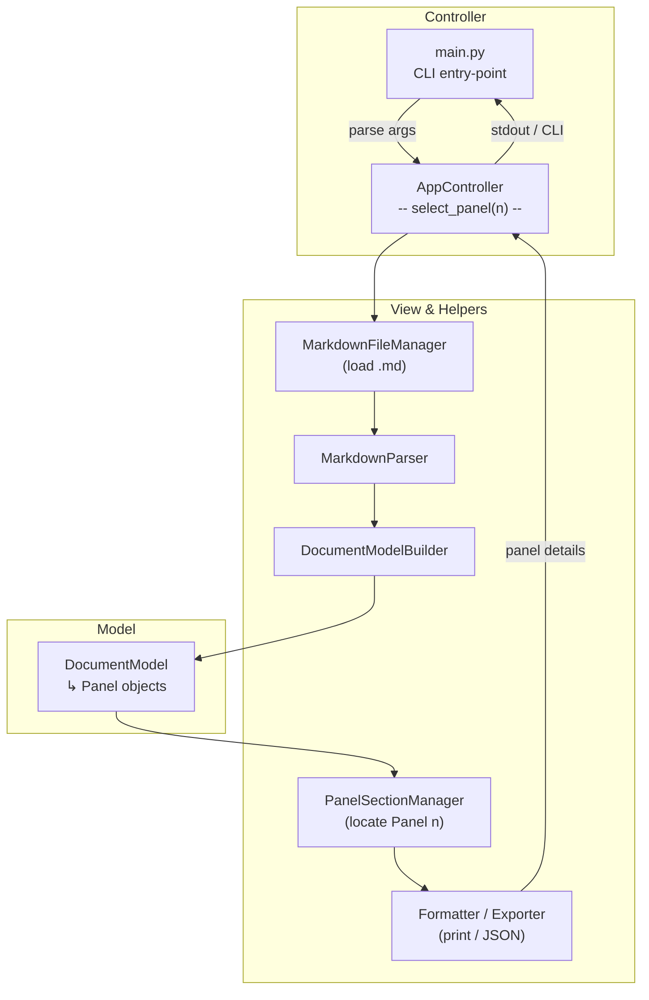
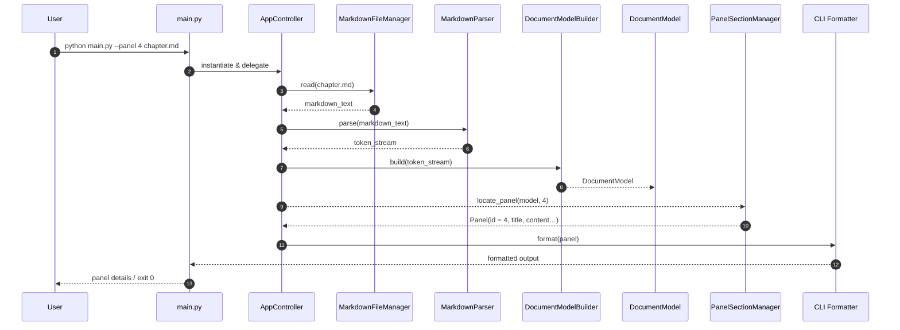

Below are **Mermaid-ready** diagrams for the **“Select Panel by Number”** command path that originates in **`src/main.py`**.
They follow the same MVC-centric style you requested earlier and use your current directory layout as the source of truth .

---

### 1 ️⃣  Flow-of-Control (Flowchart)

---

### 2 ️⃣  Sequence-of-Interactions (Sequence Diagram)

---

### Using These Diagrams

1. **Render** – Paste either block into any Mermaid-enabled viewer (or your Kroki container) to get SVG/PNG artifacts.
2. **Extend** – If selecting a panel triggers additional actions (e.g., opening an editor, exporting JSON), simply branch from **`PanelSectionManager`** to those services.
3. **Document** – Embedding the flowchart and sequence diagram in your repo (e.g., `docs/architecture.md`) helps new contributors quickly understand this specific control path.

Let me know if you need diagrams for any other sub-commands (such as **sync-images**, **generate-scene-json**, or **validate-doc**) and I’ll prepare matching MVC views.
