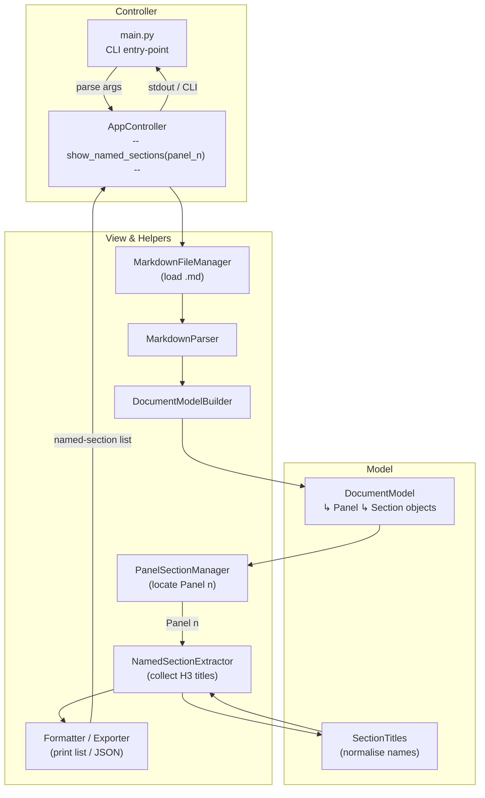
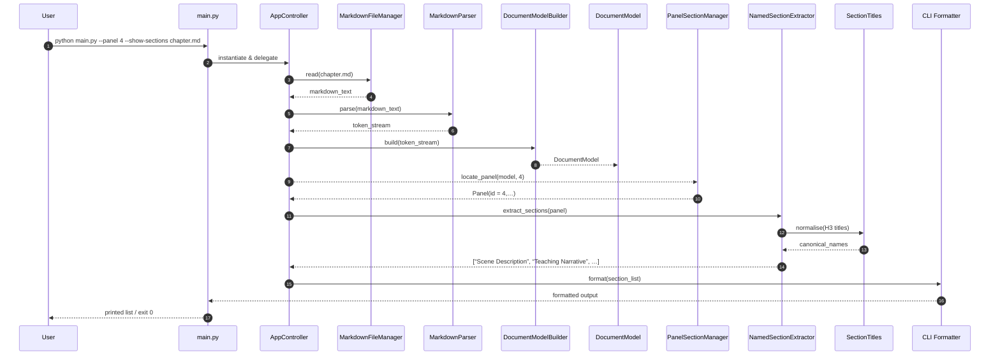

# Operation: Show Named Sections

## Command: `python main.py --panel 4 --show-sections chapter.md`

### 1 ️⃣ Flow-of-Control (Flowchart)

---

### 2 ️⃣ Sequence-of-Interactions (Sequence Diagram)

---

### How to Render & Extend

* **Render** – Paste either block into any Mermaid-enabled editor (or your Kroki instance) to obtain SVG/PNG assets.
* **Extend** – If you later add filters (e.g., “only empty sections”), branch from **`NamedSectionExtractor`** to the relevant filter service and from **`Formatter`** to a JSON/CSV exporter.
* **Document** – Drop these diagrams into `docs/architecture.md` (or similar) so new contributors can immediately visualise this control path.

Let me know if you’d like diagrams for any other sub-commands (e.g., **sync-images**, **validate-doc**) and I’ll generate matching MVC views.
