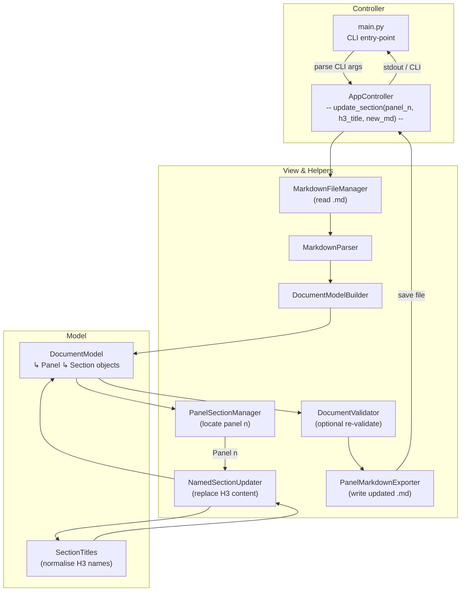
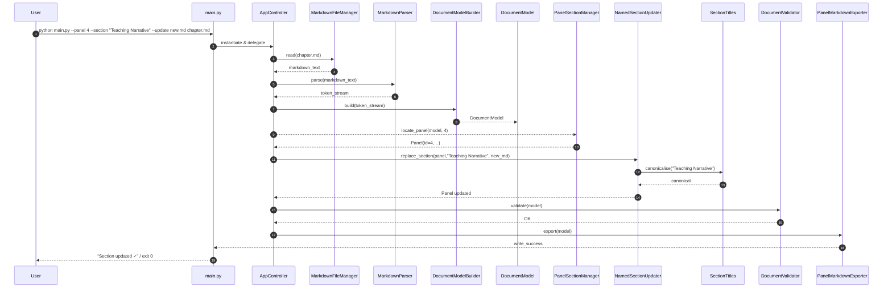

Below is an **MVC-aligned** map of the *“Update Named Section in Panel”* command exposed by **`src/main.py`**.
As before, you get a **flowchart** and a **sequence diagram** you can paste straight into any Mermaid-enabled renderer (or your Kroki container).
Module names match the folders and files listed in `dir_report_may_19_2025.txt` .

---

### 1 ️⃣ Flow-of-Control (Flowchart)

---

### 2 ️⃣ Sequence-of-Interactions (Runtime View)

---

### Usage & Next Steps

* **Render** – Copy either diagram into your Mermaid viewer or run it through your Kroki Docker service to produce SVG/PNG assets for docs or slide decks.
* **Extensibility** –

  * If you add content-enrichment via OpenAI, branch from **`NamedSectionUpdater`** to **`openai_service`** before the write-back step.
  * For dry-run or diff-only modes, branch from **`PanelMarkdownExporter`** to **`diff_utils`** rather than writing to disk.
* **Documentation** – Insert these diagrams into an architecture guide (e.g., `docs/cli_flows.md`) so contributors instantly see how updates propagate through the MVC layers.

Let me know if you’d like comparable diagrams for other commands—*validate-doc*, *sync-images*, *export-json*, etc.—and I’ll whip them up in the same style.
