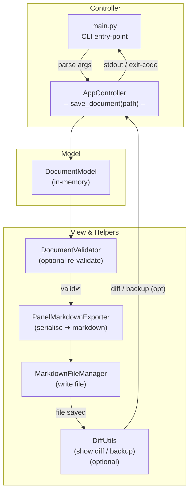
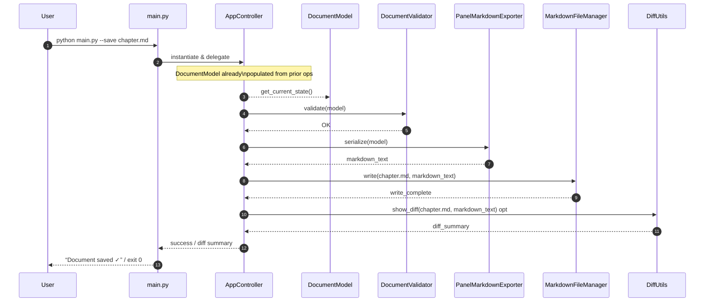

Below is an **MVC-styled** depiction of the *“Save Document”* action exposed by **`src/main.py`**.
As with the prior commands, you get both a **flowchart** (control flow) and a **sequence diagram** (runtime interactions).
Module names mirror the current repository layout in `dir_report_may_19_2025.txt` .

---

### 1 ️⃣ Flow-of-Control (Flowchart)

---

### 2 ️⃣ Sequence-of-Interactions (Runtime View)

---

### Usage & Extension Tips

| Aspect                     | Guidance                                                                                                                                                |
| -------------------------- | ------------------------------------------------------------------------------------------------------------------------------------------------------- |
| **Rendering**              | Paste either diagram into any Mermaid-enabled editor (or your Kroki Docker container) to obtain SVG/PNG artifacts.                                      |
| **Validation Toggle**      | If you add a `--skip-validation` flag, simply branch from **`AppController`** directly to **`PanelMarkdownExporter`** when the flag is set.             |
| **Back-ups / Revisioning** | For automatic versioning, branch from **`MarkdownFileManager`** to a new **`RevisionStore`** service before the final write.                            |
| **Dry-Run**                | Route `markdown_text` to `stdout` (or a temp file) instead of **`MarkdownFileManager.write`** when users pass `--dry-run`, avoiding filesystem changes. |

These visuals round out the core CLI flows.
Let me know if you’d like similar diagrams for any additional commands, or if you need sequence details expanded to include OpenAI enrichment calls, diff previews, or error-handling branches.
