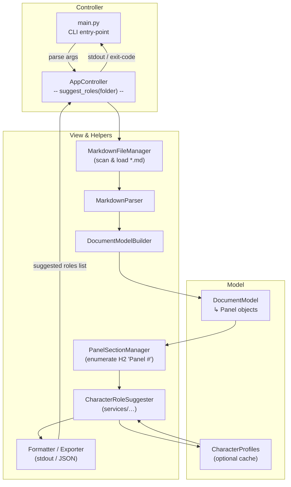
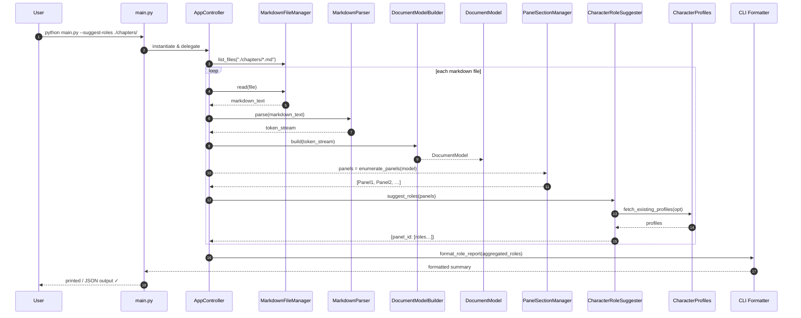

# Suggest Character Roles Only (all panels in a folder)

## Overview

Below are **Mermaid-ready** diagrams for the **“Suggest Character Roles Only (all panels in a folder)”** command exposed by **`src/main.py`**.
They follow the same MVC format you requested for earlier flows and use the modules shown in your repository listing .

---

### 1 ️⃣ Flow-of-Control (Flowchart)

---

### 2 ️⃣ Sequence-of-Interactions (Runtime View)

---

### Implementation Notes & Extensions

| Aspect              | Guidance                                                                                                                                                                   |
| ------------------- | -------------------------------------------------------------------------------------------------------------------------------------------------------------------------- |
| **Bulk Processing** | The loop in the sequence diagram emphasises batch scanning of every `.md` file in the folder.                                                                              |
| **Caching**         | If role suggestions depend on prior character profiles, **`CharacterProfiles`** can be injected before the call to **`CharacterRoleSuggester`** for context-aware results. |
| **Output Modes**    | Add a `--json` or `--csv` flag to route data from **`Formatter / Exporter`** to a file instead of stdout.                                                                  |
| **Parallelism**     | Large folders can be processed concurrently by branching from **`AppController`** into a worker pool before parsing each file.                                             |

Copy either block into a Mermaid-enabled viewer (or your Kroki instance) to generate SVG/PNG diagrams for documentation or slide decks.
Need similar diagrams for additional commands? Just let me know!
