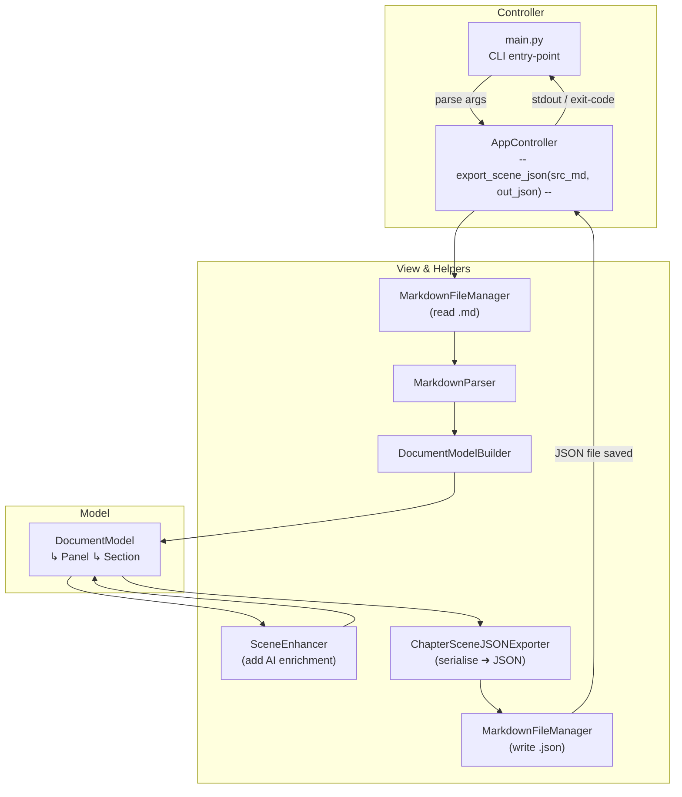
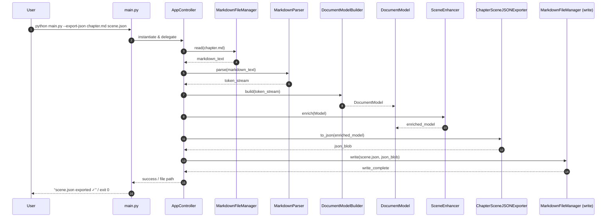

Below are **Mermaid-compatible** diagrams for the **“Export Enriched Scene JSON”** command in **`src/main.py`**.
They follow the same MVC style as the earlier sets and reference the modules present in your repo (e.g. `scene_enhancer.py`, `chapter_scene_json_exporter.py`) .

---

### 1 ️⃣ Flow-of-Control (Flowchart)

---

### 2 ️⃣ Sequence-of-Interactions (Runtime View)

---

### Implementation & Extension Tips

| Aspect                | Guidance                                                                                                                             |
| --------------------- | ------------------------------------------------------------------------------------------------------------------------------------ |
| **AI Calls**          | `SceneEnhancer` typically leverages **`openai_service.py`**. Add retry logic or rate-limit handling there if you expect high volume. |
| **JSON Schema**       | Keep a version field inside the JSON output. Future changes to panel or character structures won’t break downstream consumers.       |
| **Output Location**   | Accept an optional `--out-dir` flag. Branch from **`AppController`** to adjust the target path before the final write.               |
| **Dry-Run / Preview** | If users pass `--dry-run`, route `json_blob` to `stdout` instead of calling **`MarkdownFileManager.write`**.                         |
| **Batch Mode**        | For folder-wide exports, loop the “Load → Enhance → Export” steps inside `AppController`, similar to the role-suggestion flow.       |

Copy either diagram into any Mermaid editor (or your Kroki Docker instance) to generate SVG/PNG artifacts for documentation or slide decks.

Need diagrams for additional commands or error-handling branches? Just let me know!
