# Chapter 1: Fundamentals of SRE Metrics

## **Chapter Overview: "Fundamentals of SRE Metrics"**

This chapter introduces the critical shift from traditional infrastructure-focused monitoring to outcome-based metrics that actually reflect customer experience and business impact. Set within high-stakes financial services environments, it explores how superficial metrics give a false sense of system health, leading to outages, failed transactions, and regulatory violations. Using scenes, examples, and practical frameworks, it maps out the evolution from basic monitoring to deep observability, ties in the regulatory dimension, and emphasizes instrumentation at the code level to ensure visibility is embedded, not bolted on.

______________________________________________________________________

## **Learning Objectives**

By the end of this chapter, readers should be able to:

1. Differentiate between traditional infrastructure metrics and customer-outcome-driven SRE metrics.
2. Recognize the risks of relying solely on superficial or component-level monitoring.
3. Describe the metrics evolution pathway: Monitoring → Metrics → Observability.
4. Design metrics that quantify business impact, customer experience, and regulatory compliance.
5. Implement Service Level Indicators (SLIs) and Objectives (SLOs) based on service criticality.
6. Build integrated metrics frameworks that align engineering, business, and compliance requirements.
7. Apply effective instrumentation strategies directly into service codebases.

______________________________________________________________________

## **Key Takeaways**

- **Healthy Servers ≠ Happy Customers**: Metrics must measure success from the user's perspective—not just CPU stats that make ops teams feel warm and fuzzy.
- **You Need to See the Crash Before You Hear It**: True observability lets you *predict* and *understand* failures, not just acknowledge they happened.
- **Bad Metrics Cost Money**: Especially in banking, where a bad dashboard can cost millions and make regulators pop out of the bushes.
- **SLIs & SLOs Aren’t Decorations**: They're business-aligned performance contracts, not fantasy football stats for nerds.
- **Metrics Aren’t Magic Dust**: If you don’t instrument your code with the right hooks, all your dashboards are just pretty lies.
- **Compliance Metrics Exist to Haunt You**: So integrate them before they integrate you... into an audit report.
- **Everything Ties to the Customer**: If a metric doesn't inform customer experience or business decision-making, it’s just noise.

______________________________________________________________________

## Panel 1: Why Traditional Metrics Fail

### Scene Description

The senior SRE is standing next to a new team member, pointing towards two monitors on the desk. The left monitor displays a dashboard with all indicators glowing green, suggesting everything is operating smoothly. The right monitor, however, shows a customer support queue filled with transaction failure reports, indicating unresolved issues affecting end-users. Below is a textual representation of the two monitors to better visualize the disconnect:

```
+-----------------------------+      +-----------------------------------+
|      System Dashboard       |      |      Customer Support Queue      |
|-----------------------------|      |-----------------------------------|
|  CPU Usage:       [  OK  ]  |      |  1. Transaction failed: #12345   |
|  Memory Usage:    [  OK  ]  |      |  2. Payment not processed: #12346|
|  Disk Utilization:[  OK  ]  |      |  3. Timeout error: #12347        |
|  Network Status:  [  OK  ]  |      |  4. Transaction failed: #12348   |
|                             |      |  ...                             |
+-----------------------------+      +-----------------------------------+
```

This contrast highlights the critical flaw in relying solely on traditional metrics, as they fail to reflect the real-world experience of users.

### Teaching Narrative

SRE metrics fundamentally differ from traditional IT monitoring by measuring what matters to users rather than infrastructure health. While traditional monitoring captures system state (CPU, memory, disk utilization), SRE metrics measure service outcomes from the customer perspective. These outcome-based metrics create a direct link between technical measurements and business impact, enabling teams to understand if systems are truly meeting user needs regardless of internal component status.

### Common Example of the Problem

A major credit card authorization system shows perfect health metrics across all infrastructure components:

| Metric | Value | Status |
| ----------------------- | -------- | ------- |
| CPU Utilization | 15% | Healthy |
| Memory Usage | 40% | Healthy |
| Network Bandwidth Usage | 30% | Healthy |
| Service Health Checks | All "OK" | Healthy |

At first glance, these metrics suggest the system is operating flawlessly. However, the customer support queue tells a different story:

| Observation | Evidence |
| --------------------- | ------------------------------------------------------------------------ |
| Declined Transactions | High volume of declined payment reports from customers. |
| Merchant Complaints | Multiple reports of failed purchases affecting business revenue. |
| Support Queue Volume | Overflowing with urgent customer issues related to transaction failures. |

The disconnect lies in what is being measured. The monitoring system focuses only on infrastructure health, such as CPU and memory usage, while ignoring critical service outcomes like transaction success rates. This creates a dangerous false sense of security: the system appears healthy internally, but business operations are actively failing. To address this, teams need outcome-based metrics that align with user experience and business impact.

### SRE Best Practice: Evidence-Based Investigation

To implement an evidence-based approach to investigation, follow this checklist of best practices for transaction-focused metrics that measure actual customer outcomes:

#### Checklist for Evidence-Based Investigation:

1. **Authorization Success Rate**

   - Track the percentage of approved vs. attempted transactions.
   - Investigate anomalies in success rates to identify potential system or user experience issues.

2. **Segmented Success Metrics**

   - Measure success rates segmented by key attributes such as:
     - Card type (e.g., credit, debit, prepaid).
     - Merchant category (e.g., retail, travel, digital goods).
     - Transaction value (e.g., low-value micropayments vs. high-value purchases).
   - Use these insights to identify patterns and improve reliability for specific customer groups.

3. **Latency Distribution Metrics**

   - Monitor latency across percentiles (e.g., p50, p90, p99) to capture a full picture of user experience.
   - Avoid relying on averages, as they can mask outliers affecting significant portions of users.

4. **Decline Rate Metrics**

   - Collect and classify decline rates with granular failure reason codes (e.g., insufficient funds, fraud, processor errors).
   - Correlate failure reasons with specific system behaviors or external dependencies to streamline troubleshooting.

5. **End-to-End Transaction Completion Metrics**

   - Measure the full transaction lifecycle, including all processing stages from initiation to completion.
   - Ensure metrics span across system boundaries to detect and address bottlenecks or failures in the entire process.

#### Example Workflow for Issue Investigation:

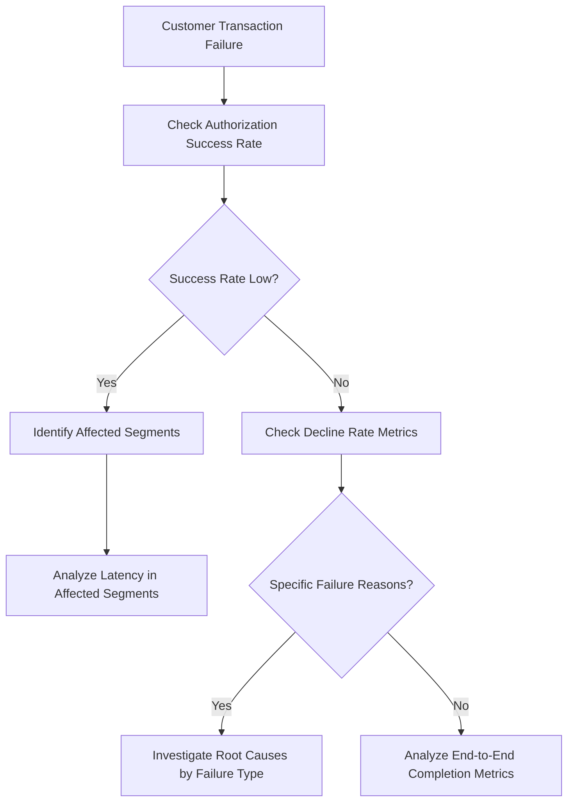

By incorporating this checklist and workflow, teams can systematically identify and resolve issues affecting customer outcomes, ensuring a data-driven and customer-focused approach to reliability.

### Banking Impact

For authorization systems, the gap between healthy infrastructure metrics and failed transactions creates direct revenue impact, customer frustration, and merchant dissatisfaction. When monitoring focuses only on system health, authorization failures can continue for hours before detection, potentially causing millions in lost transactions, damaged customer trust, and regulatory concerns.

#### Real-World Example: Case of Bank X

Consider the case of Bank X, a leading global financial institution. During a routine maintenance window, their monitoring systems showed all infrastructure components as operational—CPU, memory, and disk utilization were well within thresholds. However, customers began flooding support lines, reporting declined card transactions at merchants worldwide.

What went unnoticed was an upstream API latency issue in the authorization service. Traditional monitoring tools failed to detect the problem because they focused solely on infrastructure health, not on service outcomes. Over the course of six hours, Bank X experienced over 500,000 declined transactions, resulting in an estimated $20 million in lost revenue. The incident also led to a spike in customer complaints, social media backlash, and significant reputational damage.

This case highlights the critical need for outcome-based metrics that measure the customer experience directly. By adopting SRE practices and implementing service-level indicators (SLIs) such as transaction success rates and end-to-end latency, Bank X could have detected the issue within minutes and initiated a faster resolution. In the financial sector, where every transaction matters, bridging the gap between traditional metrics and customer-centric measurements is essential to protect both revenue and trust.

### Implementation Guidance

To successfully implement outcome-based metrics, follow these steps:

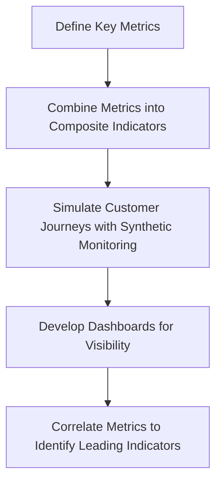

1. **Define Key Metrics**: Identify transaction success metrics that directly reflect customer experience outcomes, such as transaction completion rates or error frequencies.
2. **Combine Metrics into Composite Indicators**: Create composite metrics by integrating technical performance (e.g., latency, error rates) with business success indicators (e.g., revenue impact, user retention).
3. **Simulate Customer Journeys with Synthetic Monitoring**: Implement synthetic transaction monitoring tools to mimic real customer interactions and measure success rates across critical user flows.
4. **Develop Dashboards for Visibility**: Build dashboards prominently displaying transaction success rates alongside system health metrics to provide a unified view of service performance.
5. **Correlate Metrics to Identify Leading Indicators**: Analyze relationships between infrastructure metrics (e.g., CPU, memory usage) and transaction success metrics to pinpoint leading indicators of potential issues.

## Panel 2: Metrics Evolution Pathway

### Scene Description

The evolution of a team's monitoring capability is represented as a three-stage progression:

1. **Basic Monitoring**: A simplistic up/down dashboard that indicates binary system states (e.g., operational or non-operational). This stage provides a basic alert mechanism but lacks depth in understanding system health.

2. **Metrics-Driven Monitoring**: Introduction of metrics displayed as graphs and numerical values. This stage offers quantitative measurements, enabling the team to assess the severity of issues and gain better visibility into system performance.

3. **Comprehensive Observability**: A sophisticated system capable of pattern recognition, such as detecting anomalies in a fraud detection system. This stage provides causal insights, allowing the team to understand why issues occur and act proactively.

Below is a text-based representation of this evolution:

```plaintext
[Basic Monitoring] --> [Metrics-Driven Monitoring] --> [Comprehensive Observability]
   Up/Down Status          Graphs & Numbers              Pattern Recognition
                           Quantitative Insights          Causal Insights
```

This pathway illustrates the increasing sophistication in measurement and the transformation of raw data into actionable intelligence.

### Teaching Narrative

Metrics maturity follows a clear evolution from basic monitoring through metrics to comprehensive observability. This progression represents a journey of increasing measurement sophistication: monitoring tells you if something is broken (binary state), metrics tell you how badly it's broken (quantitative measurement), and observability enables you to understand why it's breaking (causal insight). Each stage builds on the previous, adding layers of measurement depth that transform raw data into actionable intelligence about system behavior.

### Common Example of the Problem

A bank's fraud detection system appears healthy according to conventional metrics:

| Metric | Value | Insight Provided |
| -------------------------- | --------------- | ---------------------------------------- |
| Service Availability | 100% | System is operational with no downtime. |
| API Response Time | 3ms | Fast response times for API calls. |
| API Error Rate | 0.1% | Minimal errors encountered in API calls. |
| CPU and Memory Utilization | Normal | Resources are not overburdened. |
| Database Connections | All functioning | Database connectivity is intact. |

Despite these positive indicators, customer complaints about legitimate transactions being incorrectly declined are increasing exponentially. This reveals a critical gap: the system is not measuring the **false positive rate** in the fraud detection algorithm.

To illustrate this gap, consider the following table comparing existing metrics to the missing observability layers:

| Existing Metric | Missing Metric (Gap) | Why It Matters |
| -------------------------- | ----------------------------- | ----------------------------------------------------------------- |
| API Error Rate | False Positive Rate | Indicates how often legitimate transactions are flagged as fraud. |
| CPU and Memory Utilization | Algorithm Decision Latency | Helps identify delays in fraud detection logic. |
| Service Availability | Transaction Pattern Anomalies | Captures irregularities in transaction flows. |

The missing metrics require deeper observability across transaction patterns, customer behavior, and decision boundaries. These insights can transform raw operational data into actionable intelligence, enabling the detection and resolution of systemic flaws in the fraud detection system.

### SRE Best Practice: Evidence-Based Investigation

Implement a progressive metrics hierarchy that builds from basic health to comprehensive observability. Use the following checklist to guide your system's evolution:

#### Checklist for Metrics Maturity:

1. **Foundational Availability Metrics**

   - [ ] Monitor service up/down status.
   - [ ] Track endpoint response success rates.

2. **Performance and Capacity Metrics**

   - [ ] Measure response times for critical endpoints.
   - [ ] Monitor queue depths in key processing systems.
   - [ ] Track throughput rates to detect bottlenecks.

3. **Business Outcome Metrics**

   - [ ] Record transaction success rates for key workflows.
   - [ ] Monitor approval percentages for automated or manual processes.
   - [ ] Track false positive rates to improve system accuracy.

4. **Customer Experience Metrics**

   - [ ] Analyze completion rates for user journeys.
   - [ ] Identify abandonment points to reduce friction.
   - [ ] Measure friction levels across critical customer interactions.

5. **Causal Relationship Metrics**

   - [ ] Identify correlation patterns between metrics and incidents.
   - [ ] Utilize anomaly indicators to predict potential failures.
   - [ ] Leverage prediction metrics for proactive system improvements.

Each stage builds on the previous, ensuring a systematic approach to evidence-based investigation. Progress through these layers to transform raw data into actionable insights for system observability.

### Banking Impact

In fraud detection systems, the gap between basic metrics and true observability directly impacts the balance between fraud prevention and customer experience. Without observability metrics that reveal false positive patterns by merchant category, geographic anomalies, or time-based triggers, banks must choose between excessive fraud exposure or frustrating legitimate customers. Enhanced metrics enable precision tuning that simultaneously improves fraud capture and customer satisfaction, directly affecting both security posture and revenue retention.

### Implementation Guidance

To illustrate the step-by-step progression, consider how a bank might evolve its metrics maturity to enhance a fraud detection system:

1. **Assess current metrics maturity and establish roadmap across monitoring-metrics-observability spectrum**

   - Evaluate the existing setup: Are there basic uptime/downtime alerts? Are there metrics tracking transaction volumes or error rates?
   - Define goals for moving from basic monitoring (binary states) to metrics (quantitative insights) and ultimately to observability (causal insights).
   - Example: The bank identifies that it currently has basic transaction failure alerts but lacks metrics on transaction latency or fraud pattern detection.

2. **Implement business outcome metrics that measure algorithm effectiveness beyond system performance**

   - Focus on metrics that tie directly to business goals, such as fraud prevention rates or customer complaint trends.
   - Example: Introduce a metric for "fraud detection accuracy" that measures the percentage of flagged transactions correctly identified as fraudulent.

3. **Develop correlation metrics that identify relationships between seemingly unrelated measurements**

   - Identify and track metrics that provide deeper insights when analyzed together, such as transaction spikes and unusual geographic patterns.
   - Example: Correlate login failure rates with IP geolocation anomalies to detect potential credential stuffing attacks.

4. **Create pattern detection metrics that identify emerging anomalies before they become problems**

   - Use machine learning or statistical models to define patterns of "normal" system behavior and flag deviations early.
   - Example: Deploy a metric that identifies unusual transaction sequences, such as rapid small-dollar transfers followed by large withdrawals, which may indicate fraudulent behavior.

5. **Build exploratory observability dashboards enabling dynamic investigation rather than static reporting**

   - Provide interactive tools to visualize and drill down into data, enabling teams to explore unexpected patterns in real time.
   - Example: Create a dashboard that layers transaction volume trends, fraud detection accuracy, and system latency, allowing analysts to dynamically investigate spikes in fraudulent activity.

By following these steps, the bank transitions from reacting to incidents towards proactively understanding and mitigating system vulnerabilities, ultimately achieving robust observability that supports both technical and business outcomes.

## Panel 3: The Business Cost of Metric Blindness

### Scene Description

Emergency meeting with the CRO unfolds in a high-stakes setting as financial impact dashboards are projected on the screen. The dashboards vividly illustrate the aftermath of a mobile banking outage on payroll day.

#### Key Metrics Displayed:

- **Financial Losses**: A sharply rising line chart quantifying revenue loss per minute.
- **Regulatory Penalties**: A bar graph showing cumulative fines incurred as downtime persists.
- **Customer Churn**: A pie chart highlighting the percentage of customers leaving the platform, segmented by account type.

#### Dashboard Flow (Simplified Representation):

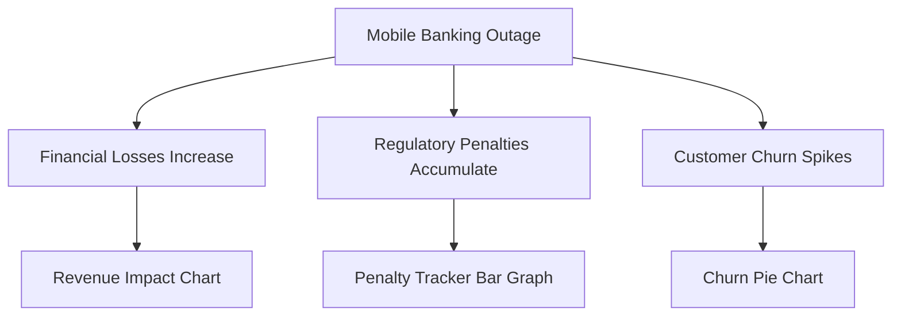

The visualizations collectively emphasize the escalating costs of metric blindness, as the team scrambles to assess the scope of the incident without timely insights. This scenario underscores the critical role of comprehensive metrics in minimizing financial, regulatory, and reputational damages.

### Teaching Narrative

Comprehensive metrics provide essential visibility that directly impacts business outcomes through faster detection, more effective response, and clearer communication during incidents. This "illumination" function of metrics transforms incident management from reactive to proactive by providing early warning of developing issues, precise impact assessment, and measurement-driven recovery tracking. For financial institutions, each minute without appropriate metrics during an incident translates directly to increased costs across multiple dimensions.

### Common Example of the Problem

A mobile banking platform fails during peak payroll processing, but operations teams lack critical visibility metrics. The gaps in metrics can be summarized as follows:

| **Metric Type** | **Missing Information** | **Impact of Absence** |
| -------------------------- | ----------------------------------------------------------------- | ---------------------------------------------------------------------------------- |
| **Degradation Metrics** | No indicators of gradual service degradation before failure | Teams cannot detect or address issues proactively, leading to a full-blown outage. |
| **Transaction Volume** | No breakdown of transaction volumes by channel or type | Unable to quantify the scope and scale of the incident’s impact on users. |
| **Financial Exposure** | No metrics tracking monetary value of affected transactions | Teams lack awareness of the financial loss incurred during the outage. |
| **Historical Performance** | No historical benchmarks to compare current performance | Difficult to estimate time-to-resolution or identify patterns for troubleshooting. |
| **Regulatory Compliance** | No metrics to track real-time adherence to reporting requirements | Risk of non-compliance with mandatory regulations, increasing potential penalties. |

This metrics gap turns what could have been a 30-minute minor incident into a three-hour major outage with corresponding financial and reputational damage. Without quantitative measurements, teams resort to guesswork and assumption throughout the response process.

### SRE Best Practice: Evidence-Based Investigation

Implement comprehensive incident metrics across the full lifecycle to ensure precision and actionable insights. Use the following checklist to guide metric selection and evaluation at each stage:

#### **Checklist: Metrics for Each Lifecycle Stage**

- **1. Early Detection Metrics**

  - [ ] Progressive degradation trends (e.g., latency, error rates)
  - [ ] Baseline deviation alerts for anomalies
  - [ ] Leading indicators forecasting potential issues (e.g., resource saturation)

- **2. Impact Quantification Metrics**

  - [ ] Transaction volume by service and channel
  - [ ] Financial value of affected operations
  - [ ] Priority-based customer segment impact

- **3. Response Effectiveness Metrics**

  - [ ] Remediation progress tracking (e.g., incident timeline)
  - [ ] Restoration of transaction success rates
  - [ ] Backlog clearance for delayed operations

- **4. Regulatory Compliance Metrics**

  - [ ] Service availability aligned with regulatory standards
  - [ ] Customer impact metrics for compliance reporting
  - [ ] Financial exposure for material risk assessment

#### **Lifecycle Flow Overview**

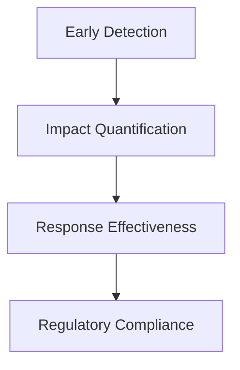

Use these metrics to transform incident management from reactive to proactive, ensuring faster detection, precise impact assessment, and recovery tracking aligned with business priorities.

### Banking Impact

The cost of inadequate metrics during banking incidents cascades across multiple dimensions:

- **Direct Financial Impact**: Failed transactions, compensation payments, penalty interest
- **Operational Costs**: Extended resolution time, emergency resource allocation, recovery effort
- **Regulatory Consequences**: Reporting violations, examination findings, compliance penalties
- **Customer Impact**: Relationship damage, trust erosion, potential attrition

To illustrate, consider a real-world scenario: During a payroll day outage for a mid-sized bank, delayed detection and resolution extended downtime by 30 minutes. This resulted in 150,000 failed transactions, $2.5 million in penalty interest and compensation payments, and a 12% spike in customer support calls. With robust metrics in place, enabling just 15 minutes faster detection and resolution, the bank could have mitigated approximately $1.2 million of these costs.

This example underscores the critical role of comprehensive metrics in minimizing financial exposure, ensuring regulatory compliance, and preserving customer trust during high-stakes incidents.

### Implementation Guidance

1. **Create comprehensive financial impact metrics**\
   Translate technical incidents into measurable business costs to quantify financial losses, operational disruptions, and recovery timelines.

2. **Develop regulatory compliance dashboards**\
   Align metrics with reporting requirements and thresholds to ensure adherence to industry regulations and avoid penalties.

3. **Implement customer impact metrics**\
   Segment metrics by customer value tiers and relationship importance to prioritize recovery efforts and reduce churn.

4. **Build comparative performance metrics**\
   Establish baseline performance patterns to quickly identify deviations and assess the broader impact of incidents.

5. **Establish clear metric ownership and accountability**\
   Define roles and responsibilities for metric management through a responsibility matrix. The following RACI chart outlines key accountability areas for teams involved in metric implementation and operation:

   ```mermaid
   graph TD
     A[Technical Teams] -->|Responsible| B[Metric Development]
     A -->|Responsible| C[Metric Monitoring]
     A -->|Consulted| D[Incident Response Metrics]
     E[Business Teams] -->|Accountable| B
     E -->|Accountable| D
     F[Compliance Team] -->|Consulted| B
     F -->|Accountable| G[Regulatory Dashboards]
     G -->|Informed| H[Leadership]
     D -->|Informed| H
   ```

   - **Responsible (R):** Executes the task.
   - **Accountable (A):** Ultimately answerable for the task.
   - **Consulted (C):** Provides input and feedback.
   - **Informed (I):** Kept updated on progress or outcomes.

6. **Promote metric-driven collaboration**\
   Foster alignment between technical and business teams by integrating metrics into incident management workflows and decision-making processes.

## Panel 4: From Data Points to Meaningful Signals

### Scene Description

The team gathers around a whiteboard, engaged in a dynamic brainstorming session to define critical SLIs for ATM services. The discussion flows between identifying raw technical metrics—such as transaction response times and error rates—and aligning them with customer-centric outcomes like ATM availability and transaction success rates.

To illustrate this process, consider the following journey visualization:

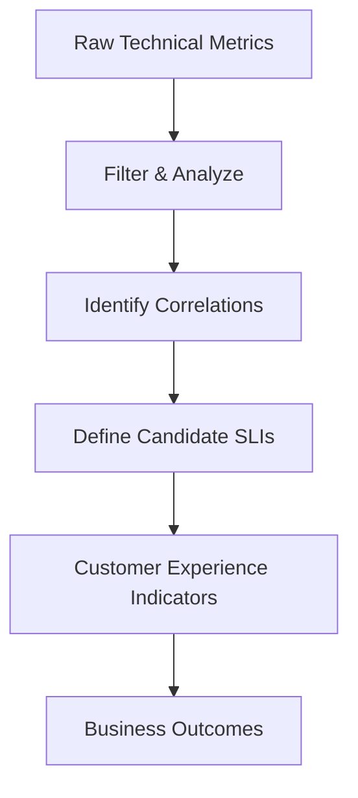

This flow represents the transition from isolated metrics to meaningful signals, highlighting key steps in translating technical data into actionable insights that reflect customer experience. The collaborative nature of the session fosters alignment between technical and business perspectives, ensuring the selected SLIs resonate with both operational goals and user satisfaction.

### Teaching Narrative

Service Level Indicators (SLIs) transform isolated technical metrics into meaningful measurements of customer experience. This transformation process requires identifying which metrics truly correlate with service quality from the user perspective and combining technical measurements into composite indicators that reflect business outcomes. Effective SLIs bridge the gap between what we can measure technically and what actually matters to customers, creating a shared language between technical and business stakeholders.

### Common Example of the Problem

An ATM operations team diligently monitors numerous technical metrics, as shown below:

| **Metric** | **What It Measures** | **Shortcoming** |
| ------------------------------------ | ------------------------------------------------ | -------------------------------------------------------------------------------------- |
| Network latency (ms) | Time taken for data to travel between endpoints | Does not reflect whether customers experience delays or timeouts during transactions. |
| Cash dispenser mechanism operational | Status of the cash dispensing hardware | Ignores whether cash is actually available or if customers receive the correct amount. |
| Card reader error frequency (%) | Frequency of card reader errors | Does not indicate if errors prevent customers from completing transactions. |
| Receipt printer paper supply level | Amount of paper available in the receipt printer | Overlooks whether customers can complete transactions despite receipt printing issues. |
| Software service health checks | Status of backend services | Fails to represent end-to-end transaction success from the customer’s perspective. |

These isolated measurements fail to answer the critical question: **can customers successfully complete their banking transactions?**

For example, an ATM with a failing receipt printer may still be marked as "operational" in monitoring systems, but customers encountering error messages are left frustrated. This illustrates the gap between technical metrics and the customer experience, where metrics fail to measure what truly matters for both the business and its users.

### SRE Best Practice: Evidence-Based Investigation

Transform technical metrics into meaningful SLIs through systematic refinement. Use the following step-by-step checklist to guide your team:

______________________________________________________________________

#### **Step 1: Customer Journey Mapping**

- **Understand the customer perspective:**

  - Map all transaction paths a customer might take.
  - Identify critical success points within each journey.
  - Highlight potential failure modes that could disrupt the journey.

- **Focus areas to evaluate:**

  ```
  [ ] Have all relevant customer paths been mapped?
  [ ] Are critical success points clearly identified and documented?
  [ ] Are failure modes prioritized based on potential customer impact?
  ```

______________________________________________________________________

#### **Step 2: Define Success Metrics**

- **Select measurable indicators of success:**

  - **Transaction Completion Metrics:** Measure how many transactions are initiated versus successfully completed.
  - **Time-to-Completion Metrics:** Assess the time taken for customers to complete a transaction.
  - **Error Recovery Metrics:** Track the system's ability to recover from minor issues without impacting the customer.

- **Checklist for actionable metrics:**

  ```
  [ ] Are transaction success rates being tracked end-to-end?
  [ ] Is time-to-completion measured from the user's perspective?
  [ ] Are error recovery scenarios quantified and analyzed?
  ```

______________________________________________________________________

#### **Step 3: Develop Composite Indicators**

- **Combine technical metrics into meaningful SLIs:**

  - **Cash Availability SLI:** Merge metrics like ATM uptime, cash levels, and refill schedules.
  - **Operational Capability SLI:** Aggregate data reflecting core ATM functions (e.g., card processing, PIN verification).
  - **Customer Experience SLI:** Incorporate speed, success rates, and usability scores into a holistic indicator.

- **Checklist for composite indicators:**

  ```
  [ ] Are technical metrics aligned with customer needs?
  [ ] Have composite SLIs been validated against real-world scenarios?
  [ ] Is there a process to regularly revisit and refine composite SLIs?
  ```

______________________________________________________________________

#### **Summary: Systematic Refinement Flow**

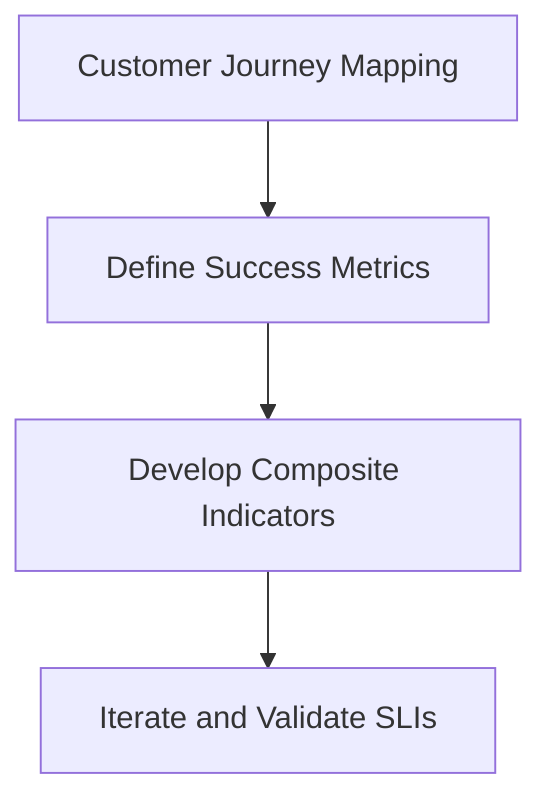

By following this structured approach, your team can ensure that the SLIs developed truly reflect meaningful customer experience outcomes.

### Banking Impact

For ATM services, the gap between technical metrics and customer-centric SLIs directly impacts both satisfaction and operational efficiency. For example, a bank identified that while 99.9% of their ATMs were technically "available," customers frequently complained about slow transaction times during peak hours. By introducing SLIs such as "Median Transaction Time" and "Error-Free Transaction Rate," the team discovered that transaction delays were primarily caused by outdated software during high-traffic periods.

Armed with these insights, they prioritized software optimizations and added proactive monitoring to address performance bottlenecks. As a result, the median transaction time dropped by 30%, and customer complaints related to ATMs fell by 40%. Furthermore, smoother ATM transactions reduced the volume of customers redirecting to costlier channels like branches or call centers, leading to an estimated annual savings of $500,000. This example illustrates how effective SLIs not only improve customer satisfaction but also drive significant cost efficiencies, creating a win-win for both users and the business.

### Implementation Guidance

To effectively implement meaningful SLIs for ATM services, follow the steps below. Use the provided checklist and flowchart to ensure a structured and actionable approach.

#### Checklist for SLI Implementation

- [ ] **Map Customer Journeys**\
  Identify critical ATM transaction types and define measurement points along each journey.
- [ ] **Develop Composite SLIs**\
  Create SLIs that focus on successful journey completion over individual component metrics.
- [ ] **Prioritize Customer-Visible Metrics**\
  Implement weighted calculations to emphasize metrics directly impacting customer experience.
- [ ] **Perform Correlation Analysis**\
  Analyze the relationship between SLIs and customer satisfaction or complaint data.
- [ ] **Review and Iterate**\
  Regularly evaluate SLI effectiveness using real customer feedback and behavior data.

#### SLI Implementation Flowchart

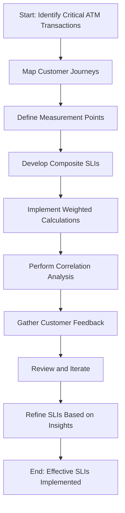

By following this structured process, you can ensure that your SLIs accurately reflect customer experience and drive meaningful improvements in ATM service quality.

## Panel 5: Setting Realistic Performance Targets

### Scene Description

The SRE is in a discussion with the product team to negotiate reliability requirements for the payment systems. A trade-off graph is displayed prominently, showing the relationship between reliability metrics (e.g., uptime percentage) and the corresponding impacts on velocity and cost. The graph emphasizes the "five nines" reliability target (99.999%) by marking it with question marks, prompting discussion around its feasibility and trade-offs. Below is a text-based representation of the graph to illustrate the scenario:

```
Reliability Metrics (Uptime %) --> 90%       95%       99%       99.9%      99.99%      99.999%
Velocity/Cost Impact          --> Minimal   Low       Moderate  High       Very High   Extreme
Highlighted Target            ------------------------------------> ??? (Five Nines)
```

This visual serves as the focal point of the negotiation, highlighting the tension between achieving ultra-high reliability and balancing innovation velocity and cost efficiency. The SRE and product team use this graph to evaluate the criticality of the payment system and determine a realistic Service Level Objective (SLO) that aligns with business priorities.

### Teaching Narrative

Service Level Objectives (SLOs) transform SLI measurements into target performance levels, creating a quantitative reliability framework. Unlike aspirational goals, effective SLOs require calibration based on business requirements, technical capabilities, and economic trade-offs. The metrics challenge lies in setting values that balance reliability needs against innovation velocity and cost efficiency while reflecting actual service criticality rather than applying uniform standards across all systems.

### Common Example of the Problem

A bank's payment processing product team demands "five nines" reliability (99.999%, equating to just 5 minutes downtime per year) for all payment-related services based on these metrics:

- API availability: 99.999%
- Transaction success rate: 99.999%
- Response time: < 200ms for 99.999% of requests

This uniform approach disregards crucial differences between payment types that should be reflected in differentiated metric targets. Below is a table comparing the reliability requirements and business impacts for different payment types:

| Payment Type | Criticality Level | Reliability Target | Key Business Impact |
| ---------------------------- | ----------------- | ---------------------------- | ------------------------------------------------------- |
| High-Value Wire Transfers | Very High | 99.999% (Five Nines) | Financial loss of millions per transaction if failed |
| Retail Card Authorizations | High | 99.9% (Three Nines) | Reduced throughput or delays impact customer experience |
| Account Information Requests | Moderate | 99.5% (Two Nines and a Half) | Temporary unavailability has minimal financial impact |

The table highlights how applying uniform SLOs creates two major problems:

1. **Impossible Standards:** Less critical services like account information requests are held to unnecessarily stringent requirements, consuming resources without proportional business value.
2. **Inadequate Protections:** Truly critical functions like high-value wire transfers are not given sufficient focus, risking significant financial and reputational damage.

By calibrating SLOs to reflect the actual criticality of each service, teams can better balance reliability, cost, and innovation velocity.

### SRE Best Practice: Evidence-Based Investigation

Implement a differentiated SLO framework based on service criticality and business impact by following these steps:

#### Checklist for Implementing a Differentiated SLO Framework

1. **Define Service Categories**

   - Classify services based on criticality and business impact.
   - Example categorization:
     - **Tier 1:** Settlement and high-value transfers (99.99%+ availability).
     - **Tier 2:** Standard payment processing (99.9%+ availability).
     - **Tier 3:** Informational services (99.5%+ availability).

2. **Identify and Prioritize Metrics**

   - Establish multi-dimensional SLO metrics to address different reliability aspects:
     - **Availability:** Measure successful response percentages.
     - **Latency:** Track response times at key percentiles (e.g., p50, p90, p99).
     - **Throughput:** Define peak capacity requirements.
     - **Accuracy:** Ensure transaction correctness.

3. **Align SLOs with Business and Economic Goals**

   - Use economic alignment metrics to evaluate trade-offs:
     - **Cost-per-Reliability Increment:** Assess the cost of achieving higher reliability levels.
     - **Innovation Impact:** Quantify the effect of reliability levels on development velocity.
     - **Error Budgets:** Use risk-tolerant error budgets to balance reliability with innovation.

4. **Iterate Based on Evidence**

   - Continuously monitor SLIs and adjust SLOs based on observed data and evolving business needs.
   - Validate assumptions with historical metrics and post-incident reviews.

#### Summary Flowchart for SLO Development

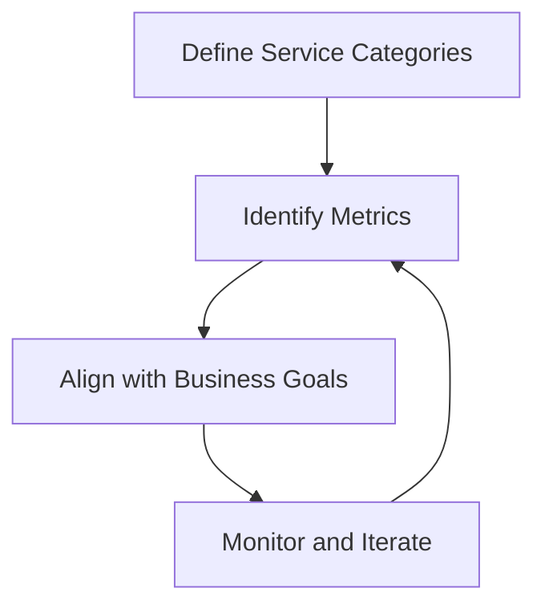

By following this structured approach, SRE teams can create actionable, evidence-based SLOs tailored to the specific needs of their services.

### Banking Impact

For payment systems, appropriate SLO calibration directly impacts both service reliability and innovation velocity. Excessive reliability requirements for non-critical services create unnecessary engineering costs, slow feature development, and reduce competitiveness. Insufficient reliability targets for critical services may allow unacceptable failure rates for high-value transactions. Finding the right balance requires metrics that reflect the actual business impact of different reliability levels for each service type.

### Implementation Guidance

To create and maintain effective Service Level Objectives (SLOs), follow these structured steps:

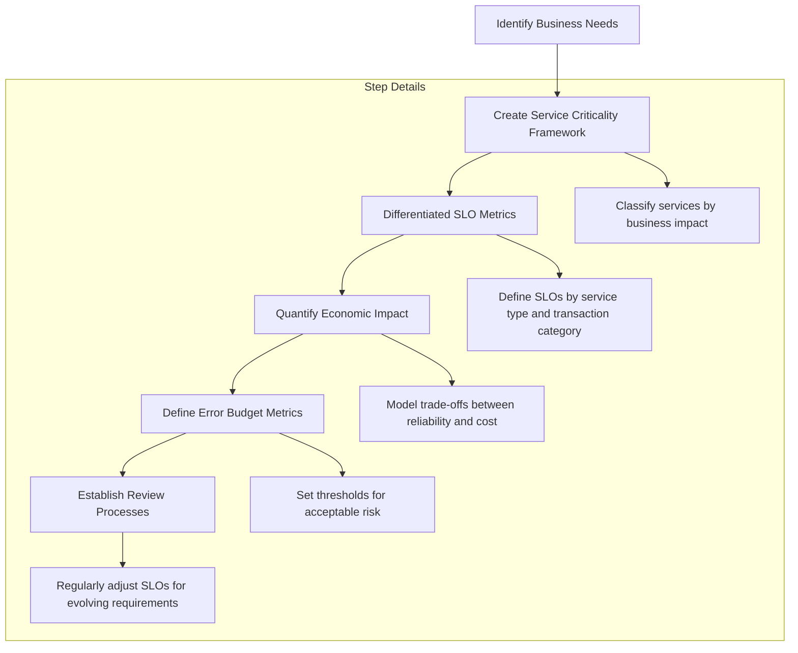

1. **Identify Business Needs**: Begin by understanding the criticality of each system to the business to ensure reliability targets align with organizational priorities.
2. **Create Service Criticality Framework**: Develop a tiered framework that assigns reliability requirements based on the business impact of each service or system.
   - Classify services into categories such as critical, important, and non-critical.
3. **Develop Differentiated SLO Metrics**: Tailor SLOs to address the unique characteristics of each service type and transaction category.
   - For example, high-value payment transactions may require stricter latency and uptime targets compared to informational dashboards.
4. **Implement Economic Impact Models**: Quantify the trade-offs between reliability benefits and associated costs to inform the SLO design process.
   - Use modeling to evaluate the balance between reliability improvements and their impact on innovation velocity and operational expenses.
5. **Establish Error Budget Metrics**: Define thresholds for acceptable operational risk, enabling calculated risk-taking to support innovation.
   - Error budgets provide a mechanism to measure and manage the trade-off between reliability and feature delivery.
6. **Create Regular SLO Review Processes**: Set up a feedback loop to periodically evaluate and adjust SLO targets based on evolving business and technical requirements.
   - Ensure reviews involve cross-functional collaboration to address both product and operational needs.

This step-by-step approach ensures that SLOs remain practical, aligned with business goals, and adaptable to change.

## Panel 6: Aligning Technical and Regulatory Metrics

### Scene Description

The scene depicts a meeting between the SRE, compliance officer, and business stakeholder where they discuss service level requirements. The focus is on aligning internal SLOs, customer SLAs, and regulatory reporting requirements. Below is a visual representation of the hierarchy diagram illustrating the relationships between these components:

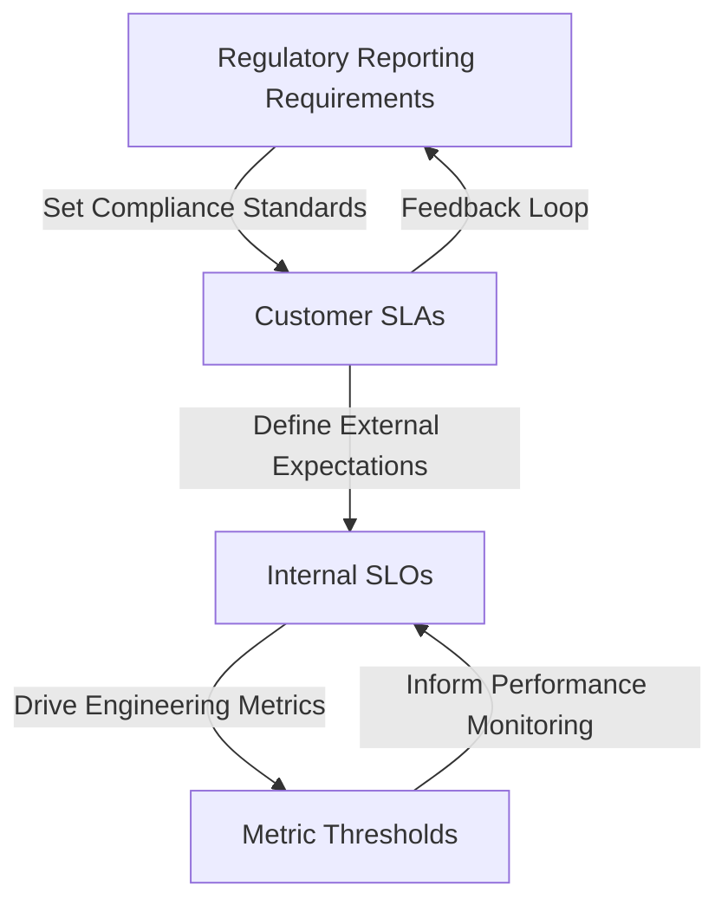

This hierarchy highlights how regulatory requirements influence customer agreements and internal operational goals, while also showing feedback loops to ensure continuous alignment and compliance.

### Teaching Narrative

Financial services metrics exist within a complex regulatory framework that imposes external requirements on measurement, reporting, and performance standards. Effective metric design must integrate these regulatory requirements with internal operational needs, creating a cohesive measurement system that satisfies compliance obligations while providing practical utility for engineering teams. This integration prevents the proliferation of parallel, disconnected measurement systems that create confusion and compliance gaps.

### Common Example of the Problem

A bank implements SLO metrics based solely on engineering considerations without incorporating regulatory requirements. This creates three parallel measurement systems:

| Measurement System | Focus Area | Example Metrics | Purpose |
| ------------------------ | -------------------------------------- | --------------------------------- | ------------------------------------------------------------------ |
| **Engineering Metrics** | Technical performance | Response time, error rates | Ensures systems meet internal technical standards for reliability. |
| **Compliance Metrics** | Regulatory requirements | Availability, incident thresholds | Satisfies legal and regulatory obligations for service operation. |
| **Customer SLA Metrics** | Contractual obligations with customers | Processing time guarantees | Meets customer expectations and contractual agreements. |

**Impact of Disconnected Systems**\
During an incident, these disconnected systems create dangerous confusion:

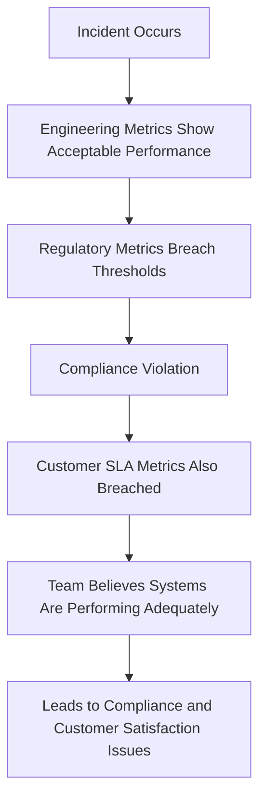

For example, while engineering metrics show acceptable performance within SLO thresholds, the degradation crosses regulatory reporting requirements, creating compliance violations. At the same time, SLA guarantees to customers are breached, further compounding the issue. Without alignment, this fragmented approach undermines both compliance and trust.

### SRE Best Practice: Evidence-Based Investigation

Create an integrated metrics framework that aligns technical, contractual, and regulatory requirements. Use the checklist below to guide your investigation and implementation process:

#### Checklist for Evidence-Based Investigation

1. **Regulatory Metrics Mapping**

   - [ ] Identify availability metrics defined by regulations (e.g., calendar-based availability).
   - [ ] Document processing time metrics for regulated transaction types.
   - [ ] Define incident classification metrics with regulatory reporting thresholds.
   - [ ] Catalog security and compliance metrics required by banking or financial regulations.

2. **Metrics Hierarchy Integration**

   - [ ] Establish technical foundation metrics that support business-level measurements.
   - [ ] Ensure business metrics are designed to meet regulatory requirements.
   - [ ] Align customer-facing metrics with contractual obligations (e.g., SLAs).
   - [ ] Map clear relationships between technical, business, and regulatory metric levels.

3. **Threshold Alignment Metrics**

   - [ ] Set internal thresholds tighter than external regulatory requirements to allow for proactive responses.
   - [ ] Define graduated response thresholds to support progressive escalation during incidents.
   - [ ] Implement leading indicator metrics to predict and prevent potential compliance violations.

By following this checklist, SREs can ensure that their metrics framework is robust, compliant, and operationally effective, reducing the risk of misalignment between technical and regulatory standards.

### Banking Impact

Misalignment between technical and regulatory metrics creates significant compliance risk beyond the immediate operational impact. When metrics don't properly reflect regulatory definitions, systems might violate reporting requirements without triggering internal alerts, creating liability for notification failures, examination findings, and potential penalties. Integrated metrics ensure operations teams understand the compliance implications of technical performance and respond appropriately to emerging issues.

### Implementation Guidance

1. **Create comprehensive mapping between technical metrics and regulatory requirements**\
   Begin by cataloging all internal Service Level Objectives (SLOs) and external Service Level Agreements (SLAs), alongside the corresponding regulatory requirements. Use a structured format to clearly depict how each aligns with compliance obligations. For example:

   ```plaintext
   +-----------------+---------------------+-----------------+
   | Technical Metric| Regulatory Standard | Compliance Gap  |
   +-----------------+---------------------+-----------------+
   | Latency (p99)   | Max 200ms (Reg X)   | None            |
   | Error Rate (%)  | <0.5% (Reg Y)       | Investigate     |
   +-----------------+---------------------+-----------------+
   ```

2. **Implement regulatory threshold monitoring with appropriate buffer margins**\
   Define thresholds slightly below regulatory limits to create a safety margin. Use monitoring tools like Prometheus to set alerts. Example Prometheus rule for latency monitoring:

   ```yaml
   groups:
     - name: regulatory_threshold_alerts
       rules:
         - alert: HighLatency
           expr: histogram_quantile(0.99, rate(http_request_duration_seconds_bucket[5m])) > 180
           for: 2m
           labels:
             severity: warning
           annotations:
             summary: "Latency approaching regulatory threshold"
             description: "p99 latency exceeded 180ms for 2 minutes."
   ```

3. **Develop integrated dashboards showing both technical and compliance perspectives**\
   Create a unified view that overlays technical performance metrics with regulatory thresholds. Below is a text-based layout illustrating a possible dashboard structure:

   ```plaintext
   +-------------------------------------------------------------+
   | Dashboard: Regulatory Compliance Metrics                    |
   +-------------------------------------------------------------+
   | Metric            | Current Value | Regulatory Threshold    |
   |-------------------|---------------|--------------------------|
   | Latency (p99)     | 175ms         | 200ms                   |
   | Error Rate (%)    | 0.3%          | 0.5%                    |
   | Availability (%)  | 99.95%        | 99.9%                   |
   +-------------------------------------------------------------+
   ```

   Tools like Grafana can be used to build such dashboards, combining metrics from Prometheus with annotations for regulatory thresholds.

4. **Build automated notification systems for approaching regulatory thresholds**\
   Use notification systems like PagerDuty or Slack integrations for real-time alerts. Below is an example of a Python script using a webhook to send alerts to Slack:

   ```python
   import requests

   SLACK_WEBHOOK_URL = "https://hooks.slack.com/services/your/webhook/url"

   def send_alert(metric_name, current_value, threshold):
       message = f"*Alert:* {metric_name} is approaching its threshold.\n" \
                 f"Current Value: {current_value}, Threshold: {threshold}"
       payload = {"text": message}
       requests.post(SLACK_WEBHOOK_URL, json=payload)

   # Example usage
   send_alert("Latency (p99)", "180ms", "200ms")
   ```

5. **Establish joint metrics reviews with engineering, compliance, and business stakeholders**\
   Schedule regular reviews with all relevant stakeholders to evaluate metrics alignment and identify gaps. Use checklists or templates to standardize discussions. Example review checklist:

   ```plaintext
   [ ] Are all regulatory thresholds being met?
   [ ] Are buffer margins sufficient for operational stability?
   [ ] Have there been any recent alerts or near misses?
   [ ] Are dashboards and alerts up to date and functional?
   [ ] Are there any changes in regulatory requirements to address?
   ```

   These discussions should result in actionable follow-ups, ensuring continuous alignment across teams.

## Panel 7: Building Measurement into Code

### Scene Description

Developer and SRE are pair programming to instrument a new transaction processing service. The process is illustrated with a split screen: the left side shows the code before instrumentation, and the right side shows the code after instrumentation, with critical measurement points highlighted.

#### Before Instrumentation

```python
def process_transaction(transaction):
    # Validate transaction
    if not validate_transaction(transaction):
        return "Invalid Transaction"

    # Process payment
    result = process_payment(transaction)
    if not result:
        return "Payment Failed"

    # Complete transaction
    complete_transaction(transaction)
    return "Transaction Successful"
```

#### After Instrumentation

```python
def process_transaction(transaction):
    # Record start time
    metrics.record_start("transaction_processing")

    # Validate transaction
    if not validate_transaction(transaction):
        metrics.increment("transaction_invalid")
        metrics.record_end("transaction_processing")
        return "Invalid Transaction"

    # Process payment
    result = process_payment(transaction)
    if not result:
        metrics.increment("payment_failed")
        metrics.record_end("transaction_processing")
        return "Payment Failed"

    # Complete transaction
    complete_transaction(transaction)
    metrics.increment("transaction_successful")
    metrics.record_end("transaction_processing")
    return "Transaction Successful"
```

#### Key Measurement Points

- **Start and end timing:** Captures total transaction processing time.
- **Validation checks:** Tracks counts of invalid transactions.
- **Payment processing failures:** Records instances of failed payments.
- **Successful transactions:** Measures successful transaction completions.

This annotated example demonstrates how instrumentation introduces critical visibility into the application's behavior, enabling both technical and business monitoring.

### Teaching Narrative

Comprehensive metrics begin with effective instrumentation - the systematic addition of measurement points within applications. Even the most sophisticated monitoring systems cannot provide visibility without properly placed instrumentation that captures the right data at appropriate points in the processing flow. For banking systems, this instrumentation must measure not just technical performance but also business context, transaction characteristics, and customer experience factors.

### Common Example of the Problem

A bank deploys a new transaction processing service with minimal instrumentation, capturing only basic availability data. The application logs contain limited timing information, no transaction context, and inconsistent formatting. When performance issues emerge, the operations team lacks critical visibility. The following table summarizes the gaps in instrumentation and their impacts:

| **Instrumentation Gap** | **Impact** |
| --------------------------------- | -------------------------------------------------------------------- |
| No business context metrics | Unable to identify which transaction types experience problems |
| No component-level timing metrics | Difficult to pinpoint where in the process bottlenecks occur |
| No user dimension metrics | Lack of insight into whether specific customer segments are affected |
| No baseline metrics | Cannot compare current performance against historical patterns |

This instrumentation gap transforms troubleshooting from data-driven analysis to speculative guesswork, extending resolution time and increasing customer impact.

### SRE Best Practice: Evidence-Based Investigation

Implement a comprehensive instrumentation strategy across three key dimensions. Use the checklist and code snippets below to guide effective implementation.

#### Checklist for Instrumentation

1. **Technical Performance Metrics**

   - [ ] Are function-level timing metrics captured for all key processing steps?
   - [ ] Are errors logged with detailed classification (e.g., type, severity, source)?
   - [ ] Are resource utilization metrics (e.g., threads, connections, memory) monitored?
   - [ ] Are dependency performance metrics for external services tracked?

2. **Business Context Metrics**

   - [ ] Is every transaction classified by type (e.g., payment, refund)?
   - [ ] Are processing stages tracked to measure flow progression?
   - [ ] Are amounts categorized by range and risk level?
   - [ ] Are merchants or counterparties identified and classified?

3. **Customer Experience Metrics**

   - [ ] Are user segments identified (e.g., new, returning, VIP)?
   - [ ] Is channel and device context (e.g., mobile, web) recorded?
   - [ ] Is session position in the journey (e.g., onboarding, checkout) tracked?
   - [ ] Is historical context (e.g., relationship length) incorporated?

#### Code Snippets for Instrumentation

**Example: Function-Level Timing Metrics**

```python
import time

def process_transaction(transaction):
    start_time = time.time()
    try:
        # Processing logic here
        process_payment(transaction)
    except Exception as e:
        log_error(error_type="ProcessingError", error_details=str(e))
    finally:
        processing_time = time.time() - start_time
        log_metric("transaction_processing_time", processing_time)
```

**Example: Business Context Metrics**

```python
def log_transaction_context(transaction):
    log_metric("transaction_type", transaction.type)
    log_metric("amount_range", categorize_amount(transaction.amount))
    log_metric("risk_category", transaction.risk_level)
    log_metric("counterparty_type", transaction.merchant_type)
```

**Example: Customer Experience Metrics**

```python
def log_customer_experience(session):
    log_metric("user_segment", session.user.segment)
    log_metric("channel", session.channel)
    log_metric("device", session.device)
    log_metric("session_stage", session.stage)
    log_metric("relationship_duration", session.user.relationship_duration)
```

By combining this checklist with practical code snippets, you can ensure your instrumentation strategy captures the critical metrics needed for evidence-based investigation.

### Banking Impact

For transaction processing, instrumentation quality directly determines both operational visibility and control effectiveness. Inadequate instrumentation creates dangerous blind spots where issues develop undetected, potentially allowing transaction failures to persist without mitigation. Comprehensive instrumentation enables rapid identification of emerging issues, precise troubleshooting, and data-driven optimization based on actual transaction patterns and performance characteristics.

### Implementation Guidance

1. **Develop standardized instrumentation libraries with consistent metrics for all banking applications**\
   Create reusable libraries that encapsulate common measurement patterns and ensure consistency across services. These libraries should support standardized metric names, labels, and formats to facilitate cross-application analysis.

2. **Implement comprehensive timing metrics at all critical transaction processing stages**\
   Use timing metrics to measure processing durations at key points in the transaction lifecycle. For example, instrument a payment processing service to measure the time taken for request validation, external API calls, and final transaction persistence.

   ```python
   import time
   from metrics_library import timing_metric

   def process_transaction(transaction):
       with timing_metric("transaction.validation_time"):
           validate_transaction(transaction)

       with timing_metric("transaction.api_call_time"):
           response = call_external_api(transaction)

       with timing_metric("transaction.persistence_time"):
           save_to_database(transaction, response)
   ```

3. **Add business context dimensions to all technical metrics for segmentation analysis**\
   Enrich metrics with tags or dimensions that capture business-relevant context. For instance, include customer tier, transaction type, or region as tags, enabling meaningful segmentation in dashboards and alerts.

   ```python
   from metrics_library import metric_with_tags

   def validate_transaction(transaction):
       metric_with_tags(
           "transaction.validation_attempts",
           tags={"customer_tier": transaction.customer_tier, "transaction_type": transaction.type}
       )
       # Validation logic here
   ```

4. **Create correlation identifiers that track transactions across system and service boundaries**\
   Generate and propagate unique identifiers for each transaction to correlate metrics across distributed systems. Use these identifiers to trace a transaction's journey and identify bottlenecks or failures.

   ```python
   import uuid
   from contextlib import contextmanager

   @contextmanager
   def transaction_context(transaction_id):
       # Add transaction ID to logs, metrics, or headers
       set_correlation_id(transaction_id)
       yield
       clear_correlation_id()

   def process_transaction(transaction):
       transaction_id = uuid.uuid4().hex
       with transaction_context(transaction_id):
           # Process the transaction
           validate_transaction(transaction)
   ```

5. **Establish instrumentation reviews as part of standard development and deployment processes**\
   Include instrumentation as a mandatory checkpoint in code reviews and CI/CD pipelines. Use automated tests to verify the presence and accuracy of metrics, ensuring they meet operational and business observability requirements.

   Example checklist for instrumentation reviews:

   ```
   - [ ] Are key transaction stages instrumented with timing metrics?
   - [ ] Do metrics include relevant business context tags?
   - [ ] Is a correlation identifier generated and propagated?
   - [ ] Are metrics tested for accuracy and consistency?
   - [ ] Are standardized libraries used for instrumentation?
   ```
