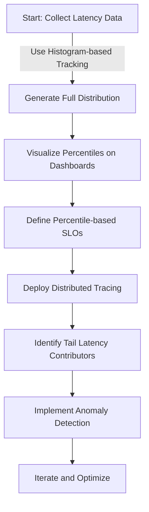
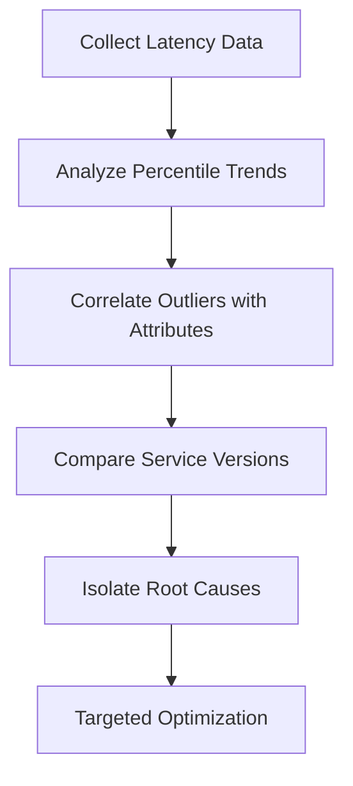
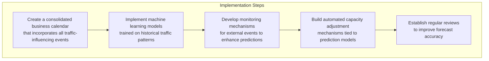
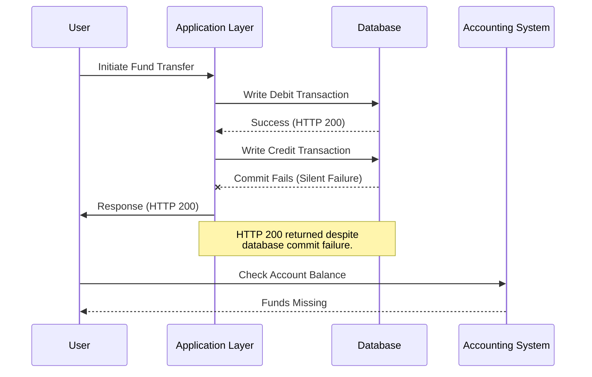
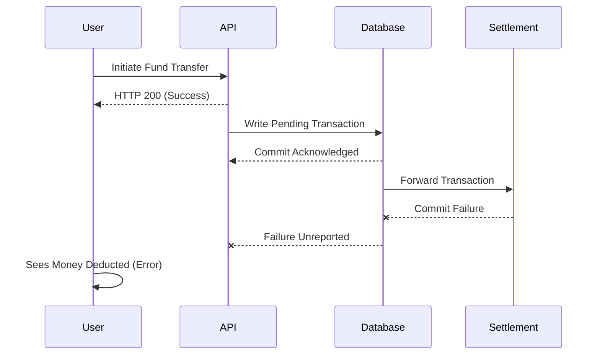
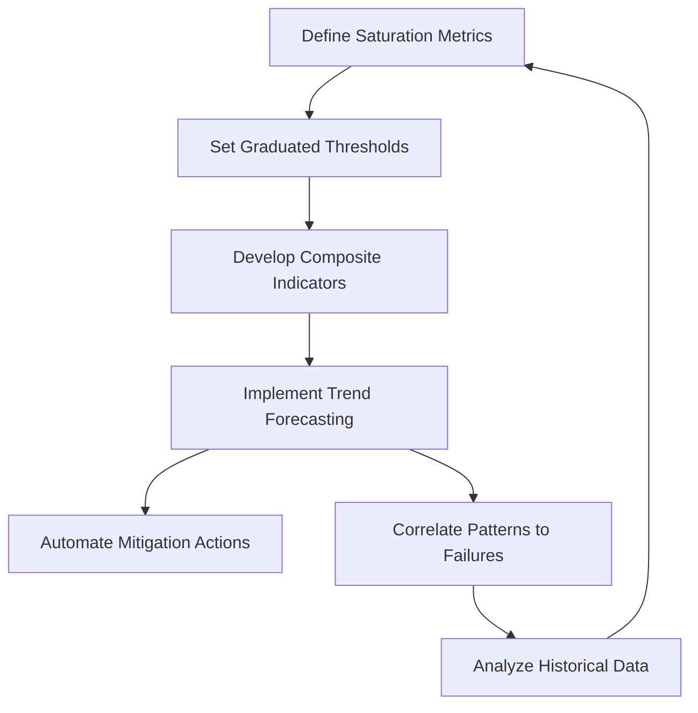
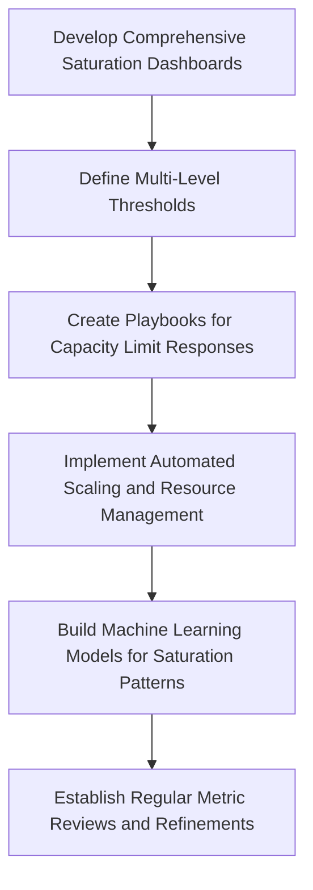

# Chapter 2: The Four Golden Signals

## Chapter Overview: The Four Golden Signals

This chapter delves into the core telemetry model used in Site Reliability Engineering (SRE): the Four Golden Signals—Latency, Traffic, Errors, and Saturation. With a heavy focus on financial systems, it showcases how each signal can betray a healthy-looking system while hiding catastrophic user failures. The narrative brings out subtle but impactful realities: averages that mislead, errors that aren’t technically errors, and success metrics that quietly fail the business. Through common industry examples, practical implementation tips, and SRE best practices, the chapter urges practitioners to discard vanity metrics and adopt granular, distributional, and business-impact-focused telemetry.

______________________________________________________________________

## Learning Objectives

By the end of this chapter, readers will be able to:

1. Explain the Four Golden Signals of SRE and how each reflects a critical system dimension.
2. Identify common pitfalls in interpreting averages and binary success indicators.
3. Use percentile-based latency and distribution metrics to detect outlier-driven failures.
4. Apply multi-dimensional traffic analysis for proactive scaling and anomaly detection.
5. Design error metrics that distinguish between technical success and business failure.
6. Monitor saturation using leading indicators to prevent silent degradation.
7. Implement dashboards and instrumentation strategies that enable predictive, not reactive, reliability.

______________________________________________________________________

## Key Takeaways

- **Averages Lie, Percentiles Tell the Truth**: If your latency looks good on average, congratulations—you’re helping no one. The pain lives in the tail.
- **HTTP 200 ≠ Success**: A transaction can be technically successful while completely failing the customer and the business. It’s called a *silent failure*, and it’s your new nemesis.
- **Traffic Isn’t Random**: It follows patterns, reacts to news, and laughs in the face of your "20% buffer." Forecast it like it matters—because it does.
- **Saturation is a Slow Death**: Systems don’t always crash; sometimes they crawl into a corner and stop returning your calls. Track saturation like it’s the emotional health of your infrastructure.
- **Business Metrics Trump Technical Vanity**: Who cares if your response time is 200ms if the customer never gets their money?
- **Four Signals, Infinite Blind Spots**: Until you treat them as connected, you’ll keep missing what matters.
- **Early Warnings Save Millions**: Waiting for red alerts is amateur hour. Build in the whispers before the scream.

______________________________________________________________________

## Panel 1: The Deceptive Average (Latency)

### Scene Description

The call center is flooded with complaints from frustrated customers about slow investment transactions. Meanwhile, the performance dashboard prominently displays "normal" average response times, creating a stark disconnect between the customer experience and the system metrics.

To illustrate this contradiction:

```
Customer Complaints       Performance Dashboard
==================        ======================
- "Why is my trade        Average Response Time: 200ms
  taking so long?"         (Normal Range)
- "Transactions are 
  lagging today!"          Status: All Systems Operational
- "My portfolio updates 
  are delayed!"
```

In the scene, a banking executive gestures at the dashboard with confusion, questioning how the system can report normal performance while customers continue to experience significant delays.

### Teaching Narrative

Latency metrics measure how long operations take to complete, but their effectiveness depends entirely on how they're calculated and presented. Average latency metrics conceal critical performance problems by masking outliers that significantly impact customer experience. In banking systems, percentile-based latency metrics (p50, p90, p99) provide essential visibility into the full spectrum of transaction performance, revealing the "long tail" problems that averages hide but customers experience directly.

### Common Example of the Problem

An investment platform's average response time shows a consistent 300ms, well within its 500ms SLO. Yet the call center is flooded with complaints about 10-second delays during market volatility. The operations team is baffled since their dashboards show healthy performance. Investigation reveals that while 80% of transactions complete quickly, 20% of users—primarily those executing time-critical trades during market movements—experience 5-10 second delays. The average metric completely obscures this critical performance problem, delaying response while customers potentially lose thousands on delayed trades.

#### Distribution of Response Times

The following table illustrates the disparity in response times:

| Percentile | Response Time | Observations |
| ------------ | ------------- | ------------------------------------------------ |
| p50 (Median) | 250ms | Most routine transactions are very fast. |
| p80 | 300ms | Still within expected performance thresholds. |
| p90 | 1 second | Higher latency starts to emerge here. |
| p99 | 10 seconds | Significant delays impact critical transactions. |

This distribution highlights why relying solely on averages is deceptive. Although the average response time is 300ms, the 99th percentile reveals that 1 in 100 transactions faces severe latency, directly affecting customer satisfaction during volatile trading periods.

### SRE Best Practice: Evidence-Based Investigation

Implement comprehensive latency measurement across the full distribution by following these best practices:

#### Checklist for Effective Latency Monitoring

- [ ] **Use Percentile-Based Metrics**: Replace averages with percentile-based measurements (e.g., p50, p90, p99, p99.9) to capture the full performance spectrum.
- [ ] **Segment Metrics**: Break down latency metrics by transaction type, customer tier, and other relevant dimensions for better granularity.
- [ ] **Separate Success and Failure**: Measure latency separately for successful and failed transactions to pinpoint failure-related delays.
- [ ] **Analyze Trends Over Time**: Track latency trends across time intervals and during varying load conditions to identify patterns and anomalies.
- [ ] **Leverage Distributed Tracing**: Correlate latency patterns with specific system components (e.g., databases, APIs) using distributed tracing for root cause analysis.

#### Example: Implementing Percentile-Based Metrics in Code

Below is a Python example using a monitoring library (e.g., Prometheus) to record and expose latency percentiles:

```python
from prometheus_client import Summary

# Define a summary metric for transaction latency
transaction_latency = Summary(
    'transaction_latency_seconds', 
    'Transaction latency in seconds',
    ['transaction_type', 'customer_tier', 'status']  # Labels for segmentation
)

def process_transaction(transaction_type, customer_tier):
    with transaction_latency.labels(
        transaction_type=transaction_type, 
        customer_tier=customer_tier,
        status="success"
    ).time():
        # Simulate transaction processing
        perform_transaction_logic()

def perform_transaction_logic():
    # Simulated logic (e.g., database operations, API calls)
    pass
```

#### Distributed Tracing Example (Text Representation)

When investigating latency outliers, distributed tracing can help identify bottlenecks. For instance:

```
Trace ID: abc123
--------------------------------------
Component               | Latency (ms)
--------------------------------------
API Gateway             | 15
Auth Service            | 12
Database Query          | 450  <-- Bottleneck
Cache Lookup            | 7
--------------------------------------
Total Latency           | 484
```

This analysis shows queuing delays due to database connection pool saturation during high-volume periods, affecting specific transaction types. Addressing this bottleneck improves latency for impacted users without affecting others unnecessarily.

By combining percentile-based metrics, segmentation, and distributed tracing, teams can uncover and address hidden latency problems that average metrics obscure.

### Banking Impact

Latency distribution in investment platforms can be compared to traffic patterns on a busy highway. Imagine a road where the "average" commute time is 30 minutes, but during rush hour, some drivers face gridlock lasting over an hour. For the drivers stuck in traffic, the "average" is irrelevant—they experience the worst delays firsthand, and their frustration shapes their overall perception of the commute. Similarly, in banking systems, customers impacted by high-latency outliers during critical trading moments experience severe dissatisfaction, regardless of the "average" performance.

Consider a case study: During a period of market volatility, a high-value client attempts to execute a large trade, but delays in platform response cause the transaction to miss a crucial price window. The client incurs a financial loss of $50,000 due to the latency, even though the platform's average response time remains within acceptable limits. This individual experience leads the client to view the platform as unreliable, prompting them to move their portfolio to a competitor. The cumulative effect of such incidents not only damages the platform's reputation but also results in revenue loss that far outweighs the technical investment required to address the performance issues.

By focusing on percentile-based latency metrics (e.g., p90, p99), banking systems can identify and mitigate these "long tail" delays, ensuring a smoother experience for all users—especially during high-stakes scenarios when performance matters most.

### Implementation Guidance

1. **Implement histogram-based latency tracking**

   - Capture the full distribution of latency data using histograms to ensure visibility into both typical and worst-case performance.

2. **Create dashboards with critical percentiles**

   - Visualize key latency percentiles such as p50, p90, p95, p99, and p99.9 to monitor the spectrum of user experiences effectively.

3. **Define latency SLOs by percentile and transaction type**

   - Establish Service Level Objectives (SLOs) tailored to specific percentiles and transaction categories to better align with customer expectations.

4. **Deploy distributed tracing**

   - Use distributed tracing to track and visualize the flow of transactions across services, pinpointing the components contributing to high tail latency.

5. **Implement latency anomaly detection**

   - Build systems that detect shifts in the latency distribution (e.g., long-tail growth) rather than relying solely on average latency thresholds.



## Panel 2: The Truth in Distribution (Latency)

### Scene Description

A performance engineer presents a histogram of transaction times to the team, highlighting the long tail problem in payment processing during periods of market volatility. The histogram starkly contrasts key latency percentiles, such as p50 and p99, with customer impact annotations emphasizing the disproportionate delays experienced by certain users. Below is a simplified representation of the histogram:

```
       Transaction Time (ms)
        |
  Count |       *
        |       *                         Long Tail
        |       *                           →
        |       *                           *
        |       *                           *
        |   *   *                           *
        |   *   *                           *
        |   *   *                           *
        |   *   *                           *
        |   *   *                           *
        |   *   *                           *
        |   *   *                           *
        |   *   *                           *
        |   *   *                           *
        |   *   *****************************
        |   **********************************
        -------------------------------------------------
          p50         p90               p99
```

This depiction helps illustrate the contrast between typical transaction times and those in the extreme percentile ranges, providing a clear visualization of the performance distribution and its impact on end-users.

### Teaching Narrative

Latency distribution metrics reveal the complete performance profile of financial transactions, providing visibility that simple averages cannot. For banking operations, understanding the entire latency distribution through percentile measurements enables precise identification of performance issues affecting specific customer segments or transaction types. These comprehensive latency metrics reveal whether slowdowns affect all users equally or disproportionately impact certain operations, enabling targeted optimization where it matters most.

### Common Example of the Problem

A payment gateway processes credit card authorizations with a reported average response time of 250ms. However, examining the full latency distribution reveals a more nuanced story: while the majority of transactions complete quickly (p50 = 180ms), a significant portion experience much longer delays, with the 99th percentile (p99) reaching 3.2 seconds. The implications of these outliers become clear when analyzing transaction attributes.

The table below illustrates the latency metrics across different transaction dimensions, shedding light on the root cause of the delays:

| Metric | Overall Latency | Domestic Cards (p99) | International Cards (p99) | High-Risk Merchant Categories (p99) |
| ------ | --------------- | -------------------- | ------------------------- | ----------------------------------- |
| p50 | 180ms | 170ms | 220ms | 250ms |
| p95 | 900ms | 850ms | 1.5s | 2.8s |
| p99 | 3.2s | 2.1s | 4.5s | 5.2s |

Further investigation revealed that the extreme delays at p99 were strongly correlated with specific merchant categories (e.g., high-risk merchants) and international cards, which required additional authentication steps. The operations team had been focusing optimization efforts on the database layer affecting all transactions equally, completely missing the bottleneck in the external authentication service that disproportionately impacted these specific transaction types.

This example demonstrates the importance of examining latency distributions in detail and segmenting metrics by relevant attributes. By doing so, teams can pinpoint where performance issues originate and target optimizations effectively.

### SRE Best Practice: Evidence-Based Investigation

Implement comprehensive distribution analysis for all critical transaction types by following these actionable steps:

#### Evidence-Based Investigation Checklist

1. **Collect Data**:
   - Track full latency histograms with appropriate bucket distributions.
   - Ensure data granularity captures all critical percentiles (e.g., p50, p90, p99).
2. **Analyze Trends**:
   - Measure percentile shifts over time to detect degrading components.
   - Establish baseline distribution patterns for different business conditions.
3. **Correlate Outliers**:
   - Investigate latency outliers by correlating with specific transaction attributes (e.g., transaction type, geographic region, or customer tier).
4. **Compare Across Versions**:
   - Evaluate latency distributions between different service versions or deployments.
   - Identify regressions introduced by recent changes.
5. **Isolate Contributing Factors**:
   - Drill down into specific services or components contributing to the long tail effect.
   - Focus on external dependencies, such as third-party services.

#### Step-by-Step Analysis Workflow



**Case Example:**\
Analysis reveals that third-party authentication service calls for international transactions have significantly higher and more variable latency. This variability creates the long tail effect, disproportionately impacting customer experience despite healthy average metrics. Using this evidence-based approach ensures targeted optimizations where they are needed most.

### Banking Impact

In payment processing, latency distribution directly affects authorization approval rates and merchant satisfaction. Long-tail latency causes transaction timeouts that register as technical declines, creating false payment failures that frustrate both cardholders and merchants. These timeout-induced declines disproportionately affect high-value international transactions, creating a negative experience for premium customers and potentially triggering fraud alerts as customers retry failed payments. The business impact includes lost transaction revenue, increased support costs, and merchant relationship damage.

To illustrate, consider a real-world scenario faced by a global payments provider during a high-demand shopping period. A surge in transactions caused a bottleneck in their authorization systems, particularly affecting cross-border transactions. For example, a luxury retailer in Paris reported an unusually high rate of declined transactions from premium customers in the U.S. Investigating the issue revealed that a small percentage of transactions experienced latency spikes exceeding the payment network’s timeout threshold. These timeouts led to false declines, frustrating customers who then abandoned their purchases or repeatedly retried, triggering fraud detection mechanisms.

The fallout was significant: merchants lost millions in potential revenue over the shopping weekend, customer support teams were overwhelmed with complaints, and the provider faced strained relationships with key merchants. By analyzing the latency distribution and addressing the long tail with targeted optimizations—such as prioritizing high-value transactions and implementing dynamic timeout thresholds—the provider was able to dramatically reduce false declines and restore trust with both customers and merchants.

This case underscores the critical importance of understanding and addressing the long-tail latency problem. Effective monitoring of latency distribution allows organizations to preemptively identify and mitigate these impacts, ensuring smoother transaction experiences for all stakeholders.

### Implementation Guidance

1. **Establish Comprehensive Latency Histograms**\
   Use instrumentation libraries or monitoring tools to record transaction latencies. For example, in a Python service using `prometheus_client`:

   ```python
   from prometheus_client import Histogram

   # Define a histogram for transaction latencies
   transaction_latency = Histogram(
       'transaction_latency_seconds',
       'Latency of payment transactions',
       buckets=[0.1, 0.5, 1, 2, 5, 10]
   )

   # Record latencies
   def process_transaction():
       with transaction_latency.time():  # Automatically measures execution time
           # Simulate the transaction processing logic
           pass
   ```

2. **Create Heat Maps Showing Latency Distribution Changes Over Time**\
   Aggregate and visualize latency data using time-series dashboards. For example, export histogram data points into a tool like Grafana to generate heat maps showing latency patterns across different times of day or market conditions.

3. **Implement Segmented Analysis to Identify Affected Transaction Attributes**\
   Enhance logging or monitoring to include metadata such as transaction type, customer segment, or geographic region. Example query for analysis using SQL:

   ```sql
   SELECT
       transaction_type,
       PERCENTILE_CONT(0.99) WITHIN GROUP (ORDER BY latency) AS p99_latency,
       PERCENTILE_CONT(0.50) WITHIN GROUP (ORDER BY latency) AS p50_latency
   FROM transaction_logs
   WHERE date >= CURRENT_DATE - INTERVAL '7 days'
   GROUP BY transaction_type;
   ```

4. **Build Adaptive Timeout Mechanisms Based on Historical Latency Distributions**\
   Implement timeouts that dynamically adjust based on observed latency percentiles. For instance:

   ```python
   import numpy as np

   # Example latency distribution (in seconds) from historical data
   latency_data = [0.3, 0.5, 0.7, 1.2, 2.5, 5.0, 10.0]

   # Determine adaptive timeout using the 95th percentile
   adaptive_timeout = np.percentile(latency_data, 95)
   print(f"Adaptive timeout set to: {adaptive_timeout} seconds")
   ```

5. **Develop Targeted Optimization Roadmaps**\
   Use insights from the above steps to prioritize optimizations. For example:

   ```
   +----------------------+-----------------------+-----------------+
   | Transaction Type     | p99 Latency (ms)     | Priority        |
   +----------------------+-----------------------+-----------------+
   | High-value Payments  | 2500                 | High            |
   | Low-value Payments   | 1200                 | Medium          |
   | Fraud Checks         | 800                  | Low             |
   +----------------------+-----------------------+-----------------+
   ```

   Align these priorities with engineering resources to address the most impactful bottlenecks first.

## Panel 3: The Unexpected Holiday (Traffic)

### Scene Description

The on-call engineer notices an unusual traffic spike in the transaction metrics on a non-payday Friday. They begin investigating the graphs and uncover a correlation between the transaction volume and a recently announced government stimulus. An executive, reviewing the situation, points out news headlines about the stimulus that the team had missed.

Below is a simplified timeline of events to illustrate the sequence:

```
[Unusual Traffic Spike] --> [Engineer Investigates Metrics] --> [Discovers Correlation with Stimulus] --> [Executive Highlights Missed News]
```

### Teaching Narrative

Traffic metrics quantify demand on banking systems, typically measured as transactions per second over time. These measurements serve multiple critical functions: capacity planning, anomaly detection, and business intelligence. Effective traffic metrics must account for multiple time dimensions, capture expected patterns, identify seasonality, and correlate with external events. For financial systems, understanding traffic patterns enables proactive scaling and resource allocation to maintain performance during both predicted and unexpected volume changes.

### Common Example of the Problem

A bank's payment processing system experiences a sudden 300% transaction volume spike on a regular Friday, causing degraded performance and increased error rates. The operations team, accustomed to traffic peaks on paydays, month-end, and holidays, is caught completely unprepared. Only after customer complaints escalate does someone notice news headlines about government stimulus payments being deposited that day. The team lacks metrics connecting external events to traffic patterns, forcing them into reactive scaling once problems have already impacted customers.

#### Checklist: Key Steps to Avoid Similar Problems

- **Monitor External Events**: Regularly track potential triggers like government announcements, holidays, or unexpected news that could impact transaction volumes.
- **Establish Anomaly Detection**: Use thresholds or machine learning models to identify traffic patterns deviating significantly from historical baselines.
- **Correlate Metrics with External Data**: Implement dashboards or alerts that overlay transaction data with external event timelines or announcements.
- **Account for Seasonality**: Incorporate known seasonal and cyclical patterns into capacity planning and alerting systems.
- **Enable Proactive Scaling**: Automate scaling mechanisms to handle unexpected spikes based on pre-defined thresholds or predictive traffic models.
- **Improve Communication Channels**: Set up processes to rapidly disseminate critical external news (e.g., stimulus announcements) to on-call and operations teams.

### SRE Best Practice: Evidence-Based Investigation

Implement multi-dimensional traffic analysis that anticipates both regular and exceptional patterns. Use the following best practices and their corresponding outcomes to guide your investigation:

| **Best Practice** | **Outcome** |
| ---------------------------------------------------------------------------------------------------- | ------------------------------------------------------------------------------------ |
| Establish baseline traffic patterns across multiple time dimensions (hourly, daily, weekly, monthly) | Identify normal vs. abnormal behavior and detect deviations effectively. |
| Create anomaly detection that identifies deviations from expected patterns | Quickly flag unexpected traffic surges or drops for further investigation. |
| Develop forecasting models incorporating business calendars and external events | Anticipate traffic spikes tied to predictable events like holidays or announcements. |
| Segment traffic metrics by channel, transaction type, and geographic region | Pinpoint traffic issues and optimize resource allocation for affected areas. |
| Implement leading indicators that predict traffic changes before they reach critical systems | Proactively mitigate potential performance bottlenecks or system overloads. |

Analysis of historical patterns reveals that government announcements typically precede payment volume spikes by 1-2 days. Leveraging this insight as an early warning indicator could have prevented the incident.

### Banking Impact

Unpredictable traffic patterns in banking systems can be likened to a highway during rush hour. Imagine a sudden surge of vehicles on a road network not designed to handle the volume—congestion builds, minor accidents cascade into larger delays, and alternate routes become overwhelmed as drivers seek detours. Similarly, when transaction volumes spike unexpectedly, payment processing systems slow down, creating a ripple effect: merchants see delays in completing sales, ATM withdrawals surge as electronic payments fail, and call centers face an influx of frustrated customers.

The financial impact mirrors the fallout from a traffic jam: lost transaction revenue is akin to missed deliveries, emergency staffing costs resemble deploying traffic control, and regulatory scrutiny is like receiving fines for failing to manage the chaos. Beyond the immediate consequences, customer frustration during these high-visibility incidents leaves a lasting dent in the bank's reputation, much like commuters who avoid a poorly managed highway long after the traffic clears.

By understanding and preparing for these "rush hour" scenarios, banking institutions can proactively scale resources, ensuring smoother operations and minimizing both technical and reputational risks.

### Implementation Guidance

1. **Create multi-dimensional traffic dashboards**\
   Design dashboards that visualize traffic patterns across multiple time dimensions (hourly, daily, weekly, monthly). Use these dashboards to highlight seasonality, trends, and anomalies. Ensure the dashboards allow filtering by key dimensions such as transaction type, region, and user demographics.

2. **Implement anomaly detection based on deviation from expected patterns**\
   Employ statistical or machine learning-based methods to detect anomalies in traffic metrics. Below is an example of Python pseudocode using a rolling z-score method for anomaly detection:

   ```python
   import pandas as pd
   import numpy as np

   # Sample traffic data: timestamp and transactions per second (TPS)
   traffic_data = pd.DataFrame({
       'timestamp': pd.date_range(start='2023-01-01', periods=100, freq='H'),
       'TPS': np.random.poisson(lam=100, size=100)
   })

   # Calculate rolling mean and standard deviation
   traffic_data['rolling_mean'] = traffic_data['TPS'].rolling(window=24).mean()
   traffic_data['rolling_std'] = traffic_data['TPS'].rolling(window=24).std()

   # Compute z-score and flag anomalies
   traffic_data['z_score'] = (traffic_data['TPS'] - traffic_data['rolling_mean']) / traffic_data['rolling_std']
   traffic_data['is_anomaly'] = traffic_data['z_score'].abs() > 3  # Threshold for anomaly

   print(traffic_data[traffic_data['is_anomaly']])
   ```

3. **Develop news and social media monitoring for leading traffic indicators**\
   Integrate APIs from news and social media platforms to monitor keywords and trends that could impact traffic, such as government announcements or viral campaigns. Use these inputs to enhance anomaly detection and adjust traffic forecasts.

4. **Build automated scaling mechanisms triggered by traffic prediction algorithms**\
   Leverage cloud-native tools or libraries to implement auto-scaling. Below is a conceptual flowchart for an automated scaling system:

   ```text
   +-------------------------+
   | Traffic Prediction Model|
   +-------------------------+
               |
               v
   +--------------------------+
   | Evaluate Predicted Demand|
   +--------------------------+
               |
       +-------+-------+
       |               |
   Scale Up         Scale Down
       |               |
       v               v
   Adjust Resources  Optimize Costs
   ```

   Use predictive analytics to forecast demand spikes. For example, integrate Kubernetes Horizontal Pod Autoscaler (HPA) with custom metrics to dynamically adjust resources.

5. **Establish traffic pattern libraries documenting responses to previous events**\
   Create a repository of traffic patterns observed during significant events (e.g., stimulus announcements, holidays). Annotate these patterns with details such as scaling actions taken, root cause analysis, and lessons learned. This library serves as a reference to improve future response strategies.

## Panel 4: Predicting the Wave (Traffic)

### Scene Description

The capacity planning meeting focuses on reviewing a traffic forecasting model that integrates key inputs such as the banking calendar, historical patterns, and external events. The discussion highlights how these dimensions feed into the predictive algorithm to identify upcoming volume spikes. Below is a simplified representation of the model’s components and flow:

```
       +----------------------+       +-----------------------+
       |  Banking Calendar    |       |  Historical Patterns  |
       +----------------------+       +-----------------------+
                     \                     /
                      \                   /
                       +-----------------+
                       |  Predictive     |
                       |  Algorithm      |
                       +-----------------+
                                |
                                v
                  +---------------------------+
                  |  Traffic Volume Forecast  |
                  +---------------------------+
                                |
                                v
                  +---------------------------+
                  |  Capacity Planning Output |
                  +---------------------------+
```

This diagram illustrates how multiple data sources converge into the predictive algorithm to generate actionable insights for proactive resource allocation. The team leverages these forecasts to ensure preparedness for both routine and atypical traffic patterns.

### Teaching Narrative

Advanced traffic metrics enable predictive capacity management through sophisticated forecasting models incorporating multiple data dimensions. These metrics extend beyond simple volume counts to include patterns across diverse factors. The table below breaks down these dimensions to provide clarity on the complexity of the forecasting model:

| **Dimension** | **Description** | **Example** |
| --------------------- | -------------------------------------------------------------- | ----------------------------------------------- |
| **Time Dimensions** | Patterns observed across specific time intervals. | Hourly, daily, weekly, monthly, seasonal trends |
| **Customer Segments** | Traffic variations based on customer groups or demographics. | Retail customers vs. corporate customers |
| **Transaction Types** | Different activities or services driving traffic. | Deposits, withdrawals, loan applications |
| **External Events** | Correlation with external influences impacting traffic trends. | Public holidays, tax deadlines, market events |

For banking systems, these predictive traffic metrics transform capacity management from reactive response to proactive preparation. By leveraging these dimensions, teams can ensure sufficient resources for both expected peaks and unusual events, maintaining seamless system performance.

### Common Example of the Problem

A bank's digital platform handles monthly bill payments with a capacity plan based on historical averages plus 20% buffer. Despite this conservative approach, the system consistently experiences performance degradation during the first week of each month. Traditional traffic metrics show the pattern but don't explain it. Advanced analysis reveals a complex interaction: government benefit deposits on the 3rd, automated bill payments on the 5th, and month-end statement generation all compete for resources. Without understanding these overlapping traffic patterns, the team repeatedly under-provisions despite using seemingly adequate buffer calculations.

### SRE Best Practice: Evidence-Based Investigation

Implement comprehensive traffic forecasting that accounts for all relevant factors. Use the checklist below to guide your approach:

#### Checklist: Steps for Evidence-Based Traffic Forecasting

1. **Define Key Variables**:
   - Identify business events (e.g., holidays, end-of-quarter deadlines).
   - Incorporate banking calendars and external events (e.g., weather, social media trends).
2. **Build Multi-Variate Models**:
   - Use statistical or machine learning models to account for multiple influencing factors simultaneously.
3. **Analyze Historical Data**:
   - Perform pattern recognition to detect cyclical traffic behaviors (hourly, daily, seasonal).
4. **Conduct Correlation Analysis**:
   - Investigate relationships between traffic patterns and external triggers.
5. **Combine Forecasting Methods**:
   - Integrate outputs from multiple algorithms to create a composite forecast.
6. **Refine Continuously**:
   - Measure prediction accuracy and update models iteratively for improvement.

#### Code Snippet: Simple Multi-Variate Model Example (Python)

```python
import pandas as pd
from sklearn.ensemble import RandomForestRegressor
from sklearn.model_selection import train_test_split
from sklearn.metrics import mean_squared_error

# Load and prepare data
data = pd.read_csv('traffic_data.csv')  # Example dataset
features = ['hour_of_day', 'day_of_week', 'holiday_flag', 'weather_index']
target = 'traffic_volume'
X = data[features]
y = data[target]

# Train-test split
X_train, X_test, y_train, y_test = train_test_split(X, y, test_size=0.2, random_state=42)

# Train model
model = RandomForestRegressor(n_estimators=100, random_state=42)
model.fit(X_train, y_train)

# Predict and evaluate
y_pred = model.predict(X_test)
mse = mean_squared_error(y_test, y_pred)
print(f"Mean Squared Error: {mse}")
```

Machine learning analysis of historical data reveals subtle traffic correlations with financial calendar events, social media activity, and even weather patterns. Leveraging these insights in a structured, evidence-based approach enables much more accurate capacity predictions.

### Banking Impact

Accurate traffic prediction directly impacts both customer experience and infrastructure costs. Under-provisioning during peak periods creates transaction delays, increased error rates, and potential regulatory issues if processing deadlines are missed. Over-provisioning wastes infrastructure resources and increases operating costs. Predictive traffic metrics enable optimal resource allocation, ensuring sufficient capacity for customer needs while minimizing unnecessary expenses – particularly valuable for cloud-based banking systems with consumption-based pricing.

### Implementation Guidance

To effectively implement predictive traffic forecasting, follow the structured process outlined below:



1. **Create a Consolidated Business Calendar**\
   Combine all traffic-influencing events, such as banking holidays, major external events, and recurring seasonal patterns, into a single calendar to serve as a foundational reference.

2. **Train Machine Learning Models**\
   Develop and train machine learning models using historical traffic data to identify and predict patterns across multiple time scales (hourly, daily, etc.).

3. **Monitor External Events**\
   Implement monitoring systems to track external factors (e.g., economic events, regional holidays) that could impact traffic volumes, ensuring these inputs are integrated into the model.

4. **Automate Capacity Adjustments**\
   Build mechanisms to automatically adjust system resources based on the predictions, enabling proactive scaling during anticipated peaks or unusual surges.

5. **Review Forecast Accuracy Regularly**\
   Schedule periodic reviews of forecast performance, leveraging feedback loops to refine models and improve prediction reliability over time.

## Panel 5: The Silent Failure (Errors)

### Scene Description

The SRE is investigating missing fund transfers. Logs show successful HTTP 200 responses for the API calls, indicating the requests were processed correctly at the application layer. However, the corresponding database commits fail silently, leaving transactions incomplete. As a result, money appears to leave the source accounts but never arrives at the destination accounts.

To illustrate the flow and pinpoint the failure, the following sequence diagram outlines the process:



This sequence highlights the core issue: the technical success of the API operation (HTTP 200) does not align with the business success of transferring funds correctly. The silent failure occurs during the database commit for the credit transaction, leading to discrepancies in account balances.

### Teaching Narrative

Error metrics measure failure rates, but their accuracy depends entirely on how "failure" is defined. In banking systems, technical success (HTTP 200, operation completed) may not represent business success (funds transferred correctly, transaction finalized). Comprehensive error metrics must bridge this gap, measuring not just technical failures but also business outcome failures. This distinction is critical in financial services where technically "successful" operations may still fail to achieve the customer's intended result.

### Common Example of the Problem

A fund transfer system consistently reports a 99.98% success rate based on API response codes, yet customer complaints about missing transfers are increasing. Investigation reveals a serious gap in error metrics: while the API returns HTTP 200 success responses, a significant number of transactions fail during asynchronous database commit operations that occur after the response is sent. These "silent failures" never appear in error metrics because they're not captured at the API level. Customers see money leave their accounts but never arrive at the destination, creating significant financial and customer service impacts that remain invisible to standard monitoring.

#### API vs. Business Success Metrics

Below is a comparison of API-reported success rates and actual business transaction success rates over a sample period:

| Metric | Reported Success Rate | Observed Issues |
| ------------------------ | --------------------- | ----------------------------------------------------------------------------- |
| API Response (HTTP 200) | 99.98% | Reflects only technical completion of the request, no validation of outcomes. |
| Transaction Finalization | 93.45% | Includes failures in asynchronous database commits and settlement processes. |
| Customer Complaint Rate | 0.15% | Indicates customer-reported cases of funds not arriving at the destination. |

This table highlights the disparity between technical success metrics (API-level) and business outcome metrics (transaction finalization). While the API success rate appears nearly flawless, the real-world impact tells a different story, with nearly 6.5% of transactions encountering issues downstream.

#### Flow of a Silent Failure

The following simplified flow illustrates how a silent failure can occur:



This sequence demonstrates how failure during downstream operations (e.g., database commit or settlement) can occur after a successful API response, leaving customers and support teams unaware until the issue surfaces through complaints or reconciliation processes.

### SRE Best Practice: Evidence-Based Investigation

Implement end-to-end transaction verification metrics that capture actual business outcomes. Use the following checklist and example code snippet to systematically apply these best practices:

#### Checklist for Evidence-Based Investigation:

- [ ] **Transaction Completion Metrics**: Verify all processing stages, ensuring transactions progress from initiation to finalization.
- [ ] **Reconciliation Metrics**: Compare initiated vs. completed operations to detect discrepancies.
- [ ] **Business-State Validation Checks**: Confirm expected account changes align with successful transaction outcomes.
- [ ] **Customer-Reported Error Tracking**: Correlate customer complaints with system-level metrics for deeper insights.
- [ ] **Failure Baseline Establishment**: Define and monitor baseline rates for different failure types to quickly identify anomalies.

#### Example Code Snippet: Reconciliation Metric Implementation

Here’s an example of how to implement a reconciliation metric programmatically using Python and a database query:

```python
import psycopg2
from datetime import datetime, timedelta

# Database connection setup
conn = psycopg2.connect(
    host="db_host",
    database="transactions_db",
    user="db_user",
    password="db_password"
)

def calculate_reconciliation_rate():
    try:
        with conn.cursor() as cursor:
            # Time window for reconciliation (e.g., last 24 hours)
            time_window_start = datetime.now() - timedelta(days=1)

            # Query initiated transactions
            cursor.execute("""
                SELECT COUNT(*) FROM transactions
                WHERE status = 'initiated' AND created_at >= %s
            """, (time_window_start,))
            initiated_count = cursor.fetchone()[0]

            # Query completed transactions
            cursor.execute("""
                SELECT COUNT(*) FROM transactions
                WHERE status = 'completed' AND created_at >= %s
            """, (time_window_start,))
            completed_count = cursor.fetchone()[0]

            # Calculate reconciliation rate
            if initiated_count > 0:
                reconciliation_rate = (completed_count / initiated_count) * 100
                print(f"Reconciliation Rate: {reconciliation_rate:.2f}%")
            else:
                print("No transactions initiated in the given time window.")

    except Exception as e:
        print(f"Error calculating reconciliation rate: {e}")
    finally:
        conn.close()

# Run the reconciliation metric calculation
calculate_reconciliation_rate()
```

#### Key Insights:

- Comprehensive error analysis reveals that approximately 0.4% of transactions fail after reporting success, a critical error pattern completely missed by traditional API-level metrics.
- By implementing end-to-end metrics and tracking discrepancies, SREs can identify and address silent failures effectively, ensuring both technical and business success.

### Banking Impact

Silent failures in fund transfer systems can lead to severe financial, regulatory, and reputational consequences. To illustrate, consider the case of Bank X, where a silent failure in their transaction processing pipeline caused significant disruption. Over a weekend, a database misconfiguration led to successful HTTP 200 responses from the API while database commits silently failed. As a result, funds were debited from customers' accounts but never credited to the recipients.

The immediate impact was dire: customers experienced missing funds, leading to financial hardship and a flood of support calls. Manual reconciliation processes were needed to identify and resolve the failed transactions, consuming hundreds of staff hours and delaying resolution by days. This not only increased operational costs but also created frustration and distrust among customers.

From a regulatory perspective, Bank X faced scrutiny for failing to meet transaction traceability and timely resolution requirements. Silent failures like this expose institutions to compliance penalties and audits, further compounding the financial impact.

To put this into perspective, think of it like a delivery service: a "success" notification is sent to the customer simply because the package was scanned out of the warehouse, even if it never left the building. The customer expects their package to arrive but is left waiting indefinitely. The system's definition of success is misaligned with the customer's expectation of a delivery, much like how technical success in banking systems can fail to ensure business success.

Ultimately, the reputational damage far outweighed the technical cost of implementing robust, end-to-end error metrics that could have detected and flagged these business failures in real-time. This scenario underscores the critical importance of designing error metrics that account for both technical and business outcomes, especially in high-stakes environments like banking.

### Implementation Guidance

#### Workflow for Bridging Technical and Business Success Metrics

```mermaid
flowchart TD
    A[Start: Transaction Initiated] --> B[Assign Unique Identifier to Transaction]
    B --> C[Log API Response (e.g., HTTP 200)]
    C --> D[Attempt Database Commit]
    D --> E{Database Commit Successful?}
    E -- Yes --> F[Log Business Event: Funds Transferred]
    E -- No --> G[Log Error: Commit Failure]
    F --> H[Verify Business Outcome via Reconciliation Process]
    G --> H
    H --> I{Reconciliation Discrepancy?}
    I -- Yes --> J[Trigger Alert and Log Discrepancy]
    I -- No --> K[Mark Transaction as Successful]
    J --> End[Action Required: Investigate Issue]
    K --> End[Transaction Complete]
```

#### Step-by-Step Example for Implementation

1. **Implement End-to-End Transaction Tracking**\
   Assign a unique identifier to every transaction at the initiation stage. Ensure this identifier is logged across all system components (e.g., APIs, databases, reconciliation processes) to enable comprehensive tracking.

2. **Automate Reconciliation Processes**\
   Develop a reconciliation system that periodically checks all completed transactions against expected outcomes. This system should compare database states, API logs, and external system confirmations to ensure consistency.

3. **Create Composite Error Metrics**\
   Define error metrics that span both technical and business layers. For example:

   - API success rate (e.g., HTTP status codes)
   - Database commit success rate
   - Reconciliation success rate (e.g., funds transferred correctly)
     Combine these metrics into a composite view that reflects overall transaction health.

4. **Build Business-Focused Dashboards**\
   Design dashboards that present both technical and business-level success rates. Include visualizations like:

   - Percentage of transactions successfully reconciled
   - Discrepancy rates over time
   - Comparison of technical vs. business success metrics

5. **Establish Discrepancy Alerting**\
   Set up automated alerts that trigger when reconciliation discrepancies occur. These alerts should provide actionable details, such as:

   - Transaction identifier
   - Affected accounts
   - Root cause indicators (e.g., API, database, or external system failure)

By following the workflow and these steps, organizations can ensure their error metrics provide a complete picture of system health, bridging the gap between technical and business success.

## Panel 6: When "Success" Isn't Success (Errors)

### Scene Description

The team is gathered around a dashboard displaying error metrics categorized by business impact rather than technical status codes. The dashboard emphasizes customer impact, highlighting key classifications such as regulatory, financial, and experience-related errors. Below is a conceptual representation of the error taxonomy used in the visual:

```
Error Taxonomy
+---------------------------+
|        Error Type         |
|  (Validation, Processing, |
|   Dependency Failures)    |
+---------------------------+
           |
+---------------------------+
|        Severity           |
|  (Critical, Major, Minor) |
+---------------------------+
           |
+---------------------------+
|     Customer Impact       |
| (Financial, Regulatory,   |
|   Experiential Issues)    |
+---------------------------+
           |
+---------------------------+
|    Recovery Potential     |
| (Self-Healing, Requires   |
|  Intervention, Permanent) |
+---------------------------+
```

This taxonomy provides a structured, multi-dimensional view of errors, enabling the team to analyze failure patterns and their specific business consequences more effectively.

### Teaching Narrative

Sophisticated error metrics in banking systems must extend beyond binary success/failure measures to capture the full spectrum of failure modes and their business implications. These enhanced metrics include error taxonomies that classify failures by type (validation, processing, dependency), severity (critical, major, minor), customer impact (financial, experiential, regulatory), and recovery potential (self-healing, requiring intervention, permanent). This multi-dimensional error measurement approach enables precise understanding of failure patterns and their business consequences.

### Common Example of the Problem

A credit card processor monitors error rates based on standard HTTP status codes, with anything in the 2xx range considered successful. However, this approach misses critical failures that affect customers. The table below highlights key differences between technical success metrics and business-level failures:

| **Aspect** | **Technical Success Metrics** | **Business-Level Failures** |
| -------------------------- | ----------------------------------------- | ---------------------------------------------------------- |
| **Example Metric** | HTTP 200 (OK) response | Duplicate charges on a customer's account |
| **System Perspective** | Transaction successfully processed by API | Transaction logic error causing unintended repeat charges |
| **Customer Impact** | None visible | Financial loss and customer frustration |
| **Operational Visibility** | Appears as a success | Invisible unless linked to customer complaints |
| **Example Metric** | HTTP 201 (Created) response | Insufficient funds rejection on a valid card |
| **System Perspective** | Resource created successfully | Failure in downstream financial validation |
| **Customer Impact** | None visible | Declined transaction with no clear explanation to customer |
| **Operational Visibility** | Appears as a success | Invisible unless escalated as a business issue |
| **Example Metric** | HTTP 202 (Accepted) response | Address verification failure blocking legitimate purchases |
| **System Perspective** | Request accepted for processing | Error in address validation causing transaction rejection |
| **Customer Impact** | None visible | Denied purchase, leading to poor customer experience |
| **Operational Visibility** | Appears as a success | Invisible until traced through customer support complaints |

This comparison demonstrates how relying solely on technical metrics like HTTP status codes creates blind spots in identifying customer-impacting issues. By incorporating business-level failure metrics into dashboards, teams gain a more accurate view of operational health and customer experience.

### SRE Best Practice: Evidence-Based Investigation

Use the following checklist to implement a comprehensive error classification that connects technical failures to business impact:

- [ ] **Create a Unified Error Taxonomy**: Define a taxonomy that spans both technical and business failure types (e.g., validation, processing, dependency issues).
- [ ] **Develop Weighted Error Metrics**: Calculate error metrics using weights based on customer and business impact (e.g., financial loss, regulatory breach, user experience degradation).
- [ ] **Perform Correlation Analysis**: Analyze correlations between technical errors and specific business outcomes to identify cause-and-effect relationships.
- [ ] **Track Error Patterns**: Monitor error patterns by transaction type, customer segment, and interaction channel to uncover systemic issues.
- [ ] **Establish Baseline Error Rates**: Set baseline error rates for each category to detect anomalies and deviations early.

> **Insight**: Business-level failures occur at 5x the rate of purely technical failures and often result in higher customer impact. Proper classification and prioritization can invert conventional approaches to issue resolution.

### Banking Impact

For financial transactions, error classification directly affects both customer experience and regulatory compliance. Technical success metrics that ignore business failures create a false sense of system health while customers experience significant problems. These untracked errors often trigger regulatory reporting requirements and compliance obligations that may be missed if not properly categorized.

#### Real-World Example: Untracked Errors and Regulatory Fallout

In 2021, a major banking institution faced significant regulatory fines after an unnoticed processing error caused thousands of international wire transfers to be delayed. While the system reported technical "success" for transaction submissions, a dependency failure at a third-party clearinghouse caused payments to remain in limbo. Customers were unaware of these delays until days later, leading to financial losses and disrupted business operations. Regulatory authorities flagged the issue as a compliance violation, citing the bank's failure to detect and address the root cause in a timely manner.

This incident underscores the importance of comprehensive error metrics that go beyond technical success. By classifying errors based on customer impact, such as delayed fund availability, and regulatory implications, banks can better identify, prioritize, and mitigate failure modes before they escalate into significant issues.

### Implementation Guidance

1. Develop unified error taxonomy aligned with business priorities
2. Create error dashboards organized by customer impact, not technical categories
3. Implement correlation tracking between error types and customer complaints
4. Build automated categorization of errors based on transaction characteristics
5. Establish regular reviews of error patterns to identify emerging failure modes

## Panel 7: The Creeping Slowdown (Saturation)

### Scene Description

The team is investigating a gradual increase in latency over several weeks. Metrics reveal a steady climb in database connection pool utilization, rising from 45% to 85% during month-end processing. The timeline below illustrates this progression:

```
Month Start       Week 1       Week 2       Week 3       Week 4       Month End
   45%             55%          65%          75%          80%          85%
```

This clear upward trend highlights the creeping saturation, prompting the team to analyze resource contention before it impacts customer transactions.

### Teaching Narrative

Saturation metrics measure how "full" systems are relative to their capacity limits. Unlike utilization metrics that show average resource usage, saturation metrics identify queuing and contention before they cause customer-visible failures. These leading indicator measurements track all constrained resources—connection pools, thread pools, network capacity, database sessions—providing early warning as systems approach their limits. For banking operations, saturation metrics enable proactive intervention before resource constraints affect customer transactions.

### Common Example of the Problem

A core banking system experiences gradually increasing response times over several weeks, despite stable traffic volumes and no code changes. The operations team focuses on standard performance metrics like CPU and memory, which show moderate utilization (50-60%) with no obvious problems. Meanwhile, database connection pool usage has been steadily climbing from 45% to 85% during month-end processing as connections aren't being properly released. Without explicit saturation metrics tracking connection pool utilization and wait times, this creeping constraint remains invisible until it crosses a critical threshold and causes widespread transaction failures.

To illustrate this, the following table and diagram represent the trend of key metrics over time, highlighting the disparity between standard utilization metrics and saturation metrics:

#### Metrics Table

| Metric | Week 1 | Week 2 | Week 3 | Week 4 | Month-End Processing |
| ------------------------- | ------ | ------ | ------ | ------ | -------------------- |
| CPU Utilization (%) | 50 | 51 | 52 | 53 | 55 |
| Memory Utilization (%) | 60 | 60 | 61 | 62 | 63 |
| Connection Pool Usage (%) | 45 | 60 | 70 | 80 | 85 |
| Connection Wait Time (ms) | 0 | 5 | 15 | 30 | 50 |

#### Metrics Trend Diagram


This visual representation makes it evident that while CPU and memory show stable, moderate utilization, the connection pool usage and wait times steadily increase, eventually breaching critical thresholds. Saturation metrics such as connection pool utilization and wait time provide the necessary early warning to address these constraints before they result in customer-facing transaction failures.

### SRE Best Practice: Evidence-Based Investigation

Use the following checklist to guide evidence-based saturation investigations:

| Step | Action | Purpose |
| ---- | -------------------------------------------------------------------------------------------------------- | ----------------------------------------------------------------------------------- |
| 1 | **Identify constrained resources**: List all pools, queues, buffers, and other limited system resources. | Ensure all potential bottlenecks are accounted for in the architecture. |
| 2 | **Measure utilization and queueing**: Gather metrics for both utilization percentages and wait times. | Capture a complete view of how resources are being used and where delays originate. |
| 3 | **Track trends over time**: Analyze saturation metrics across multiple time windows. | Detect gradual degradation before it leads to critical impact. |
| 4 | **Set warning thresholds**: Define alerts at 70-80% capacity, well below the breaking point. | Enable proactive intervention before reaching critical saturation levels. |
| 5 | **Correlate metrics to impact**: Investigate relationships between saturation data and performance. | Understand how resource constraints translate into customer-visible issues. |

#### Example: Connection Pool Saturation Analysis

- **Observation**: Gradual increase in database connection pool utilization from 45% to 85% over weeks.
- **Analysis**: Saturation metrics revealed queuing spikes during month-end, aligning with specific transaction types.
- **Outcome**: Identified and resolved connection pool leakage that was depleting resources under high transaction load.

### Banking Impact

In banking systems, saturation-induced failures often occur during critical processing periods like month-end, statement generation, or batch processing windows. When core systems approach capacity limits, transaction processing slows, batch jobs miss completion deadlines, and customer-facing applications become unresponsive. The business impact includes delayed financial reporting, incomplete customer statements, failed regulatory submissions, and widespread customer experience degradation. Early detection through proper saturation metrics can prevent these high-impact failures through proactive intervention.

### Implementation Guidance

1. **Create an inventory of all capacity-constrained resources in the banking architecture**\
   Document connection pools, thread pools, database sessions, and network capacity as key resources to monitor.

2. **Implement comprehensive saturation dashboards showing utilization and queuing**\
   Use tools like Prometheus, Grafana, or similar to visualize saturation metrics. Below is an example PromQL query for monitoring connection pool saturation:

   ```promql
   (db_connection_pool_active_connections / db_connection_pool_max_connections) * 100
   ```

   This query calculates the percentage of active connections relative to the total capacity, allowing you to track saturation over time.

3. **Develop trend analysis highlighting resources approaching critical thresholds**\
   Use dashboard panels to overlay historical trends for month-end processing or other high-traffic periods. For instance, a graph showing connection pool usage over the past 30 days can help identify recurring patterns.

4. **Establish early warning alerts at 70-80% saturation thresholds**\
   Set alerts in your monitoring system to trigger notifications when saturation exceeds predefined thresholds. Example alerting configuration in Prometheus:

   ```yaml
   - alert: HighConnectionPoolSaturation
     expr: (db_connection_pool_active_connections / db_connection_pool_max_connections) > 0.8
     for: 5m
     labels:
       severity: warning
     annotations:
       summary: "Connection pool saturation over 80%"
       description: "Connection pool usage is {{ $value }}. Investigate potential bottlenecks."
   ```

5. **Build automated runbooks for addressing common saturation scenarios**\
   Create runbooks that include steps for diagnosing and mitigating saturation issues. For example:

   - Verify if a surge in traffic is causing saturation.
   - Scale up the database connection pool or optimize query performance.
   - Redistribute workload across multiple nodes or regions.

   Example ASCII flowchart demonstrating a basic runbook for connection pool saturation:

   ```
   [Start] --> [Check Active Connections] --> {Saturation > 80%?}
                Yes -----------------------------> [Scale Pool or Optimize Queries]
                No ------------------------------> [Monitor and Reassess]
   ```

## Panel 8: The Early Warning System (Saturation)

### Scene Description

The operations team is gathered around a new leading indicator metrics dashboard, which displays resource saturation trends approaching critical thresholds. The dashboard visually represents graduated warning levels using a tiered color-coding system (e.g., green, yellow, orange, red) to indicate varying levels of saturation severity. Automated mitigation actions, such as resource scaling or traffic rerouting, are shown alongside these warnings.

Below is a conceptual representation of the dashboard layout:

```
+-------------------------+-------------------------+
|       Metric Name       |       Saturation Level |
+-------------------------+-------------------------+
| CPU Usage              |       ████▁▁▁▁▁ (70%)  |
| Memory Usage           |       ██████▁▁ (85%)   |
| Network Throughput     |       ███▁▁▁▁▁ (60%)  |
+-------------------------+-------------------------+

Graduated Warning Color Key:
- Green: Normal (< 70%)
- Yellow: Warning (70-85%)
- Orange: Critical (85-95%)
- Red: Severe (> 95%)
```

The visual summary helps the team preemptively address resource constraints by offering actionable insights and aligning automated mitigations with the saturation trends displayed on the dashboard.

### Teaching Narrative

Proactive saturation metrics transform reliability management from reactive response to preventive action by providing visibility into approaching capacity limits before they affect customers. These advanced measurements track saturation trends over time, establish thresholds below 100% capacity that trigger graduated responses, and implement canary metrics that detect subtle saturation indicators. For financial services, this early warning measurement system prevents customer-impacting outages by identifying and addressing resource constraints during their formative stages.

### Common Example of the Problem

A payment processing platform experiences periodic transaction failures during peak volumes, typically discovered only after customer complaints. Traditional monitoring focuses on infrastructure metrics and current state, missing the gradual build-up to failure. A comprehensive saturation metrics implementation reveals clear patterns: thread pool queuing begins 30 minutes before customer impact, database connection acquisition time increases 15 minutes before failures, and memory allocation rates change pattern 10 minutes before outages.

The following timeline illustrates the sequence of leading indicators that occur before customer impact:

```mermaid
gantt
    title Saturation Leading Indicators Timeline
    dateFormat  HH:mm
    axisFormat  %H:%M
    section Leading Indicators
    Thread Pool Queuing Starts           :active, t1, 00:30, 20m
    Database Connection Acquisition Slows:active, t2, 00:15, 10m
    Memory Allocation Pattern Shifts     :active, t3, 00:10, 5m
    Customer Impact                      :crit, t4, 00:00, 0m
```



Without measuring these leading indicators, the team repeatedly responds to failures rather than preventing them. By visualizing the progression of saturation metrics over time, teams can more effectively anticipate and mitigate resource constraints before they escalate into customer-facing outages.

### SRE Best Practice: Evidence-Based Investigation

Implement proactive saturation management through comprehensive leading indicators. Use the following checklist to guide implementation and ensure best practices are followed:

#### Checklist for Evidence-Based Investigation in Saturation Management

- [ ] **Define Graduated Thresholds**: Establish saturation thresholds with increasing levels of urgency to guide response prioritization.
- [ ] **Develop Composite Indicators**: Combine multiple resource metrics into unified indicators to provide a holistic view of saturation trends.
- [ ] **Forecast Trends**: Leverage trend prediction algorithms to project approaching resource limits and act preemptively.
- [ ] **Automate Mitigation Actions**: Configure automated responses triggered by early warning thresholds to reduce manual intervention.
- [ ] **Map Saturation to Failure Modes**: Build and maintain correlation libraries that link specific saturation patterns to known failure scenarios.
- [ ] **Leverage Historical Data**: Use machine learning to analyze historical incidents and identify saturation signatures that precede customer-impacting events.

#### Example Workflow



Machine learning analysis of historical incidents reveals clear saturation signatures that typically precede customer-impacting events by 15-45 minutes. This provides sufficient time for preventive interventions, enabling teams to maintain reliability and minimize disruptions.

### Banking Impact

For payment systems, preventing saturation-induced failures has direct financial and reputational benefits. Each prevented outage avoids lost transaction revenue, emergency response costs, potential regulatory penalties, and customer relationship damage. Proactive saturation management enables consistent service quality even during peak processing periods, maintaining customer confidence in critical financial services. The business value of these preventive capabilities typically far exceeds their implementation cost through avoided incidents alone.

#### Cost-Benefit Comparison of Saturation Management

| **Category** | **Cost of Outage** | **Benefit of Proactive Saturation Management** |
| -------------------------------- | ----------------------------------------------- | ---------------------------------------------- |
| **Lost Revenue** | Millions in missed transactions during downtime | Steady transaction flow and revenue retention |
| **Emergency Response Costs** | High costs for on-call escalations and overtime | Reduced reliance on emergency responses |
| **Regulatory Penalties** | Fines for SLA breaches or compliance violations | Compliance maintained through early detection |
| **Customer Relationship Damage** | Loss of trust, churn, and reputational harm | Improved customer confidence and loyalty |
| **Implementation Cost** | N/A | Moderate cost, offset by long-term savings |

By quantifying these impacts, it's evident that proactive saturation management is not just a reliability improvement measure but a significant business enabler, ensuring operational excellence while safeguarding financial performance.

### Implementation Guidance

A structured approach to implementing an early warning system for saturation involves the following key steps:



1. **Develop Comprehensive Saturation Dashboards**\
   Design dashboards that provide clear visibility into resource utilization trends. Ensure they include multi-level thresholds to highlight graduated warning levels as saturation approaches critical thresholds.

2. **Define Multi-Level Thresholds**\
   Establish thresholds below 100% capacity that trigger specific mitigation actions. Use these thresholds to guide operational responses before saturation impacts customers.

3. **Create Playbooks for Capacity Limit Responses**\
   Develop detailed playbooks that describe step-by-step procedures for addressing resource constraints. Include scenarios for varying levels of saturation, ensuring teams can respond effectively.

4. **Implement Automated Scaling and Resource Management**\
   Integrate automation to handle early warning triggers. This might include scaling resources, redistributing workloads, or other predefined actions to maintain system stability.

5. **Build Machine Learning Models for Saturation Patterns**\
   Leverage historical data to train machine learning models that detect subtle trends and anomalies in resource usage. These models enhance the precision of early warning indicators.

6. **Establish Regular Metric Reviews and Refinements**\
   Conduct periodic reviews of saturation metrics to evaluate the effectiveness of thresholds, dashboards, and automated actions. Continuously refine these components to adapt to evolving system demands.
