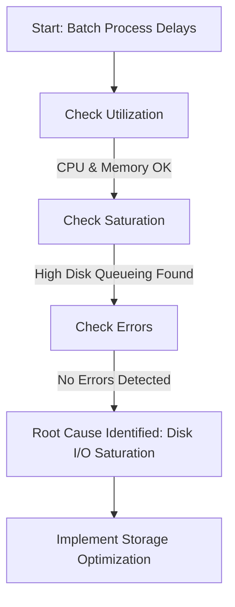
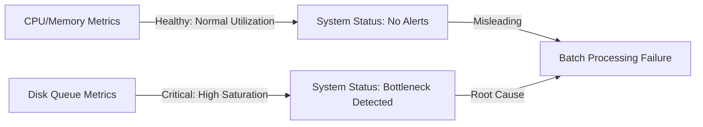
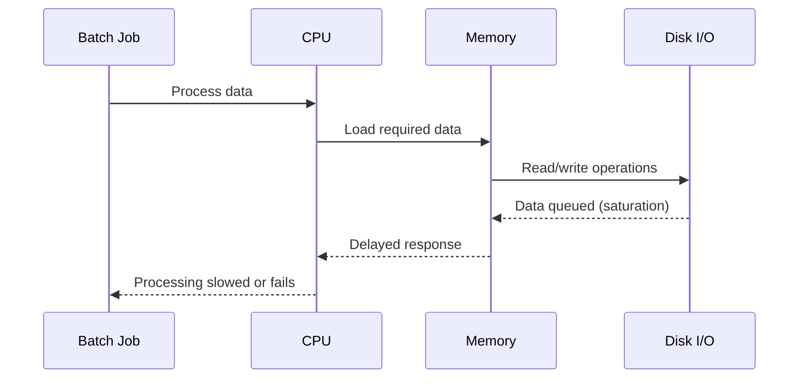
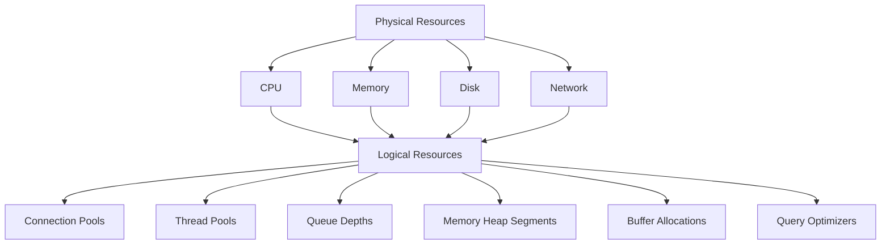
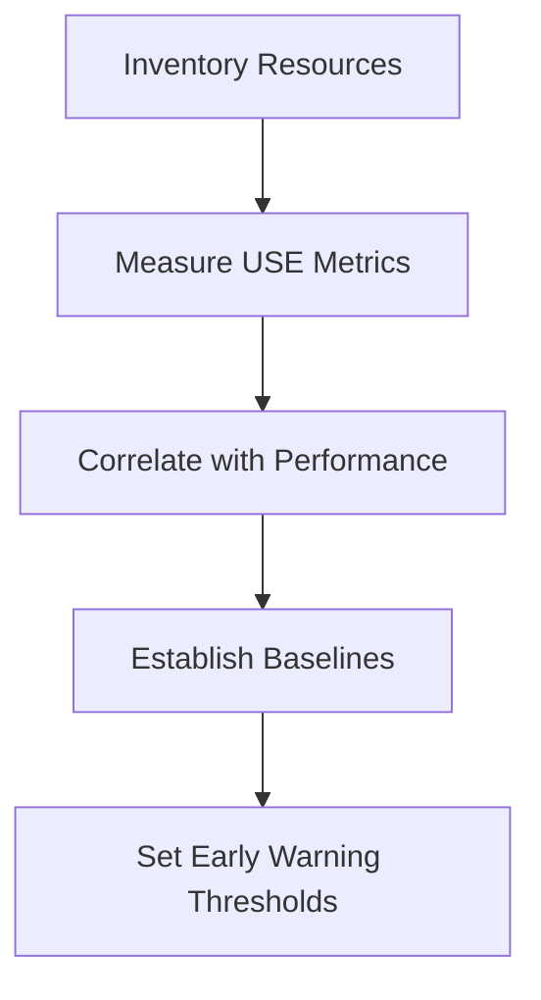
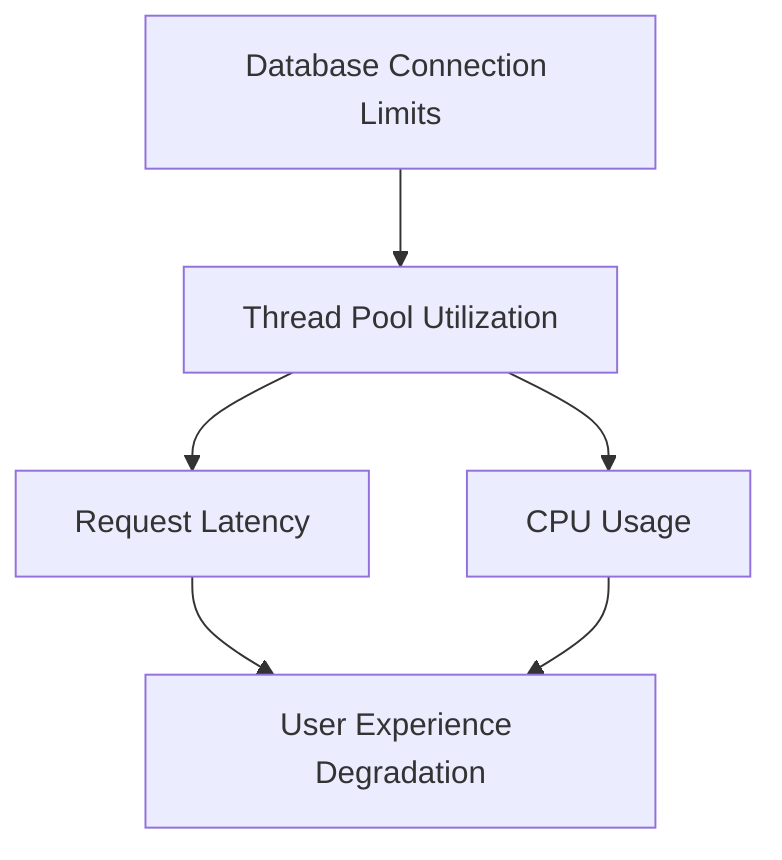

# Chapter 3: Resource-Focused Measurement (USE Method)

## Chapter Overview: Resource-Focused Measurement (USE Method)

This chapter introduces the USE Method—Utilization, Saturation, and Errors—as a systematic framework for resource-level telemetry in complex systems. Moving beyond traditional CPU and memory monitoring, it uncovers how banking systems can experience severe failures due to overlooked resource constraints. From disk I/O saturation to connection pool exhaustion, the chapter presents real-world examples and structured practices that show why comprehensive resource visibility is essential. The chapter equips teams to map, measure, and monitor every layer of infrastructure and application architecture to find root causes before they escalate into business-impacting failures.

______________________________________________________________________

## Learning Objectives

By the end of this chapter, readers will be able to:

1. Define the three pillars of the USE Method: Utilization, Saturation, and Errors.
2. Apply USE methodology to all system resources—not just the obvious ones.
3. Detect hidden constraints using saturation metrics and queue depths.
4. Extend resource monitoring to application-level constraints (e.g., thread pools, connection limits).
5. Construct a measurement matrix that covers system layers from hardware to middleware.
6. Correlate constraints across components to identify cascading failures.
7. Prioritize root-cause bottlenecks over symptomatic performance issues.

______________________________________________________________________

## Key Takeaways

- **Most Problems Aren’t Where You’re Looking**: Just because your CPU isn’t on fire doesn’t mean everything’s fine. Bottlenecks are shy.
- **Saturation Is the Canary in the Coal Mine**: It tells you where queues are building, and where your next 3 AM page is coming from.
- **If It Can Queue, It Can Kill You**: Disk writes, DB connections, message queues—all innocent-looking until they clog up and ruin your batch window.
- **USE Your Head**: Stop staring at 40% CPU dashboards like they owe you answers. Build full resource inventories and measure everything.
- **Applications Have Bottlenecks Too**: Thread pools and connection pools need as much love (and scrutiny) as your servers.
- **The Matrix Is Real**: Build a measurement matrix so you can find blind spots before they find you.
- **Fix the Cause, Not the Echo**: Don’t throw memory at a queueing problem or scale your way out of a lock—you’ll just look busy while doing nothing useful.

______________________________________________________________________

## Panel 1: The Resource Detective

### Scene Description

The infrastructure team is shown systematically applying the USE method checklist to diagnose a batch processing failure in the core banking system. The engineers collaborate to evaluate three critical dimensions for each system component: Utilization (how busy the resource is), Saturation (the level of queueing), and Errors (failure counts).

Below is a simplified representation of the workflow they follow, illustrating the structured approach of the USE method:

```
+---------------------------+
| Start: Identify Resource  |
+---------------------------+
            |
            v
+---------------------------+
| Measure Utilization       |
| (e.g., CPU, memory, I/O)  |
+---------------------------+
            |
            v
+---------------------------+
| Measure Saturation        |
| (e.g., queues, backlogs)  |
+---------------------------+
            |
            v
+---------------------------+
| Measure Errors            |
| (e.g., retries, timeouts) |
+---------------------------+
            |
            v
+---------------------------+
| Evaluate Findings         |
| and Investigate Further   |
+---------------------------+
```

This structured process ensures no resource is overlooked, enabling the team to pinpoint bottlenecks or failures that may impact critical financial operations. The visualization emphasizes the methodical nature of the troubleshooting effort and highlights the collaborative teamwork involved.

### Teaching Narrative

The USE Method provides a comprehensive framework for measuring resource health through three key dimensions: Utilization (how busy the resource is), Saturation (how much queueing is occurring), and Errors (failure counts). This systematic measurement approach ensures no resource constraints go unexamined, creating a methodical path through performance investigation. For banking infrastructure, USE metrics create a structured approach to identifying bottlenecks that might otherwise remain hidden during critical financial processing.

### Common Example of the Problem

A bank's nightly batch reconciliation process has been gradually taking longer to complete, now threatening its 6 AM completion deadline before daily operations begin. The operations team has tried various troubleshooting approaches: examining application logs, increasing server CPU and memory allocation, and optimizing database queries. None of these efforts have improved completion times. Without a systematic approach to resource measurement, the team keeps focusing on the most visible components while missing the actual constraint: disk I/O saturation on storage systems handling the transaction journaling.

The USE method provides a clear and structured path to uncover this hidden bottleneck. Below is a flowchart illustrating the troubleshooting progression using the USE method:



By systematically evaluating utilization, saturation, and errors for each resource, the team identifies excessive disk queueing as the root cause. This approach avoids wasted efforts on non-critical components and pinpoints the specific resource requiring optimization, ensuring timely resolution of performance issues.

### SRE Best Practice: Evidence-Based Investigation

To implement the USE method effectively and ensure evidence-based troubleshooting, follow this checklist:

#### Checklist for Evidence-Based Investigation using the USE Method:

1. **Inventory Resources**

   - Create a comprehensive list of all system resources to investigate:
     - CPU
     - Memory
     - Network interfaces
     - Disk I/O
     - Storage capacity
     - File descriptors
     - Connection pools
     - Thread pools

2. **Measure Key Dimensions for Each Resource**

   - For every resource identified, collect metrics on:
     - **Utilization**: Percentage of time the resource is busy (0-100%)
     - **Saturation**: Extent of queued work that cannot be processed immediately
     - **Errors**: Count of error events related to the resource

3. **Maintain Consistency Across Resources**

   - Use a uniform measurement approach for all resources, even those that may not appear problematic initially.

4. **Prioritize Analysis by Metric Severity**

   - Start by examining resources with the highest **utilization** or **saturation** levels, as these are likely points of contention.

5. **Correlate Metrics with Application Performance**

   - Compare resource behavior with application-level performance to pinpoint true bottlenecks or failure sources.

#### Example: Applying the USE Method

Systematic analysis identified **disk I/O saturation** as the root cause of write operation delays during high-volume journal processing. This constraint was missed by traditional monitoring but uncovered through the disciplined application of the USE method.

By following this checklist, teams can ensure a structured and reliable approach to troubleshooting, uncovering hidden constraints that may significantly impact performance.

### Banking Impact

For batch reconciliation processes, completion within defined windows is critical as it directly influences regulatory compliance and start-of-day operations. Any delay in reconciliation completion results in cascading effects across the organization. These impacts extend beyond technical issues, affecting business operations, customer satisfaction, and regulatory standing.

#### Cascading Impacts and Consequences

| Impact Area | Cascading Effect | Consequence |
| ---------------------------- | -------------------------------------- | ---------------------------------------------- |
| **Branch Operations** | Delayed branch openings | Reduced customer service availability |
| **Customer Accounts** | Unupdated customer account balances | Customer dissatisfaction and loss of trust |
| **Financial Reporting** | Missed reporting deadlines | Internal disruption and decision-making delays |
| **Regulatory Compliance** | Late regulatory submissions | Regulatory penalties and reputational damage |
| **Operational Coordination** | Disrupted inter-departmental workflows | Inefficiencies and increased operational costs |

By systematically addressing these impacts using the USE Method, infrastructure teams can uncover root causes in utilization, saturation, and error metrics, mitigating risks to both technical performance and business outcomes.

### Implementation Guidance

1. **Create a Comprehensive Resource Inventory**\
   Begin by cataloging all infrastructure components, including servers, databases, storage systems, and network devices. Ensure that each resource is uniquely identifiable and categorized by type and function.

2. **Implement Standardized USE Dashboards**\
   Set up dashboards that provide real-time visibility into Utilization, Saturation, and Errors for each resource type. Below is an example of a standardized USE dashboard configuration for a database server using a monitoring tool like Prometheus and Grafana:

   ```yaml
   # Prometheus scrape configuration for a database server
   scrape_configs:
     - job_name: 'database-server'
       static_configs:
         - targets: ['db01.example.com:9100']
   ```

   Example Grafana Panel Setup:

   - **Utilization**: Database CPU and memory usage (e.g., `cpu_usage` and `memory_usage` metrics).
   - **Saturation**: Query queue length (e.g., `query_queue_length` metric).
   - **Errors**: Query failures or connection errors (e.g., `query_errors_total` metric).

   Sample panel title structure: `USE Dashboard - [Resource Name]`.

3. **Develop Systematic Troubleshooting Runbooks**\
   Create step-by-step runbooks that align with the USE methodology. For example:

   - **Step 1**: Check resource Utilization. If it exceeds 80%, identify top contributors.
   - **Step 2**: Analyze Saturation. If queues are growing, investigate potential bottlenecks.
   - **Step 3**: Review Errors. If error counts are elevated, trace specific failure events.

   Use the following decision flow for troubleshooting:

   ```mermaid
   graph TD
   Start[Start Troubleshooting] --> Utilization[Check Utilization]
   Utilization -->|High| Saturation[Check Saturation]
   Utilization -->|Normal| Errors[Check Errors]
   Saturation -->|High| InvestigateBottleneck[Investigate Bottlenecks]
   Errors -->|High| TraceFailures[Trace Specific Failures]
   InvestigateBottleneck --> Resolve[Resolve Issue]
   TraceFailures --> Resolve
   ```

4. **Establish Baseline Performance**\
   Collect USE metrics during normal operations to establish baseline performance. Use historical data to define thresholds for normal Utilization, acceptable Saturation levels, and typical Error rates.

5. **Build Automated Analysis Tools**\
   Deploy tools to automate anomaly detection and alerting. Below is an example Python script snippet to flag anomalous metrics using Prometheus API:

   ```python
   import requests

   PROMETHEUS_URL = "http://prometheus.example.com/api/v1/query"
   QUERY = 'cpu_usage > 0.8 or query_queue_length > 10 or query_errors_total > 5'

   response = requests.get(PROMETHEUS_URL, params={'query': QUERY})
   results = response.json().get('data', {}).get('result', [])

   for result in results:
       print(f"Anomaly detected: {result['metric']} - Value: {result['value']}")
   ```

   Configure alerts to notify the team when thresholds are breached, enabling rapid response to potential issues.

## Panel 2: The Invisible Bottleneck

### Scene Description

The team uncovers disk I/O saturation during peak write periods, which triggers nightly batch processing failures despite CPU and memory metrics appearing normal. The issue is visualized through a clear contrast: CPU and memory dashboards show healthy utilization, while disk queue metrics reveal critical saturation levels.

Below is a conceptual representation of the observed metrics:



This diagram emphasizes the disparity between standard monitoring dashboards (CPU/Memory) and the hidden bottleneck revealed by disk metrics. It highlights the importance of comprehensive resource monitoring to uncover non-obvious constraints impacting system performance.

### Teaching Narrative

USE metrics reveal "invisible" resource constraints that standard monitoring approaches often miss but that significantly impact system performance. By measuring utilization, saturation, and errors for all system resources—not just the obvious ones—this methodology identifies non-intuitive bottlenecks that explain otherwise mysterious performance problems. For banking batch processing, comprehensive resource metrics enable precise identification of constraints that cause processing delays, reconciliation failures, or incomplete operations.

### Common Example of the Problem

A core banking system performs end-of-day processing to calculate interest, update balances, and generate customer statements. Despite running on servers with ample CPU and memory capacity (both showing only 40-50% utilization), processing regularly fails to complete within its operational window. Traditional monitoring focuses exclusively on these primary resources, showing healthy systems with no apparent issues. USE methodology applied to all resources reveals the actual problem: disk I/O saturation during peak write periods, where operations are queuing for storage access despite low overall disk utilization. This saturation metric—showing operations waiting in queue—was not being monitored at all, creating an invisible bottleneck that throttled the entire process.

The workflow below illustrates the batch processing sequence, highlighting where the bottleneck occurs:



In this sequence, the disk I/O saturation occurs during intensive read/write operations. While CPU and memory appear healthy, the queuing at the disk level prevents timely data access, delaying the entire batch job. This bottleneck is invisible without specific monitoring of disk saturation metrics, underscoring the importance of comprehensive resource analysis.

### SRE Best Practice: Evidence-Based Investigation

#### Checklist for Comprehensive Resource Measurement

Use this checklist to ensure a thorough and evidence-based investigation into resource constraints:

| Step | Action | Example |
| ------------------------------ | ----------------------------------------------------------------------------------- | ----------------------------------------------------------------------------------------- |
| **1. Expand Monitoring Scope** | Monitor beyond primary resources (CPU/memory) to include all potential bottlenecks. | Include disk I/O, network bandwidth, and storage throughput in your monitoring framework. |
| **2. Measure Utilization** | Track both average utilization and peak saturation for all resources. | Investigate disk usage during peak write periods, not just overall averages. |
| **3. Analyze Queue Metrics** | Focus on queue depths and wait times as key indicators of resource constraints. | Look for high disk queue lengths during nightly batch processing failures. |
| **4. Correlate Data** | Correlate resource saturation with specific workload patterns and timing. | Identify if disk saturation aligns with statement generation workloads. |
| **5. Characterize Workloads** | Use workload characterization to identify resource demands by operation type. | Determine which operations (e.g., read/write mix) are driving disk saturation. |

#### Example Insight from USE Analysis

A USE analysis of storage resources revealed that 200+ operations were consistently queued for disk access during peak statement generation workloads. This bottleneck—missed by traditional utilization metrics—was identified by focusing on saturation and queue depth metrics, enabling targeted remediation.

### Banking Impact

In financial batch processing, invisible bottlenecks directly affect regulatory compliance and customer service. End-of-day processing failures delay interest calculations, statement generation, and balance updates critical for start-of-day operations. When these processes extend beyond their windows, they affect ATM availability, online banking accuracy, and branch readiness. Beyond operational impacts, these delays can trigger regulatory reporting requirements for system availability and processing completeness, creating compliance issues in addition to customer experience problems.

### Implementation Guidance

1. **Identify Storage Resources and Enable Queue Monitoring**\
   Begin by cataloging all storage resources within the banking architecture, including disk arrays, SAN devices, and cloud storage volumes. Implement queue depth monitoring for these resources using available tools or APIs. For example, in Linux systems, tools like `iostat` or `dstat` can provide insights into disk queue metrics. For cloud-based environments, enable and configure storage-specific monitoring, such as AWS CloudWatch metrics for EBS volumes.

   ```bash
   # Example: Monitor disk queue with iostat
   iostat -x 1 5 | grep "await" 
   ```

2. **Create Saturation-Focused Dashboards**\
   Design dashboards centered around saturation metrics, such as disk queue lengths, I/O wait times, and throughput. Below is a sample JSON configuration for a Grafana dashboard widget tracking disk I/O queue length:

   ```json
   {
     "title": "Disk Queue Length",
     "type": "gauge",
     "targets": [
       {
         "expr": "node_disk_io_time_seconds_total{device='sda'}",
         "refId": "A"
       }
     ],
     "options": {
       "fieldOptions": {
         "unit": "short",
         "min": 0,
         "max": 100
       }
     }
   }
   ```

3. **Develop Resource Demand Profiles**\
   Analyze historical batch operation logs to identify resource usage patterns. Create profiles that characterize the I/O demand, peak times, and saturation points for each type of batch operation. Use these profiles to anticipate resource contention and preemptively allocate resources.

4. **Implement I/O Scheduling Optimizations**\
   Configure I/O scheduling policies to prioritize critical batch operations during peak periods. For example, in Linux, the `ionice` command can adjust the I/O scheduler's priority for specific processes:

   ```bash
   # Set a batch job to the highest I/O priority
   ionice -c 1 -p $(pgrep batch-job)
   ```

5. **Establish Comprehensive Monitoring**\
   Extend monitoring beyond traditional CPU and memory metrics to include all potential bottlenecks. Incorporate metrics such as disk latency, file system utilization, and error rates. Below is a simple ASCII example illustrating a recommended monitoring stack:

   ```
   +-----------------------+
   | Resource Monitoring   |
   | (CPU, Memory, Disk)   |
   +-----------------------+
             |
             v
   +-----------------------+
   | Saturation Metrics    |
   | (Queue Length, I/O)   |
   +-----------------------+
             |
             v
   +-----------------------+
   | Alerting & Dashboards |
   +-----------------------+
   ```

## Panel 3: Beyond Basic Resources

### Scene Description

In this scene, the team engages in an advanced monitoring discussion, focusing on identifying non-standard resources critical to measure in a payment processing system. These include connection pools, thread pools, and queue depths. To enhance understanding, the resource hierarchy from physical to logical components is visualized below:



This diagram illustrates how logical resources like connection pools and thread pools rely on underlying physical resources such as CPU, memory, disk, and network. Understanding these relationships is essential for pinpointing bottlenecks in financial transaction processing systems.

### Teaching Narrative

Comprehensive USE measurement extends beyond traditional infrastructure metrics (CPU, memory, disk, network) to include application-level resources that often become critical constraints in banking systems. These expanded resource metrics include connection pools, thread pools, memory heap segments, buffer allocations, and query optimizers. By applying the USE methodology to these specialized resources, teams gain visibility into bottlenecks that traditional monitoring overlooks but that directly impact financial transaction processing.

### Common Example of the Problem

A payment processing platform handles credit card authorizations with consistent CPU and memory metrics well within capacity limits, yet transaction latency periodically spikes during peak periods. Traditional monitoring shows no resource constraints at the infrastructure level, creating confusion about the performance degradation. By applying the expanded USE methodology, the team uncovers the actual bottleneck: database connection pool saturation. Below is a step-by-step breakdown of how the issue was identified and resolved:

1. **Observation**:

   - Periodic spikes in transaction latency are reported during peak usage hours.
   - Standard infrastructure metrics (CPU, memory, disk, network) remain well within acceptable thresholds.

2. **Hypothesis Formation**:

   - The team suspects the issue lies in an application-level resource, as infrastructure-level metrics fail to explain the latency spikes.

3. **Data Collection**:

   - Monitoring is expanded to include connection pool usage metrics.
   - Metrics reveal that during peak periods, the database connection pool hits its configured limit, causing new authorization requests to queue.

4. **Root Cause Identification**:

   - The database server itself shows moderate load, confirming the issue is not with database processing power or capacity.
   - The true bottleneck is the saturation of the connection pool, which limits the number of concurrent database connections.

5. **Solution Implementation**:

   - Connection pool size is increased to better handle peak demand.
   - The team also configures alerts to trigger when connection pool usage exceeds 80% capacity, allowing proactive intervention.

6. **Validation**:

   - Post-implementation monitoring confirms that transaction latency no longer spikes during peak periods.
   - Connection pool saturation is resolved, and customer transaction times remain stable.

**Text-Based Flow Representation**:

```
Peak Latency Observed --> Infrastructure Metrics Normal
                     --> Application Metrics Expanded
                     --> Connection Pool Saturation Found
                     --> Pool Size Increased
                     --> Latency Issue Resolved
```

By methodically applying the USE methodology, the team successfully identifies and resolves a critical application-level bottleneck that traditional monitoring would have missed, improving both system performance and customer experience.

### SRE Best Practice: Evidence-Based Investigation

Implement expanded USE methodology that includes application-level resources. Use the following checklist to guide your investigation and analysis:

#### Checklist for Evidence-Based Investigation

| Step | Action | Key Resource Types |
| ---- | ----------------------------------------------------------------------- | ------------------------------------------------------------------------------------------------------ |
| 1 | **Inventory all constrained resources in the application architecture** | Connection pools (database, API, service connections), thread pools (worker threads, async queues) |
| | | Memory structures (heap segments, buffer caches, in-memory data structures) |
| | | Locks and semaphores (database locks, file locks, shared resource controls) |
| | | Message queues (processing backlog, consumption rates, queue depths) |
| 2 | **Measure utilization, saturation, and errors for each resource** | Gather metrics such as active connections, queue depth, thread utilization, memory fragmentation, etc. |
| 3 | **Correlate application performance with resource constraints** | Identify bottlenecks and their downstream impacts on performance metrics |
| 4 | **Establish baseline patterns for normal vs. peak operations** | Define thresholds for typical vs. abnormal behavior under varying workloads |
| 5 | **Create early warning thresholds for approaching constraints** | Set alerts based on utilization, saturation, or error trends nearing critical limits |

#### Example Analysis Flow



This structured approach ensures comprehensive resource analysis, unveiling multiple constraint layers. For example:

- Connection pool saturation can lead to thread pool exhaustion.
- Thread pool exhaustion may cascade into latency spikes across dependent services.

By identifying these hidden bottlenecks, teams can address issues that traditional monitoring often overlooks, ensuring robust performance in critical financial systems.

### Banking Impact

In payment authorization systems, application resource constraints directly impact transaction approval rates and processing times. For example, consider a real-world scenario involving a major payment processor during a high-traffic shopping event like Black Friday. Due to connection pool saturation, authorization requests began queuing beyond acceptable thresholds, leading to timeouts. These timeouts appeared to merchants and customers as technical declines, prompting frustrated customers to retry transactions multiple times. The retries further strained the system, creating a feedback loop that exacerbated the issue.

This situation triggered unnecessary fraud alerts as the repeated attempts mimicked suspicious behavior patterns. For premium customers, such as those using high-value corporate cards, these failures created friction that jeopardized strategic merchant relationships. Additionally, merchants experienced lost sales and diminished trust in the processor's reliability, which could lead to renegotiations or even switching providers.

To illustrate the cascading impact:

```
Customer Transaction -> Connection Pool Saturation -> Timeout -> Technical Decline -> Retry -> System Strain -> Fraud Alert
       ^                                                                                                     |
       |_____________________________________________________________________________________________________|
```

These constraint-induced failures affect not only customer satisfaction but also merchant relationships, interchange revenue, and the broader reputation of the payment processor. By proactively monitoring and addressing application-level resource utilization, such as connection pools and thread pools, teams can preemptively identify and resolve bottlenecks, ensuring smoother transaction flows and preserving trust within the financial ecosystem.

### Implementation Guidance

1. **Create an Inventory**\
   Document all application resource pools, including connection pools, thread pools, and any other critical components. Include their configuration limits (e.g., max connections, max threads, queue sizes) and any relevant operational constraints.

2. **Enable Monitoring for Key Metrics**\
   Configure monitoring tools to track metrics like connection acquisition times, thread usage, queue depths, and pool utilization. Below is an example configuration snippet for Prometheus with a Java application using Micrometer:

   ```yaml
   scrape_configs:
     - job_name: 'application-metrics'
       static_configs:
         - targets: ['localhost:8080']
   ```

   In your application, ensure metrics are exposed. For example, with Spring Boot:

   ```java
   @Bean
   public MeterRegistryCustomizer<MeterRegistry> metricsCommonTags() {
       return registry -> registry.config().commonTags("application", "payment-system");
   }
   ```

3. **Develop Dashboards**\
   Use a visualization tool like Grafana to create dashboards for resource pool utilization. For example, display connection pool usage as a gauge and queue depths as a time series chart. Below is an example query for a thread pool:

   ```
   sum(rate(thread_pool_active_threads[1m])) by (pool_name)
   ```

4. **Optimize Resource Pool Configuration**\
   Analyze collected data to determine optimal pool sizes. Adjust configurations dynamically using observed usage patterns and transaction priorities. For instance, in a Spring Boot application:

   ```yaml
   spring.datasource.hikari.maximum-pool-size=50
   spring.datasource.hikari.minimum-idle=10
   ```

5. **Establish Graduated Alerting**\
   Set up alerting rules to notify teams as resource saturation increases. Use a tool like Prometheus Alertmanager. Example rule for connection pool saturation:

   ```yaml
   - alert: ConnectionPoolSaturation
     expr: (current_pool_size / max_pool_size) > 0.8
     for: 2m
     labels:
       severity: warning
     annotations:
       summary: "Connection pool saturation exceeds 80%"
       description: "The connection pool is {{ $value }}% utilized."
   ```

6. **Simulate Load for Validation**\
   Test configurations under varying load profiles using tools like JMeter or Locust to ensure monitoring thresholds and pool configurations are robust. Iterate based on findings to refine the setup.

## Panel 4: The Measurement Matrix

### Scene Description

The Operations team is shown creating a comprehensive resource inventory with USE metrics applied to each component in the trading platform. The structured matrix visually maps resources to measurement types across system layers, ensuring clarity and thorough coverage. Below is a text-based representation of the matrix structure:

```
+----------------------+----------------+----------------+----------------+-----------------+
| System Layer         | Resource Type | Utilization    | Saturation     | Errors          |
+----------------------+----------------+----------------+----------------+-----------------+
| Physical Resources   | CPU           | U: % usage     | S: Queue depth | E: Core errors  |
|                      | Memory        | U: % capacity  | S: Swap usage  | E: Memory faults|
|                      | Network       | U: Bandwidth   | S: Latency     | E: Packet drops |
|                      | Disk          | U: I/O rate    | S: I/O wait    | E: Disk failures|
+----------------------+----------------+----------------+----------------+-----------------+
| Virtualization Layer | Hypervisor    | U: vCPU usage  | S: Contention  | E: Allocation   |
|                      | Containers    | U: CPU shares  | S: Limits hit  | E: Throttling   |
+----------------------+----------------+----------------+----------------+-----------------+
| Middleware           | Connection    | U: Active conns| S: Pool depth  | E: Timeouts     |
|                      | Caches        | U: Hit ratio   | S: Evictions   | E: Corrupt data |
|                      | Queues        | U: Msg count   | S: Backlog     | E: Dropped msgs |
+----------------------+----------------+----------------+----------------+-----------------+
| Application Layer    | Thread Pools  | U: Thread usage| S: Queue depth | E: Starvation   |
|                      | Handlers      | U: Active reqs | S: Timeout reqs| E: Errors handled|
|                      | Buffers       | U: % filled    | S: Overflow    | E: Data loss    |
+----------------------+----------------+----------------+----------------+-----------------+
```

This matrix helps the team systematically assess constraints, apply consistent metrics, and identify potential bottlenecks across all layers of the system.

### Teaching Narrative

Systematic resource measurement requires a structured approach that inventories all potential constraints and applies consistent metrics across them. This resource measurement matrix applies USE metrics to physical resources (CPU, memory, network, disk), virtualization layers (hypervisor resources, container limits), middleware components (connection pools, caches, queues), and application resources (thread pools, handlers, buffers). For complex trading platforms, this comprehensive measurement approach ensures no potential bottleneck goes unmonitored.

### Common Example of the Problem

A trading platform experiences unpredictable performance degradation during market volatility, despite substantial infrastructure investment. The monitoring team tracks dozens of metrics but lacks a systematic approach to resource measurement. Some components have detailed monitoring while others have significant gaps. During incidents, the team wastes critical time checking resources ad hoc, with no clear methodology.

A comprehensive USE measurement matrix reveals the problem: while most physical resources are well-monitored, virtualization layer metrics are completely missing, hiding CPU throttling at the hypervisor level that occurs during peak load but remains invisible to guest OS monitoring.

The following table summarizes the monitored and unmonitored layers, highlighting the gap that contributed to the issue:

| **System Layer** | **Example Metrics** | **Monitoring Status** |
| --------------------- | --------------------------------- | ------------------------- |
| Physical Resources | CPU usage, memory usage, disk I/O | Monitored (detailed) |
| Virtualization Layer | CPU throttling, hypervisor I/O | **Unmonitored** |
| Middleware Components | Connection pool usage, cache hits | Partially Monitored |
| Application Resources | Thread pool usage, buffer sizes | Monitored (limited scope) |

This lack of visibility into the virtualization layer created a blind spot, delaying diagnosis and resolution during peak load incidents.

### SRE Best Practice: Evidence-Based Investigation

To implement a structured measurement matrix across all resource layers, use the following checklist to guide your efforts:

#### Checklist for Evidence-Based Investigation:

| Step | Action | Examples & Details |
| ---- | ----------------------------------------------------------------------- | ------------------------------------------------------------------------------------------------------ |
| 1 | **Create a two-dimensional matrix mapping resources to system layers** | - Resource types: compute, memory, storage, network, pools, queues |
| | | - System layers: hardware, virtualization, OS, middleware, application |
| 2 | **Implement USE metrics for each cell in the matrix** | - Utilization: CPU usage, memory consumption, IOPS |
| | | - Saturation: queue depth, thread pool waiting |
| | | - Errors: packet drops, failed writes, connection errors |
| 3 | **Identify and address monitoring gaps** | - Look for missing metrics in resources or layers |
| | | - Confirm comprehensive coverage of all critical components |
| 4 | **Apply consistent measurement methodology across all resources** | - Use standard tools and configurations to ensure uniformity |
| 5 | **Establish cross-layer correlation to identify cascading constraints** | - Analyze how issues in one layer (e.g., virtualization) impact others (e.g., application performance) |

#### Example Insight

A comprehensive measurement matrix can uncover critical visibility gaps, such as missing metrics at the virtualization layer. For example, during peak trading periods, unresolved saturation at the hypervisor level may propagate and degrade application response times. Systematic use of this checklist ensures such issues are proactively identified and mitigated.

### Banking Impact

For trading platforms, comprehensive resource visibility directly affects transaction execution quality and regulatory compliance. Invisible resource constraints can cause trade execution delays during market volatility—precisely when performance matters most—potentially costing clients significant amounts on price movements during delayed execution. These performance issues may also trigger regulatory reporting requirements for best execution compliance, creating both financial and regulatory consequences. Complete resource visibility enables the prioritization of critical trading operations even during constrained periods.

### Implementation Guidance

Use the following checklist to systematically implement the resource measurement matrix:

- [ ] **Develop a comprehensive resource inventory**\
  Map all physical resources (CPU, memory, network, disk), virtualization layers (e.g., hypervisors, containers), middleware components (e.g., connection pools, caches, queues), and application resources (e.g., thread pools, handlers, buffers) across the system.

- [ ] **Create standardized USE metrics for each resource type**\
  Define metrics to assess Utilization, Saturation, and Errors tailored to each resource category.

- [ ] **Implement monitoring to address visibility gaps**\
  Deploy monitoring tools and configure them to capture the defined USE metrics for every resource in the inventory.

- [ ] **Build cross-layer dashboards**\
  Design dashboards that visualize relationships between resources across layers, ensuring interdependencies are clear.

- [ ] **Establish regular review processes**\
  Schedule periodic reviews to identify blind spots, refine metric definitions, and ensure continuous improvement of monitoring practices.

## Panel 5: Correlating Resource Constraints

### Scene Description

Performance engineers are mapping relationships between resource metrics to identify cascade patterns where one resource constraint triggers others. The visual representation below uses a dependency diagram to illustrate how database connection limits impact thread pool utilization, leading to cascading effects on system performance.



This diagram highlights the flow of dependencies, showing how saturation in database connections can propagate through the system, affecting thread pools, increasing CPU usage, and ultimately degrading the user experience. Understanding these relationships enables targeted intervention at the root cause of resource constraints.

### Teaching Narrative

Advanced resource metrics reveal causal relationships between different system constraints, showing how saturation in one component can cascade to others. These cascading effects can be likened to traffic congestion on an interconnected road system. For example, when a critical highway becomes congested, vehicles divert to secondary roads, which then become overwhelmed, causing delays to ripple out across the entire network. Similarly, in a system, a database reaching its connection limit can lead to thread pool saturation, which in turn slows down request handling and propagates bottlenecks throughout dependent services.

These correlation metrics map dependencies between resources, identify trigger thresholds where constraints begin to propagate, and measure amplification effects where small limitations in one area cause larger problems elsewhere. For banking systems, understanding these resource interaction patterns enables targeted optimization at constraint sources rather than just addressing symptoms. Just as city planners analyze traffic patterns to optimize the flow at key choke points, performance engineers can use these insights to mitigate resource constraints before they cascade.

### Common Example of the Problem

A bank's mobile deposit system experiences periodic processing delays despite having apparently adequate resources at each individual component. Engineers optimize each system in isolation based on its utilization metrics, but problems persist. Correlation analysis of resource metrics reveals the actual pattern: when image processing threads reach 70% utilization, database connections begin to be held longer, which then saturates the connection pool at 85% capacity, triggering a queue in the API gateway, ultimately causing end-user latency. Without understanding these cascade relationships, engineers focus on symptoms (API gateway queuing) rather than the root cause (image processing efficiency), implementing ineffective solutions that waste resources.

### SRE Best Practice: Evidence-Based Investigation

Implement evidence-based resource correlation analysis to identify and address dependency patterns effectively. Use the following checklist to guide your investigation:

#### Checklist for Resource Correlation Analysis:

1. **Map Dependencies**: Create resource dependency maps to visualize relationships between system components and metrics.
2. **Measure Correlations**: Calculate correlation coefficients across resource metrics to identify statistically significant relationships.
3. **Identify Threshold Triggers**: Pinpoint thresholds where a constraint in one resource begins to impact others.
4. **Analyze Propagation Delays**: Examine timing patterns to understand delays between resource saturations and their cascading effects.
5. **Determine Amplification Factors**: Quantify how small constraints in one area escalate into larger downstream problems.
6. **Validate Findings**: Cross-reference correlation results with system logs, telemetry, or historical incident reports to confirm root causes.
7. **Prioritize Interventions**: Focus on resolving constraints at the root cause rather than mitigating symptoms downstream.

#### Example Insight:

Resource correlation analysis reveals that image processing thread saturation is the root cause of multiple downstream constraints. Timing signatures clearly show how saturation triggers a cascade of issues, affecting database connection limits and thread pool utilization. By addressing the image processing bottleneck, system-wide performance improves significantly.

### Banking Impact

In mobile deposit processing, understanding resource dependencies directly affects both customer experience and operational efficiency. Correlation metrics enable targeted optimization at constraint sources, reducing processing delays that affect funds availability and customer satisfaction. These insights also prevent wasteful overprovisioning of downstream resources that won't resolve the root constraint. For financial institutions, this analytical approach enables cost-effective reliability improvements by addressing actual bottlenecks rather than symptoms.

### Implementation Guidance

To implement resource correlation analysis effectively, follow these structured steps:

```plaintext
Step 1: Collect Metrics
   |
   v
Step 2: Visualize Correlations
   |
   v
Step 3: Perform Statistical Analysis
   |
   v
Step 4: Model Cascading Constraints
   |
   v
Step 5: Build Dependency Dashboards
   |
   v
Step 6: Prioritize Optimization Efforts
```

1. **Collect Metrics**: Aggregate resource utilization data across components, ensuring sufficient granularity and historical depth to detect patterns.
2. **Visualize Correlations**: Create tools or graphs that display how resource metrics fluctuate over time and highlight potential relationships.
3. **Perform Statistical Analysis**: Apply techniques such as regression analysis or Spearman correlation to identify significant metric dependencies.
4. **Model Cascading Constraints**: Develop models that map the impact of one resource constraint propagating to others, especially for critical transaction paths.
5. **Build Dependency Dashboards**: Create dashboards that visualize the dependency relationships, focusing on root constraints and their downstream effects.
6. **Prioritize Optimization Efforts**: Use constraint impact analysis to rank optimization priorities, addressing high-impact constraints at their source.
